\newpage
# Introduzione
Lo scopo dell'indagine statistica presentata in questo documento è quello di analizzare i dati forniti dall'ISTAT sulla popolazione italiana rispetto ai **titoli di studio**.\
L’obiettivo è ottenere informazioni dalle quali ricavare ulteriore conoscenza e poter fare **considerazioni sul fenomeno analizzato**.\
L'argomento merita particolare attenzione: diversi sono gli aspetti della vita, anche i meno scontati, che sono statisticamente legati al livello di istruzione.\
Sempre maggiori infatti sono gli studi che si concentrano sulla **correlazione tra il livello di istruzione dei cittadini e il loro stile di vita**.\
I dati sulla povertà come ad esempio quello presentato dal _**[rapporto sulla povertà della caritas](http://www.caritasitaliana.it/caritasitaliana/allegati/7847/Poverta%20in%20Attesa_Sintesi.pdf)**_ mostrano come la povertà educativa e culturale in Italia influisca pesantemente sul benessere degli individui, specialmente confrontando i dati italiani con quelli del resto dell'Europa.\
Un altro esempio riguarda gli studi dell'Osservatorio Nazionale della Salute nelle Regioni Italiane che evidenziano come il titolo di studio influisca fortemente sulle **condizioni di salute**, sulla speranza di vita e anche sulla rinuncia da parte degli italiani ad almeno una prestazione sanitaria.\
Un’analisi approfondita sul grado di istruzione della popolazione italiana può quindi essere molto interessante per fornire dati in modo da ampliare queste analisi sull’incidenza del livello culturale sullo stile di vita.\
Procediamo quindi mostrando il dataset scelto.

## Dataset
La fonte del **[dataset utilizzato](http://dati.istat.it/Index.aspx?DataSetCode=DCCV_POPTIT1)** è il sito dell'**Istituto nazionale di statistica**.\
Il dataset colleziona dati raccolti su campioni di migliaia di individui per ciascuna regione italiana riguardo il **titolo di studio raggiunto**.\
Il campione considerato è composto da persone comprese nella fascia di età **tra i 25 e i 64 anni**. Per ciascuna regione italiana è indicata, nell'ordine di presentazione, la **percentuale** di individui che hanno ottenuto al più la **licenza elementare**, quelli che hanno terminato gli studi con l'ottenimento della **licenza media**, quelli che hanno conseguito un **diploma professionale**, quelli che hanno ottenuto la **maturità**, e infine sono raggruppati nell'ultima colonna gli individui che hanno come titolo massimo di studio una **laurea o post-laurea**.\
I dati risultano essere relativi all'anno **2017**.\


Di seguito dunque la tabella

```{r Immagine Matrice, echo=FALSE}
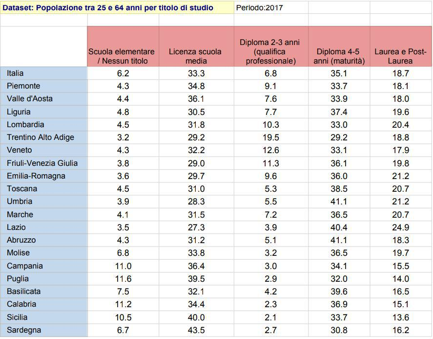
```

Per la realizzazione del progetto si è scelto di utilizzare il **linguaggio di programmazione e ambiente di sviluppo R** poiché adatto allo specifico obiettivo dell'analisi statistica dei dati.

### Inizializzazione dati matrice
L'azione preliminare necessaria per iniziare la nostra analisi è quella di inizializzare la matrice che utilizzeremo durante la nostra indagine statistica.\
Per ciascuna colonna della tabella creiamo un **vettore**:
```{r Inizializzazione Colonne matrice}
licenza_elementare_o_nessuno <- c(4.3, 4.4, 4.8, 4.5, 3.2, 4.3, 3.8,3.6,
                                  4.5,3.9, 4.1, 3.5, 4.3,6.8,11.0, 11.6,
                                  7.5, 11.2, 10.5, 6.7)

licenza_media <- c(34.8, 36.1, 30.5, 31.8, 29.2, 32.2, 29.0, 29.7, 31.0, 
                  28.3, 31.5, 27.3, 31.2, 33.8, 36.4, 39.5, 32.1, 34.4,
                  40.0, 43.5)

diploma <- c(9.1, 7.6, 7.7, 10.3, 19.5, 12.6, 11.3, 9.6, 5.3, 5.5, 7.2,
            3.9, 5.1, 3.2, 3.0, 2.9, 4.2, 2.3, 2.1, 2.7)

maturita <- c(33.7, 33.9, 37.4, 33.0, 29.2, 33.1, 36.1, 36.0, 38.5, 41.1,
             36.5, 40.4, 41.1, 36.5, 34.1, 32.0, 39.6, 36.9, 33.7, 30.8)

laurea = c(18.1, 18.0, 19.6, 20.4, 18.8, 17.9, 19.8, 21.2, 20.7, 21.2,
           20.7, 24.9, 18.3, 19.7, 15.5, 14.0, 16.5, 15.1, 13.6, 16.2)
```

A questo punto si può procedere facilmente alla creazione della matrice.\
Utilizziamo i vettori appena definiti per specificare le colonne della matrice. Per la leggibilità della matrice inizializziamo due vettori per definire i nomi associati a colonne e righe:

```{r Setup matrice}
matricePopolazionePerTitoloDiStudio <- cbind(licenza_elementare_o_nessuno, 
                                 licenza_media, diploma, maturita, laurea)

regioni <- c("Piemonte", "Valle d'Aosta", "Liguria", "Lombardia",
"Trentino Alto Adige","Veneto", "Friuli-Venezia Giulia", "Emilia-Romagna",
"Toscana","Umbria", "Marche","Lazio", "Abruzzo", "Molise", "Campania",
"Puglia", "Basilicata", "Calabria", "Sicilia", "Sardegna")
rownames(matricePopolazionePerTitoloDiStudio) <- regioni

titoli <- c("Nessun titolo", "Medie", "Diploma", "Maturità", "Laurea")
colnames(matricePopolazionePerTitoloDiStudio) <- titoli
```
La matrice risultante dalle operazioni precedenti è la seguente:
```{r Stampa Matrice, echo=FALSE}
matricePopolazionePerTitoloDiStudio
```


Infine come ultima operazione preliminare definiamo anche un vettore contenente i nomi delle regioni abbreviate: il vettore sarà utile quando dovremmo visualizzare i grafici e avremo bisogno di indici del genere.
```{r Regioni Abbreviate}
regioniAbbreviate <- c("PIE","VDA","LIG","LOM","TAA","VEN","FVG","ER","TOS",
                     "UMB","MAR","LAZ","ABR","MOL","CAM","PUG","BAS","CAL",
                     "SIC","SAR")
```

\newpage
# Distribuzioni di frequenza
Il primo passo da fare dopo aver predisposto i dati su cui si lavorerà è di **organizzarli in maniera che siano significativi** anche nella forma in modo da poter facilmente estrapolare le informazioni iniziali non immediatamente evidenti.\
Il primo metodo di cui ci serviamo per organizzare i dati è la **distribuzione di frequenza**. La distribuzione di frequenza è un'organizzazione dei dati in maniera tabulare che permette di rappresentare i valori individuali dei nostri dati in una categoria su una determinata scala. Attraverso la distribuzione di frequenza possiamo avere uno sguardo all'intero set di dati in maniera immediata e semplice. Capiamo se **determinate osservazioni sono più o meno significative** e come sono distribuite sulla scala considerata.\
Prima di costruire una tabella di frequenza si deve conoscere la natura dei dati con i quali si sta avendo a che fare. Considerando la tipologia di dati nel dataset preso in analisi, ad esempio, la scelta migliore è quella di dividere i vari insiemi in **classi**. Nel nostro dataset infatti è immediato notare che tutti i dati a nostra disposizione sono percentuali numeriche e il contenuto di ciascuna colonna della tabella non può assumere valori classificabili all’interno di una ben precisa modalità. La soluzione ideale è quella di **raccogliere le informazioni in classi** e poi calcolare le frequenze con cui gli elementi del campione cadono in ciascuna di esse.\
La scelta dei "range" delle classi deve essere fatta **in modo appropriato** osservando il dataset e tenendo in considerazione che sia utilizzarne pochi che molti è controproducente ai fini dell'analisi. Una buona metrica può essere quella di scegliere i range dividendo i range delle osservazioni col numero di classi scelto.\
La scelta sulle classi è stata fatta dunque nel seguente modo:\
**(0,8] (8,16] (16,24] (24,32] (32,40] (40,48]**\
In r creiamo dunque un vettore per contenere le classi scelte nel seguente modo:
```{r Definizione classi}
classiScelte <- c(0,8,16,24,32,40,48)
```
L'ambiente R per lavorare con intervalli fornisce la funzione **cut()** che prende in input un vettore e gli estremi degli intervalli considerati (aperti a sinistra).\
Per calcolare la frequenza sull'output di cut utilizziamo invece la funzione table().\
Vediamo dunque prima di tutto la distribuzione di **frequenza assoluta** e successivamente la distribuzione di **frequenza relativa**.

## Distribuzione di frequenza assoluta

Utilizziamo anche dei **grafici a barre** per graficare i risultati.

### Persone con nessun titolo o licenza elementare

```{r frequenza assoluta licenza elementare}
table(cut(licenza_elementare_o_nessuno,classiScelte))
```

```{r BarPlot freqAss licenza elementare,echo=FALSE}
barplot(table(cut(licenza_elementare_o_nessuno,classiScelte)), col = 1:6,main = "Licenza elementare")
```

Da questo risultato capiamo che: 

* La percentuale di persone con un titolo di studio praticamente nullo è omogenea in bene o male tutte le regioni italiane e si attesta attorno al **6.2%**.
* In generale le regioni settentrionali hanno una percentuale assai minore rispetto a quelle del sud.
* Ci sono infatti quattro regioni, cioè **Campania, Puglia, Calabria e Sicilia**, che presentano dati molto al di sopra della media, quasi il doppio rispetto a quanto riscontrato nelle altre regioni.
* Anche **Basilicata e Molise** si discostano dalla media delle regioni centro-settentrionali, anche se la differenza è meno marcata.

### Persone con licenza media

```{r frequenza assoluta licenza media}
table(cut(licenza_media,classiScelte))
```

```{r BarPlot freqAss licenza media,echo=FALSE}
barplot(table(cut(licenza_media,classiScelte)), col = 1:6,main = "Licenza media")
```

Da questo risultato capiamo che: 

* Nel quadro italiano si hanno valori abbastanza diversificati in tutte le regioni riguardo la percentuale di persone che hanno terminato gli studi con la licenza media. La media nazionale si attesta attorno al **33.3%**.
* Risultano essere 10 le regioni che fanno parte della quarta classe e hanno una percentuale leggermente minore rispetto alla media italiana, su tutte abbiamo diverse regioni del centro-nord quali: **Trentino Alto Adige, Friuli-Venezia Giulia, Emilia-Romagna, Umbria e Lazio**.
* Le restanti regioni facenti parte maggiormente del sud Italia fanno parte della quinta classe e sono 9. Tra queste particolare attenzione va data alla percentuale riscontrata in **Sicilia e Puglia**, regioni borderline con l'ultima classe.
* Una regione su tutte, la **Sardegna**, ha una percentuale altissima pari al **43.5%** ed è infatti l'unica regione a far parte dell'ultima classe considerata. 

### Persone con diploma professionale

```{r frequenza assoluta diploma}
table(cut(diploma,classiScelte))
```


```{r BarPlot freqAss diploma,echo=FALSE}
barplot(table(cut(diploma,classiScelte)), col = 1:6,main = "Diploma")
```

Da questo risultato capiamo che: 

* La scelta di conseguire un titolo che attesti una qualifica professionale in Italia è generalmente poco seguita, la media nazionale è infatti del **6.8%**.
* La quasi totalità delle regioni centro-meridionali ha una percentuale **minore al 5.5%**, con alcune regioni come **Sicilia e Calabria** dove la percentuale raggiunge solo il **2%**.
* Nelle regioni del nord Italia invece le percentuali aumentano di molto e il caso del **Trentino-Alto Adige** è decisamente un unicum nel contesto italiano raggiungendo un valore percentuale addirittura 3 volte pari alla media nazionale con il **19.5%**.
* In generale al nord la qualifica professionale è molto più apprezzata e questo dato è in linea con gli studi sulle opportunità lavorative del territorio.

### Persone con maturità liceale

```{r frequenza assoluta maturita}
table(cut(maturita,classiScelte))
```


```{r BarPlot freqAss maturita,echo=FALSE}
barplot(table(cut(maturita,classiScelte)), col = 1:6,main = "Maturità")
```

Da questo risultato capiamo che: 

* Il dato sulla percentuale di persone che conseguono la maturità in Italia è piuttosto omogeneo in tutte le regioni e si attesta per ogni regione sulla media nazionale pari al **35.1%**.
* Il discostamento in positivo maggiore si ha in **Abruzzo, Umbria e Lazio** dove le prime due presentano una percentuale pari al **41.1%**, mentre il Lazio pari a **40.4%**.
* Il discostamento in negativo maggiore si ha in **Trentino-Alto Adige, Sardegna e Puglia** rispettivamente con **29.2%**, **30.8%** e **32%**.

### Persone con laurea o titolo avanzato

```{r frequenza assoluta laurea}
table(cut(laurea,classiScelte))
```


```{r BarPlot freqAss laurea,echo=FALSE}
barplot(table(cut(laurea,classiScelte)), col = 1:6,main = "Laurea")
```

Da questo risultato capiamo che: 

* Per questo ultimo dato risulta che le regioni italiane siano sostanzialmente spaccate ancora tra sud e il resto di Italia.
* Al sud infatti abbiamo la regione che ha il dato "peggiore", cioè la **Sicilia** con una percentuale di laureati del **13.6%**, e anche le altre regioni del sud non vanno di molto oltre a questa percentuale.
* Sorprendentemente le regioni con le percentuali di laureati maggiori sono quelle del centro Italia e la regione che in assoluto si discosta maggiormente dalle altre è il **Lazio** con una percentuale che si distanzia del 6% dalla media nazionale con il suo **24.9%** di laureati.

## Distribuzione di frequenza relativa
Per calcolare le frequenze relative, invece, è necessario dividere l'output della frequenza assoluta per la lunghezza dei vettori presi in considerazione tramite la funzione lenght().\
Vediamo dunque quali percentuali otteniamo calcolando le frequenze relative dei titoli di studio per regione usando come scala la suddivisione in classi definita in precedenza.

### Persone con nessun titolo o licenza elementare

```{r frequenza relativa licenza elementare}
table(cut(licenza_elementare_o_nessuno,classiScelte))/
      length(licenza_elementare_o_nessuno)
```

```{r BarPlot freqRel licenza elementare,echo=FALSE}
barplot(table(cut(licenza_elementare_o_nessuno,classiScelte))/length(licenza_elementare_o_nessuno), col = 1:6,main = "Licenza elementare")
```

Da questo risultato capiamo che: 

* L'**80%** delle regioni italiane presenta per la prima categoria una percentuale relativamente bassa.
* Il restante **20%** composto dalle regioni del sud già citate invece ha indici molto più alti e preoccupanti. 

### Persone con licenza media

```{r frequenza relativa licenza media}
table(cut(licenza_media,classiScelte))/length(licenza_media)
```


```{r BarPlot freqRel licenza media,echo=FALSE}
barplot(table(cut(licenza_media,classiScelte))/length(licenza_media), col = 1:6,main = "Licenza Media")
```

Da questo risultato capiamo che: 

* Qui notiamo come il **50%** delle regioni presenta valori compresi tra il **24%** e il **32%**.
* Un altro **45%** sono regioni del centro-sud che hanno un valore leggermente più altro compreso tra il **32%** e il **40%**.
* Il restante **5%** è causato dalla  **Sardegna** che presenta una percentuale altissima in questa categoria rispetto al resto delle regioni della penisola.

### Persone con diploma professionale

```{r frequenza relativa diploma}
table(cut(diploma,classiScelte))/length(diploma)
```


```{r BarPlot freqRel diploma,echo=FALSE}
barplot(table(cut(diploma,classiScelte))/length(diploma), col = 1:6,main = "Diploma")
```

Da questo risultato capiamo che: 

* Anche in questa categoria le percentuali sono abbastanza omogenee e il **70%** delle regioni ricade nella prima classe. 
* Le restanti regioni tendono invece ad avere più individui nelle quali la scelta di conseguire un titolo professionale risulta maggiormente appetibile con il **25%**.
* L'unica regione che compone il restante **5%** è il **Trentino-Alto Adige** in cui il valore si distacca fortemente dalle altre regioni italiane e difatti è l'unica regione presenta nella terza classe selezionata.

### Persone con maturità

```{r frequenza relativa maturita}
table(cut(maturita,classiScelte))/length(maturita)
```


```{r BarPlot freqRel maturita,echo=FALSE}
barplot(table(cut(maturita,classiScelte))/length(maturita), col = 1:6,main = "Maturità")
```

* Riguardo questa categoria abbiamo che la maggior parte delle regioni, il **70%**, ha una percentuale compresa tra il **32%** e il **40%**.
* Particolari sono alcune regioni nelle quali questi valori si distaccano o in positivo o in negativo suddividendo il restante **30%** in:
  + ci sono **Abruzzo, Umbria e Lazio** che hanno una percentuale molto alta e ricoprono con il **15%** l'ultima classe.
  + in modo opposto invece **Trentino-Alto Adige, Sardegna e Puglia** ricoprono con il **15%** del totale la classe relativa alle regioni con percentuali comprese tra **24% e 32%** 

### Persone con laurea o titolo avanzato

```{r frequenza relativa laurea}
table(cut(laurea,classiScelte))/length(laurea)
```

```{r BarPlot freqRel laurea,echo=FALSE}
barplot(table(cut(laurea,classiScelte))/length(laurea), col = 1:6,main = "Laurea")
```

* Considerando le regioni e i laureati vediamo come la classe maggiormente presenta è quella che comprende i valori tra il **16%** e il **24%**.
* Abbiamo determinate regioni del sud che si discostano in negativo non superando il **15%** di laureati comportando il **20%** del totale per la classe che parte dell'**8%**. 
* Infine abbiamo il Lazio che ha una percentuale di laureati altissima e occupa da solo la quarta classe con una percentuale del  **24.9%** altissima rispetto al resto dell'Italia.
\newpage

# Analisi tramite rappresentazioni grafiche
Le rappresentazioni grafiche sono necessarie in quanto ci permettono di avere una raffigurazione pulita dei dati che abbiamo. In poco spazio riusciamo a **visualizzare tanta conoscenza e a comunicarla in maniera più chiara ed efficace**.\
Infatti anche se la statistica produce i propri output in forma numerica o in tabelle, le tecniche grafiche ci permettono di comunicare al meglio i nostri risultati.\
Ci sono tantissimi tipologie di grafici attraverso cui esprimiamo il nostro lavoro di analisi. Vediamoli dunque nel dettaglio e arricchiamo la nostra conoscenza del dominio trattato.

## Grafici a barre
Attraverso i grafici a barre possiamo avere un quadro completo dei dati relativi alle categorie che analizziamo.\
Un grafico a barre è formato da una serie di barre della stessa larghezza, ognuna di esse descrive una categoria. L'altezza di ciascuna barra è proporzionale al valore riscontrato per ogni singola categoria presa in considerazione.\
Nel nostro caso le categorie sono le regioni e i valori riscontrati per ciascuna di esse sono le percentuali associate ai titoli di studio per regione.\
Per ciascuna delle colonne della matrice quindi andiamo a realizzare un grafico a barre in cui **sull’asse delle x avremo le regioni**, mentre **sull'asse delle y avremo le percentuali individuate per ogni tipologia di titolo di studio**.\
Con questa rappresentazione possiamo avere una visione d'insieme del dataset a disposizione.

In R per realizzare un grafico a barre si utilizza il comando barplot() con i parametri necessari per specificare i valori da rappresentare e la resa grafica.

* Grafico relativo alle persone con nessun titolo o licenza elementare

```{r barPlot licenza elementare tutti i valori}
barplot(matricePopolazionePerTitoloDiStudio[,1], col = 1:20,
    main = "Percentuale di persone con nessun titolo o licenza elementare",
    las=2, names.arg=regioniAbbreviate, ylim = c(0,15))
```

* Grafico relativo alle persone con licenza media

```{r barPlot licenza media tutti i valori, echo=FALSE}
barplot(matricePopolazionePerTitoloDiStudio[,2], col = 1:20,
    main = "Percentuale di persone con la sola licenza media",
    las=2, names.arg=regioniAbbreviate, ylim = c(0,45))
```

* Grafico relativo alle persone con diploma di qualifica professionale

```{r barPlot diploma tutti i valori, echo=FALSE}
barplot(matricePopolazionePerTitoloDiStudio[,3], col = 1:20,
    main = "Percentuale di persone con diploma professionale",
    las=2, names.arg=regioniAbbreviate, ylim = c(0,20))
```

* Grafico relativo alle persone con maturità conseguita

```{r barPlot maturita tutti i valori, echo=FALSE}
barplot(matricePopolazionePerTitoloDiStudio[,4], col = 1:20,
    main = "Percentuale di persone con maturità conseguita",
    las=2, names.arg=regioniAbbreviate, ylim = c(0,45))
```

* Grafico relativo alle persone con laurea o titolo superiore conseguito

```{r barPlot laurea tutti i valori, echo=FALSE}
barplot(matricePopolazionePerTitoloDiStudio[,5], col = 1:20,
    main = "Percentuale di persone con laurea o titolo superiore",
    las=2, names.arg=regioniAbbreviate, ylim = c(0,25))
```

## Grafico a torta
Un grafico a torta è un grafico circolare suddiviso in "fette" che illustrano una porzione numerica. **L'arco descritto da ciascuna fetta è proporzionale alla quantità rappresentata**.\
Anche i grafici a torta consentono di avere una visione di insieme immediata, ma sono criticati da alcuni per la difficoltà di comparazione dei dati tra differenti grafici a torta.\
Possiamo usare un grafico a torta per riassumere la situazione italiana sui vari titoli di studio introducendo il vettore corrispondente alla situazione italiana ricavato dal dataset iniziale:
```{r vettore Italia}
italia <- c(
  rep("Scuola elementare/Nessun titolo",6.21),
  rep("Licenza media",33.3),
  rep("Diploma professionale",6.8),
  rep("Maturità",35.1),
  rep("Laurea/Post laurea",18.7)
  )
```

Disegnamo il grafico a torta con il comando pie() come mostrato nel seguente snippet:
```{r grafico a torta Italia}
pie(table(italia),col = 1:5)
```

## Plot per vettori
Attraverso la funzione plot possiamo visualizzare l'**andamento dei valori assunti** dai vari vettori che costituiscono la matrice che rappresenta il dataset.
Consideriamo dunque ad uno ad uno i **vettori della nostra matrice** e vediamo come la funzione plot() ci permette di visualizzare le modalità assunte da ogni regione.

* Grafico relativo alle persone con nessun titolo o licenza elementare

```{r plot licenza elementare}
plot(licenza_elementare_o_nessuno,
     ylab="Percentuale nessun titolo o licenza elementare",
     xlab="Regioni",
     col =1:20,type = "b",axes = FALSE)
box(which = "plot", lty = "solid")
axis(side=2)
axis(side=1, at=1:20, labels=regioniAbbreviate,cex.axis=0.50)
```

* Grafico relativo alle persone con licenza media

```{r plot licenza media,echo=FALSE}
plot(licenza_media,ylab="Percentuale licenza media", xlab="Regioni", col =1:20,type = "b",axes = FALSE)
box(which = "plot", lty = "solid")
axis(side=2)
axis(side=1, at=1:20, labels=regioniAbbreviate,cex.axis=0.50)
```

* Grafico relativo alle persone con diploma di qualifica professionale

```{r plot diploma,echo=FALSE}
plot(diploma,ylab="Percentuale diploma professionale", xlab="Regioni", col =1:20,type = "b",axes = FALSE)
box(which = "plot", lty = "solid")
axis(side=2)
axis(side=1, at=1:20, labels=regioniAbbreviate,cex.axis=0.50)
```

* Grafico relativo alle persone con maturità conseguita

```{r plot maturita,echo=FALSE}
plot(maturita,ylab="Percentuale maturità", xlab="Regioni", col =1:20,type = "b",axes = FALSE)
box(which = "plot", lty = "solid")
axis(side=2)
axis(side=1, at=1:20, labels=regioniAbbreviate,cex.axis=0.50)
```

* Grafico relativo alle persone con laurea o titolo superiore conseguito

```{r plot laurea,echo=FALSE}
plot(laurea,ylab="Percentuale laureati", xlab="Regioni", col =1:20,type = "b",axes = FALSE)
box(which = "plot", lty = "solid")
axis(side=2)
axis(side=1, at=1:20, labels=regioniAbbreviate,cex.axis=0.50)
```

## Istogrammi
Un istogramma è un'altra rappresentazione della distribuzione di dati numerici. È un tipo di diagramma cartesiano usato quando l'intervallo di definizione delle variabili è diviso in sotto-intervalli di **ampiezza uguale o disuguale**. Quello che si ottiene da un istogramma è una figura costituita da una serie di rettangoli adiacenti aventi la base sull'asse delle ascisse e di altezza dipendente dalla frequenza delle classi.\
Per costruire un istogramma il primo passo è quello di dividere il range dei valori assunti in una serie di intervalli e successivamente bisogna contare quanti valori cadono in ogni intervallo. I "contenitori" utilizzati sono solitamente specificati come intervalli di variabili consecutivi e non sovrapposti.\

In R utilizziamo la funzione hist() per disegnare un istogramma. Il numero di classi può essere definito dall'utente, ma può anche essere **lasciato a discrezione di R che deciderà il numero di classi che ritiene adeguato**.\
La funzione hist genera oltre al grafico anche altre informazioni utili: i **breaks** definiti per la creazione dell'istogramma, le **frequenze assolute** delle classi, la **densità** delle classi e i **punti centrali** delle classi.

Vediamo ad esempio l'istogramma relativo alla percentuale di laureati:

```{r istogramma laurea assolute}
laureaHistOutput<-hist(laurea ,freq=TRUE ,main=" Istogramma  laurea",
                 ylab="Frequenza  assoluta  delle classi ",col = 1:7)
str(laureaHistOutput)
laureaHistOutput$breaks
laureaHistOutput$counts
laureaHistOutput$density
laureaHistOutput$mids

```

La suddivisione in classi fatta da R ha restituito le seguenti **sette classi**: (12,14] (14,16] (16,18] (18,20] (20,22] (22,24] (24,26].\
Infatti, dei 20 valori, 2 cadono nella prima, 2 nella seconda, 4 nella terza, 6 nella quarta, 5 nella quinta, 0 nella sesta e 1 nell'ultimo.\
Le frequenze relative associate alle sette classi possono essere ottenute moltiplicando gli elementi del vettore dell'attributo density per l'ampiezza delle classi che nel nostro caso è 2.

```{r frequenze relative ricavate da density}
laureaHistOutput$density * 2
```

Il parametro freq ci permette di specificare se calcolare le frequenze assolute o relative di ogni classe.\
```{r istogramma laurea relative}
laureaHistOutputRel<-hist(laurea ,freq=FALSE ,main=" Istogramma  laurea",
                 ylab="Frequenza  assoluta  delle classi ",col = 1:7)
str(laureaHistOutput)
laureaHistOutputRel$breaks
laureaHistOutputRel$counts
laureaHistOutputRel$density
laureaHistOutputRel$mids

```

Il codice produce l’istogramma rappresentato in base alle densità di frequenza delle classi. Anche qui il numero di classi è stato scelto da R.\
Anche in questo caso la funzione hist() restituisce un elemento di tipo lista con gli stessi attributi del caso in cui viene considerata la frequenza assoluta.

Anche per ottenere le frequenze relative il procedimento è analogo al precedente.

## Boxplot
Nella statistica descrittiva un boxplot è un metodo per raffigurare graficamente gruppi di dati numerici attraverso i **quartili**.\
Quando parliamo di quartili si intende un **particolare tipo di quantile**. Il primo quartile, indicato generalmente con **Q1**, è definito come il valore centrale più piccolo tra il numero più piccolo e la mediana: il valore per il quale si trovano il **25% dei valori più piccoli alla propria sinistra e il 75% dei valori più grandi alla sua destra**.\
Il secondo quartile (**Q2**) è la mediana dei dati: ha il **50% dei dati più piccoli alla sinistra e il restante 50% dei valori più grandi alla destra**.\
Il terzo quartile (**Q3**) è il valore centrale tra la mediana e il valore più grande del dataset.\
**Q0** e **Q4** sono invece rispettivamente il valore minimo e il valore massimo del campione.\
I quartili si calcolo tramite la funzione quantile() in R, mentre la funzione summary() restituisce i valori precisi dei quartili.\
Vediamo ad esempio per il vettore contente le informazioni sulla percentuale di individui con nessun titolo o la licenza elementare quale output ci viene fornito: 
```{r quantile licenza elementare}
quantile(licenza_elementare_o_nessuno)
```
Da cui deduciamo che Q0 = 3.2, Q1 = 4.050, Q2 = 4.450, Q3 = 6.975 e Q4 = 11.600.

```{r summary licenza elementare}
summary(licenza_elementare_o_nessuno)
```

Un boxplot è costituito da una scatola i cui **estremi sono in corrispondenza del valore di Q1 e Q3**, ed è tagliata da una linea orizzontale in corrispondenza di Q2.\
Un boxplot presenta anche altre due linee orizzontali, dette **baffi**: per tale motivo il boxplot viene definito anche "**diagramma a scatola e baffi**".\
Il baffo inferiore corrisponde al valore più piccolo tra le osservazioni che risulta maggiore o uguale di:

```{r baffo0, fig.align="center",  echo=FALSE}
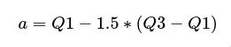
```

mentre il baffo superiore corrisponde al valore più grande delle osservazioni che risulta minore o uguale a: 

```{r baffo1, fig.align="center", echo=FALSE}
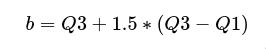
```

La distanza tra il primo e il terzo quartile è detta **intervallo interquartile** o **scarto interquartile**.\
Nel caso in cui tutti i valori rientrano nell'intervallo (a,b) allora i baffi sono posizionati in corrispondenza del minimo e del massimo del campione.\
Se ci sono invece valori che si trovano fuori dall'intervallo (a,b), questi valori vengono evidenziati come punti nel grafico e sono detti **valori anomali** o **outlier**: sono infatti un'anomalia rispetto alla maggioranza delle altre osservazioni del campione e sono pertanto molto interessanti da analizzare.\
Attraverso il boxplot ricaviamo molte informazioni: oltre ai già descritti valori anomali, osserviamo la **centralità**, la **dispersione** e la **forma**.\
La centralità si deduce dalla mediana.\
Dalla forma possiamo verificare se i dati sono simmetrici o meno, questo può essere osservato tramite lo scarto interquantile e la mediana: **se Q3 e Q1 hanno una distanza simile da Q2 allora il nostro set di dati è simmetrico**.\
I baffi invece ci danno informazioni sulla **dispersione e la distribuzione dei dati**.\
In R usiamo la funzione boxplot() per disegnare i boxplot.Vediamo quindi i risultati dell'applicazione della funzione sui nostri vettori:

* Nessun titolo o scuola elementare
```{r boxplot licenza_elementare_o_nessuno}
boxplot(licenza_elementare_o_nessuno, 
        main = "boxplot nessun titolo o licenza elementare", 
        col = "red", axes = FALSE)
axis(side=2, 3:12, cex.axis=0.80)
box()

summary(licenza_elementare_o_nessuno)
```

Da cui deduciamo che Q0 = 3.2, Q1 = 4.050, Q2 = 4.450, Q3 = 6.975 e Q4 = 11.600.

Per avere le informazioni relative all'esecuzione della funzione boxplot sul vettore possiamo usare boxplot.stats() che restituisce un dataframe contenente tra le varie cose un vettore di lunghezza cinque con i valori dei baffi e di Q1, Q2 e Q3, e ci **dà anche informazioni riguardo eventuali valori che si trovano al di fuori dei baffi**:

```{r boxStatsElementari}
elementariBoxPlotStats <- boxplot.stats(licenza_elementare_o_nessuno)
#Baffo inferiore
elementariBoxPlotStats$stats[1]
#Baffo superiore
elementariBoxPlotStats$stats[5]
#valori anomali
elementariBoxPlotStats$out
```
Il baffo inferiore è quindi pari a 3.2, cioè il minimo dei valori del vettore.\
Il baffo superiore è pari a 11.6 e corrisponde al massimo: **non ci sono dunque valori anomali poiché ogni valore è compreso tra i due baffi**.\
Il grafico infatti non ci indica la presenza valori anomali.\
Possiamo anche affermare che c'è una **forte asimmetria dei dati** dato che la differenza Q3 – Q2 è molto più grande rispetto a quella tra Q2 – Q1. Questa deduzione è chiara anche solo visualizzando il grafico poiché la mediana è praticamente prossima alla base inferiore della scatola.

* Licenza media

```{r boxplot licenza_media, echo=FALSE}
boxplot(licenza_media, main = "boxplot percentuale con licenza media", col = "green", axes = FALSE)
axis(side=2, 27:44, cex.axis=0.75)
box()

summary(licenza_media)

```

Quindi **Q0 = 27.30, Q1 = 30.30, Q2 = 31.95, Q3 = 35.12 e Q4 = 43.50**.

```{r boxStatsMedie, echo = FALSE}
mediaBoxPlotStats <- boxplot.stats(licenza_media)
mediaBoxPlotStats$stats[1]
mediaBoxPlotStats$stats[5]
```
Il baffo inferiore è quindi pari a 27.3, cioè il minimo dei valori del vettore.\
Il baffo superiore è invece pari a 40.0 e non corrisponde al massimo: **c'è un valore anomalo**.\
```{r valoreAnomaloMedie}
mediaBoxPlotStats$out
```

Il grafico infatti indica la presenza di un valore anomalo ed è corrispondente a quello della **Sardegna** che è infatti pari a 43.5, cioè maggiore del baffo superiore.\

Anche per questa categoria abbiamo un'**asimmetria dei dati**, meno marcata rispetto al caso precedente ma è comunque evidente anche con un'analisi visuale che la differenza Q3 – Q2 è maggiore rispetto alla a quella tra Q2 – Q1. Questa deduzione è chiara anche solo visualizzando il grafico poiché la mediana è praticamente prossima alla base inferiore della scatola.

* Diploma professionale

```{r boxplot diploma, echo=FALSE}
boxplot(diploma, main = "boxplot percentuali con diploma professionale", col = "blue", axes = FALSE)
axis(side=2, 2:20, cex.axis=0.75)
box()

summary(diploma)
```

Quindi **Q0 = 2.1, Q1 = 3.15, Q2 = 5.4, Q3 = 9.225 e Q4 = 19.5**.


```{r boxStatsDiploma, echo = FALSE}
diplomaBoxPlotStats <- boxplot.stats(diploma)
diplomaBoxPlotStats$stats[1]
diplomaBoxPlotStats$stats[5]
```

Il baffo inferiore è quindi pari a 2.1, cioè il minimo dei valori del vettore.\
Il baffo superiore è invece pari a 12.6 e non corrisponde al massimo: **c'è un valore anomalo**.\
```{r valore anomalo diploma}
diplomaBoxPlotStats$out
```

Il grafico infatti indica la presenza di un valore anomalo ed è corrispondente a quello del **Trentino-Alto Adige** che è infatti pari a 19.5 come indicatoci da R, e cioè maggiore del baffo superiore.\

Come nel caso precedente anche qui vi è **asimmetria nei dati** abbastanza marcata.

* Maturità

```{r boxplot maturita, echo=FALSE}
boxplot(maturita, main = "boxplot percentuali con maturità", col = "magenta", axes = FALSE)
axis(side=2, 29:42, cex.axis=0.75)
box()
summary(maturita)
```

Quindi **Q0 = 29.20   Q1 = 33.55   Q2 = 36.05   Q3 = 37.67   Q4 = 41.10** 

```{r boxStatsMaturita, echo = FALSE}
maturitaBoxPlotStats <- boxplot.stats(maturita)
maturitaBoxPlotStats$stats[1]
maturitaBoxPlotStats$stats[5]
```

Il baffo inferiore è quindi pari a 29.2, cioè il minimo dei valori del vettore.\
Il baffo superiore è invece pari a 41.1, cioè il massimo: **non ci sono valori anomali**1.\

Anche in questo vettore abbiamo una discreta **asimmetria nei dati**, ma a differenza dei casi precedenti la mediana è più vicina a Q3.

* Laurea

```{r boxplot laurea, echo=FALSE}
boxplot(laurea, main = "boxplot percentuale laureati", col = "cyan", axes = FALSE)
axis(side=2, 13:25, cex.axis=0.75)
box()
summary(laurea)
```

Quindi **Q0 = 13.60, Q1 = 16.43, Q2 = 18.55, Q3 = 20.48, Q4 = 24.90**


```{r boxStatsLaurea, echo = FALSE}
laureaBoxPlotStats <- boxplot.stats(laurea)
laureaBoxPlotStats$stats[1]
laureaBoxPlotStats$stats[5]
```

Il baffo inferiore è quindi pari a 13.6, cioè il minimo dei valori del vettore.\
Il baffo superiore è invece pari a 24.9, cioè il massimo: non ci sono valori anomali.\

In questo caso i valori del vettore sono abbastanza **simmetrici** infatti la mediana è solo leggermente più vicina a Q3.

* Confronto tra boxplot

Tra le varie possibilità che ci dà R c'è anche quella di confrontare i vari Boxplot inserendoli in un unico grafico in modo da avere un quadro completo:
```{r confrontoBoxplot}
boxplot(licenza_elementare_o_nessuno, licenza_media, diploma, maturita, laurea, 
        col = c("red","green","blue","magenta", "cyan"), 
        names = c("Elementare", "Media", "Diploma", "Maturità", "Laurea"))
```

Riguardo l'analisi tramite Boxplot quindi siamo venuti a conoscenza di una **tendente asimmetria delle colonne del nostro dataset**: la prima categoria è quella che presenta una asimmetria maggiore, mentre l'ultima è quella maggiormente simmetrica.\
Siamo venuti inoltre a conoscenza di **due valori anomali** nella seconda e nella terza categoria in corrispondenza della percentuale di individui con la licenza media in **Sardegna** e per la percentuale di individui con un diploma professionale in **Trentino-Alto Adige**.

## Grafico di dispersione
Un grafico di dispersione, anche chiamato **scatterplot**, è un tipo di diagramma che utilizza coordinate cartesiane per mostrare tipicamente due variabili di un dato set. I dati vengono definiti come una collezione di punti, ognuno dei quali prende valore rispetto all'asse orizzontale o quello verticale in base all'insieme di appartenenza. La variabile posta sull'asse delle ascisse viene definita **variabile indipendente**, mentre quella posta sull'asse delle ordinate viene chiamata **variabile dipendente**.\
Il risultato grafico di un diagramma di dispersione è quello di avere una **nuvola di punti**: questo tipo di rappresentazione serve a capire **se esiste una relazione tra le variabili e di che tipo si tratta**.\
In R uno scatterplot di due vettori viene definito tramite il comando plot(vettore1, vettore2).

Vediamo dunque un esempio di grafico di dispersione prendendo due categorie del nostro dataset, ad esempio confrontiamo l'insieme contenente la percentuale di individui che hanno conseguito la maturità con quello di chi ha conseguito una laurea:
```{r scatterplot maturita-laurea}
plot(licenza_media,laurea, 
main = "Licenza media in funzione laurea", 
xlab = "Percentuale medie", ylab = "Percentuale laurea", col ="red")
```

Un'altra possibilità che ci dà R è quella di visualizzare un grafico contenente uno **scatterplot per ogni coppia di variabili** del nostro dataset. Per farlo ci basta semplicemente utilizzare la funzione pairs() e passare la matrice della nostra popolazione: in un unico grafico abbiamo **tutti gli scatterplot mettendo in relazione tutte le possibili coppie**.\
Vediamo dunque questo tipo di grafico:
```{r scatterplot tutte le coppie}
pairs(matricePopolazionePerTitoloDiStudio, 
      main = "Scatterplot per tutte le coppie di variabili")
```

I vari grafici ottenuti mostrano le nuvole di punti che si ottengono prendendo in considerazioni tutte le differenti coppie di variabili.\
Nei successivi capitoli analizzeremo i due vettori usati in precedenza per valutare se esiste una qualche relazione e se esiste una qualche retta o curva che interpola i punti.

\newpage

# Statistica descrittiva

La statistica **descrittiva** è una statistica di sintesi che descrive **quantitativamente** e **sintetizza** le caratteristiche di una collezione di dati.\
La statistica descrittiva si distingue dalla statistica **inferenziale** (o induttiva), in quanto quella descrittiva ha come proprio scopo quello di sintetizzare un campione con **pochi numeri o grafici significativi**, cioè si occupa di **fotografare una data situazione e di sintetizzarne le caratteristiche salienti**, mentre quella inferenziale si concentra piuttosto sull'utilizzo dei dati statistici, anche sintetizzati mediante la statistica descrittiva, per fare **previsioni probabilistiche**. La statistica descrittiva non si sviluppa sulle basi della teoria della probabilità e sono statistiche non parametriche.

Alcune misure che sono comunemente utilizzate per descrivere un insieme di dati sono le **misure di centralità** e le **misure di dispersione o variabilità**.\
Del primo gruppo fanno parte la **media campionaria, la mediana e la moda**, mentre misure di variabilità includono **la varianza, la deviazione standard, la curtosi campionaria e la skewness campionaria**.\
La statistica descrittiva fornisce semplici misure di sintesi sul campione e sulle osservazioni che sono state fatte. Queste sintesi possono essere quantitative o visuali e possono essere sia la base di un'iniziale descrizione dei dati come parte di un'analisi più approfondita, ma anche sufficienti da soli per particolari indagini.

Vediamo dunque la statistica descrittiva **univariata** in primo luogo e successivamente la statistica descrittiva **bivariata**.

\newpage

## Statistica descrittiva Univariata

La statistica descrittiva **univariata** descrive la distribuzione di una **singola variabile** e include gli indici di posizione **centrali** (**media, mediana, moda**) e **non centrali** (**quantili**: quartili, decili, percentali) e gli indici di dispersione (**varianza, deviazione standard, coefficiente di variazione**) che misurano quanto si disperdono i dati rispetto alla media.\
Descriviamo la **forma** della distribuzione invece attraverso gli indici di **skewness e curtosi**.\
Nel corso della trattazione dei vari indici di sintesi, questi saranno accompagnati con opportuni grafici.

### Funzione di distribuzione empirica

Quando abbiamo a che fare con fenomeni quantitativi, come nel nostro caso, è utile definire la **funzione di distribuzione empirica**.\
Vediamo quindi la funzione di distribuzione empirica **discreta** e successivamente quella **continua**.

#### Funzione di distribuzione empirica discreta

La funzione viene definita a partire dalle **frequenze relative cumulate**.\
Prendiamo in considerazione una delle nostre variabili quantitative come ad esempio la percentuale di individui che hanno conseguito una laurea per ogni regione. Diciamo che i **valori distinti che può assumere questa variabile** sono z1,z2 ... zk e assumiamo che siano ordinati in **ordine crescente**. Consideriamo poi le frequenze relative e le **frequenze relative cumulate**:

```{r freqRelImg, fig.align="center", echo=FALSE}
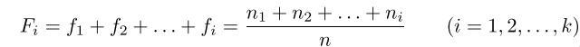
```

dove la generica $F_i$ rappresenta la proporzione dei dati del campione minori o uguali di zi.
Una funzione di distribuzione empirica discreta risulta:
```{r distribuzioneFrequenzaEmpiricaDiscreta.jpg, fig.align="center", echo=FALSE}
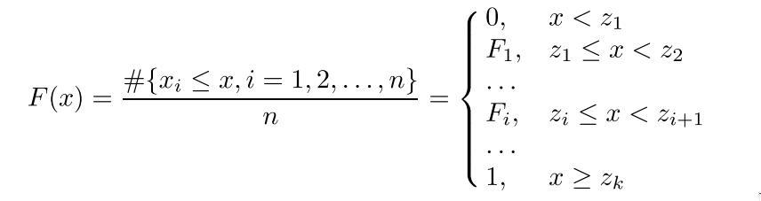
```

La funzione è definita per ogni x reale e ha diverse caratteristiche:

* È una funzione **a scalini non decrescente**
* In corrispondenza di ogni salto assume il valore a sinistra sull'asse delle ascisse
* La funzione vale:
  + **0** per ogni valore minore dell'osservazione minima
  + **1** per ogni valore maggiore dell'osservazione massima

R mette a disposizione la funzione ecdf() (**empirical cumulative distribution function**) che ci permette di disegnare il grafico della funzione e di determinare per ogni x reale il valore di tale funzione.

Dato che i valori contenuti nei nostri vettori sono tutti diversi, **la funzione non ci è molto di aiuto nella nostra indagine**.\
Vediamo un esempio di applicazione sul vettore relativo ai laureati per regione in Italia:
```{r plotEsempioDistribuzioneEmpDiscreta}
plot(
  ecdf(laurea),
  main="Funzione di distribuzione empirica discreta relativo alle lauree ",
  verticals = TRUE , col="red")
```

Nel caso si voglia sapere il valore della funzione in un dato punto x, R permette di farlo nel seguente modo:
```{r esempioEcdfValore}
ecdf(laurea)(17)
```

#### Funzione di distribuzione empirica continua

La funzione di distribuzione empirica continua viene invece utilizzata quando si lavora con **dati raccolti in classi**.
Infatti considerando la tipologia del nostro campione di dati è più opportuno suddividere le informazioni a disposizione in k distinte classi.
Anche in questo caso la funzione viene definita a partire dalle **frequenze relative cumulate**.\

La funzione di distribuzione empirica continua è dunque così definita:
```{r distribuzioneFrequenzaEmpiricaContinua.jpg, fig.align="center", echo=FALSE}
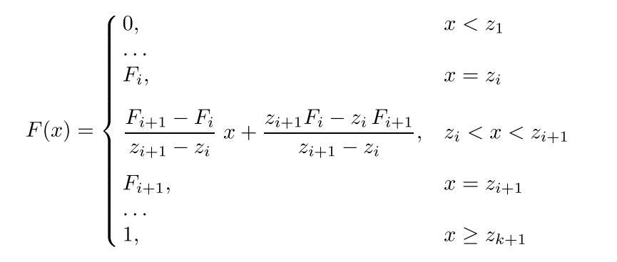
```
La funzione è definita per ogni x reale e:

* Vale **0** per ogni x minore di z1
* Vale **1** per ogni x maggiore o uguale a zk+1
* Se **zi < x < zi+1** coincide con il segmento che passa per i punti (zi, Fi) e (zi+1,Fi+1)
```{r segmentoDistEmpCopnt.jpg, fig.align="center", echo=FALSE}
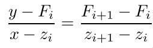
```

Introduciamo dunque le seguenti classi:\
**[0,5) [5,10) [10,15) [15,20) [20,25) [25,30) [30,35) [35,40) [40,45) [45,50)**
```{r classiDistrEmpCont}
classiDistrEmpCont <-c(0, 5, 10, 15, 20, 25, 30, 35, 40, 45, 50)
```

Descriviamo ora come ottenere il grafico della funzione di distribuzione empirica continua per quanto riguarda la licenza elementare:

```{r Funzione di distribuzione empirica continua licenza elementare}
FrequenzaCumulateLicEle <- cumsum (table (
  cut(licenza_elementare_o_nessuno ,
  breaks =classiDistrEmpCont ,
  right =FALSE )))/length (licenza_elementare_o_nessuno)

FrequenzaCumulateLicEle <- c(0,FrequenzaCumulateLicEle)
plot(classiDistrEmpCont , 
     FrequenzaCumulateLicEle , type = "b", axes = FALSE , 
     main = "Funzione di distribuzione empirica continua licenza elementare",
     col="red", xlab = "Classi", ylab = "Frequenze cumulate")
axis(1, classiDistrEmpCont, cex.axis=0.80)
axis(2, format (FrequenzaCumulateLicEle , digits = 2), cex.axis=0.80)
box ()
```

È possibile notare dal grafico come ci sia una forte concentrazione dei dati, il **65%** dei dati è nelle prime due classi, e l'unità si raggiunge velocemente in quelle successive.

Procediamo con i grafici per ogni altra variabile.

```{r Funzione di distribuzione empirica continua licenza media, echo=FALSE}
FrequenzaCumulateLicEle <- cumsum (table (cut(licenza_media ,breaks =classiDistrEmpCont ,right =FALSE )))/length (licenza_media)
FrequenzaCumulateLicEle <- c(0,FrequenzaCumulateLicEle)
plot(classiDistrEmpCont , 
     FrequenzaCumulateLicEle , type = "b", axes = FALSE , 
     main = "Funzione di distribuzione empirica continua licenza media ",
     col="green", xlab = "Classi", ylab = "Frequenze cumulate")
axis(1, classiDistrEmpCont, cex.axis=0.80)
axis(2, format (FrequenzaCumulateLicEle , digits = 2), cex.axis=0.80)
box ()
```

I dati sono concentrati principalmente verso le ultime classi, i primi valori si riscontrano nella classe [25,30).
In generale abbiamo percentuali mediamente molto alte.

```{r Funzione di distribuzione empirica continua diploma, echo=FALSE}
FrequenzaCumulateLicEle <- cumsum (table (cut(diploma ,breaks =classiDistrEmpCont ,right =FALSE )))/length (diploma)
FrequenzaCumulateLicEle <- c(0,FrequenzaCumulateLicEle)
plot(classiDistrEmpCont , 
     FrequenzaCumulateLicEle , type = "b", axes = FALSE , 
     main = "Funzione di distribuzione empirica continua diploma",
     col="blue", xlab = "Classi", ylab = "Frequenze cumulate")
axis(1, classiDistrEmpCont, cex.axis=0.80)
axis(2, format (FrequenzaCumulateLicEle , digits = 2), cex.axis=0.80)
box ()
```

Analogamente alla prima situazione anche qui l'unità si raggiunge subito e c'è una concentrazione di dati nelle prime classi: addirittura con le prime due classi copriamo **l'80%** dei dati.

```{r Funzione di distribuzione empirica continua maturita, echo=FALSE}
FrequenzaCumulateLicEle <- cumsum (table (cut(maturita ,breaks =classiDistrEmpCont ,right =FALSE )))/length (maturita)
FrequenzaCumulateLicEle <- c(0,FrequenzaCumulateLicEle)
plot(classiDistrEmpCont , 
     FrequenzaCumulateLicEle , type = "b", axes = FALSE , 
     main = "Funzione di distribuzione empirica continua maturità",
     col="red", xlab = "Classi", ylab = "Frequenze cumulate")
axis(1, classiDistrEmpCont, cex.axis=0.80)
axis(2, format (FrequenzaCumulateLicEle , digits = 2), cex.axis=0.80)
box ()
```

I dati sono concentrati principalmente verso le ultime classi, le percentuali sono **mediamente molto alte**.

```{r Funzione di distribuzione empirica continua laurea, echo=FALSE}
FrequenzaCumulateLicEle <- cumsum (
  table (
    cut(laurea ,breaks =classiDistrEmpCont ,right =FALSE )))/length (laurea)
FrequenzaCumulateLicEle <- c(0,FrequenzaCumulateLicEle)
plot(classiDistrEmpCont , 
     FrequenzaCumulateLicEle , type = "b", axes = FALSE , 
     main = "Funzione di distribuzione empirica continua laurea",
     col="green", xlab = "Classi", ylab = "Frequenze cumulate")
axis(1, classiDistrEmpCont, cex.axis=0.80)
axis(2, format (FrequenzaCumulateLicEle , digits = 2), cex.axis=0.80)
box ()
```

Il grafico si differenzia dagli altri per raggiungere l'unità nelle classi centrali, i dati sono **molto più centrati rispetto agli altri** dove abbiamo visto una concentrazione nelle classi iniziali e quelle finali, qui invece la **concentrazione è in quelle centrali**.

### Indici di sintesi

Gli indici di sintesi sono necessari per **sintetizzare e classificare specifiche osservazioni** sui dati che abbiamo.\
Per avere una visione d'insieme dei nostri dati e ricavare informazioni quanto più complete possibili è preferibile che gli **indici di sintesi vadano osservati assieme**.

Vediamo dunque attraverso i boxplot dei nostri vettori quali sono le caratteristiche delle loro distribuzioni di frequenza: possiamo comprenderne la **forma e se i dati risultano molto variabili o meno**.

Nel seguente grafico riportiamo tutti i boxplot osservati:

```{r confronto boxplot, echo=FALSE}
layout(matrix(c(rep(1,3),rep(2,3),rep(3,3),rep(4,4),0,rep(5,4)), nrow = 2, ncol = 9, byrow = TRUE))
boxplot (licenza_elementare_o_nessuno ,horizontal =TRUE ,col="red",main="Boxplot licenza elementare")
boxplot (licenza_media ,horizontal =TRUE ,col="blue",main="Boxplot licenza media ")
boxplot (diploma ,horizontal =TRUE ,col="brown ",main="Boxplot diploma")
boxplot (maturita ,horizontal =TRUE ,col="magenta ",main="Boxplot maturità")
boxplot (laurea ,horizontal =TRUE ,col="green ",main="Boxplot  laurea")
box()
```

In tutti i grafici notiamo una certa asimmetria: la più marcata è nel primo boxplot relativo alla percentuale della licenza elementare, mentre quello più regolare sembra essere quello relativo alle lauree.\

Gli indici che introdurremo nel seguito servono a misurare quantitativamente alcune delle caratteristiche che si possono intuire nei grafici delle distribuzioni di frequenza e nei box plot.

#### Media campionaria
Supponiamo di avere un campione di numerosità N con valori x1,x2 ... xn.\
Definiamo la media campionaria come la **media aritmetica** di questi valori:

```{r mediaCampionaria.jpg, fig.align="center", echo=FALSE}
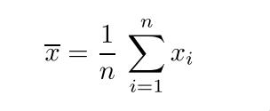
```
La media campionaria ha diverse proprietà:

* Gode della **proprietà di linearità**:
```{r linearitaMediaCamp.jpg, fig.align="center", echo=FALSE}
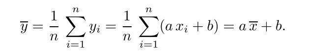
```
* È una **media pesata dei valori distinti assunti** dai dati dove ogni valore distinto usa come peso la **frequenza**:
```{r mediaCampComeMediaPesataFreq.jpg, fig.align="center", echo=FALSE}
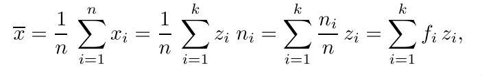
```

* La somma algebrica degli scarti della media campionaria è sempre **nulla**:
```{r sommaScartiCampionariNulla.jpg, fig.align="center", echo=FALSE}
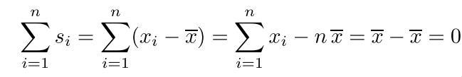
```

* La media è **influenzata da tutti i dati** e in particolar modo da valori particolarmente grandi o piccoli, cioè da **valori anomali**

R ci mette a disposizione la funzione mean() per calcolare la media campionaria dei nostri dati.\
Applichiamo questa funzione ad ogni vettore che compone il nostro campione:

```{r mediaCampionariaElementari}
mediaCampionariaElementari <- mean(licenza_elementare_o_nessuno)
mediaCampionariaElementari
```

```{r mediaCampionariaMedie}
mediaCampionariaMedie <- mean(licenza_media)
mediaCampionariaMedie
```

```{r mediaCampionariaDiploma}
mediaCampionariaDiploma <- mean(diploma)
mediaCampionariaDiploma
```

```{r mediaCampionariaMaturita}
mediaCampionariaMaturita <- mean(maturita)
mediaCampionariaMaturita
```

```{r mediaCampionariaLaurea}
mediaCampionariaLaurea <- mean(laurea)
mediaCampionariaLaurea
```

#### Mediana campionaria

Un altro indice di posizione è la **mediana**.\
Data una distribuzione di un carattere quantitativo oppure qualitativo ordinabile si definisce mediana (o valore mediano) il **valore che separa la metà più grande e la metà più piccola di un campione di dati**, cioè il valore che si trova **nel mezzo della distribuzione**.

I passi per calcolare la mediana sono i seguenti:

* Si ordinano gli n elementi in **ordine crescente**
* Se il numero di dati è **dispari** la mediana corrisponde al valore $\frac{n+1}{2}$
* Se il numero di dati è **pari** allora la mediana è calcolato come la media aritmetica dei valori alla posizione $\frac{n}{2}$ e alla posizione $\frac{n}{2}+1$


È importante notare come la mediana campionaria **dipenda solo da uno o due valori** e quindi **non risente degli estremi**.

In R per calcolare la mediana abbiamo a disposizione la funzione median().\
Calcoliamola dunque per i nostri vettori:

```{r medianaElementari}
medianaElementari <- median(licenza_elementare_o_nessuno)
medianaElementari
```

```{r medianaMedie}
medianaMedie <- median(licenza_media)
medianaMedie
```

```{r medianaDiploma}
medianaDiploma <- median(diploma)
medianaDiploma
```

```{r medianaMaturita}
medianaMaturita <- median(maturita)
medianaMaturita
```

```{r medianaLaurea}
medianaLaurea <- median(laurea)
medianaLaurea
```

Visualizziamo in forma tabellare i risultati:

```{r tabella media e mediana, echo=FALSE}
library(gridExtra)
library(grid)

TSpecial <- ttheme_minimal(
  core=list(bg_params = list(fill = blues9[1:4], col=NA),
            fg_params=list(fontface=3)),
  colhead=list(fg_params=list(col="olivedrab", fontface=4L)),
  rowhead=list(fg_params=list(col="orangered4", fontface=3L)))

matriceMedieMediane <- cbind(c(mediaCampionariaElementari,medianaElementari),
                         c(mediaCampionariaMedie,medianaMedie),
                         c(mediaCampionariaDiploma,medianaDiploma),
                         c(mediaCampionariaMaturita,medianaMaturita),
                         c(mediaCampionariaLaurea,medianaLaurea))

rownames(matriceMedieMediane) <- c("Media","Mediana")
colnames(matriceMedieMediane) <- titoli
outputMatrix <- tableGrob(matriceMedieMediane, theme=TSpecial)
grid.draw(outputMatrix)
```

Dalla tabella notiamo che il calcolo della media e della mediana ha **prodotto risultati simili per ciascuna categoria**, ad esempio il vettore laurea dà praticamente lo stesso risultato per media e mediana, mentre per la prima variabile vediamo la differenza maggiore.\
Confrontare media e mediana è utile poiché se queste misure sono simili, come nel nostro caso, la **distribuzione di frequenza tende ad essere simmetrica**.\
Vedremo nel paragrafo in cui studiamo la forma della distribuzione se questa intuizione sarà verificata.

##### Mediana per una distribuzione di frequenza

Un altro modo per **definire la mediana è tramite le frequenze cumulative**.\
In questo caso la mediana viene definita come la modalità che soddisfa la doppia disuguaglianza:

```{r medianaFrequenzaCumulativa.jpg, fig.align="center", echo=FALSE}
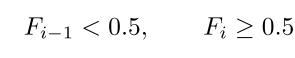
```

La mediana di una distribuzione di frequenza può essere individuata graficamente a partire dalla funzione di distribuzione empirica discreta continua, ad esempio:

```{r Esempio mediana funzione distribuzione empirica, echo=FALSE}

plot(classiDistrEmpCont , 
     FrequenzaCumulateLicEle , type = "b", axes = FALSE , 
     main = "Funzione di distribuzione empirica continua maturità",
     col="red", xlab = "Classi", ylab = "Frequenze cumulate")
FrequenzaCumulateLicEle <- c(0.50,FrequenzaCumulateLicEle)
axis(1, classiDistrEmpCont, cex.axis=0.80)
axis(2, format (FrequenzaCumulateLicEle , digits = 2), cex.axis=0.80)
box ()

abline (h=0.5, lty =2, col ="blue")
```

#### Moda campionaria

La moda identifica la **modalità che si presenta con la maggiore frequenza** (assoluta o relativa) in un campione. Se ci sono più modalità con frequenza massima, ciascuna viene definita come **valore modale**.\
Sulla moda c'è da dire che questa, a differenza di media e mediana, **può essere calcolata anche quando si ha a che fare con dati di tipo qualitativo**.\
Nel nostro caso è **inutile calcolarla** in quanto abbiamo a che fare con percentuali.

Infine sottolineiamo che media, mediana e moda sono detti indici di posizione centrale poiché **descrivono attorno a quali valori è centrato l'insieme di dati**.

#### Quantili
Sono definiti come indici di sintesi di posizione non centrali.\
I quantili **dividono l'insieme dei dati in un fissato numero di parti uguali**.\
Definiamo i quantili in base a come viene suddiviso l'insieme dei dati:

* Se l'insieme dei dati viene suddiviso in 100 parti mediante 99 quantili si parla di **percentili**
* Se l'insieme dei dati viene suddiviso in 10 parti mediante 9 quantili si parla di **decili**
* Se l'insieme dei dati viene suddiviso in 4 parti mediante 3 quantili si parla di **quartili**

Ovviamente sia quartili che decili sono un caso particolare dei percentili.

In R esistono 9 algoritmi per calcolare i quantili utilizzando la funzione quantile() e specificando il parametro type con un numero nell'insieme {1 ... 9}. R utilizza di default l'algoritmo di tipo 7. Ad ogni modo **se il numero di osservazioni è elevato, i valori calcolati dagli algoritmi tendono a coincidere**.\

I percentili maggiormente utilizzati sono il 25-esimo, il 50-esimo e il 75-esimo detti rispettivamente **primo quartile (Q1), secondo quartile (Q2), terzo quartile (Q3)**.\

Vediamo dunque il calcolo dei quartili per il vettore laurea come cambia anche in base al tipo di algoritmo scelto: 
```{r}
quantile(laurea)
quantile(laurea, type = 2)
quantile(laurea, type = 1)
```

#### Varianza e deviazione standard campionaria
Gli indici di posizione sono importanti, ma le informazioni che ci danno non tengono conto della **variabilità dei dati**: può capitare di avere a che fare con distribuzioni di frequenza molto diverse tra di loro ma che presentano la stessa media campionaria ad esempio.\
È dunque importante arricchire l'indagine su un dato campione di dati con degli **indici per capaci di misurare la variabilità dei dati**.\

Introduciamo dunque la **varianza campionaria** e la **deviazione standard campionaria**.\

La varianza campionaria è indicata con $s^2$ ed è definita:

```{r varianzaCampionaria.jpg, fig.align="center", echo=FALSE}
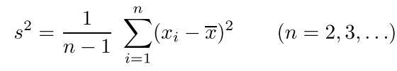
```

La deviazione standard è invece indicata con $s$ ed è definita come la radice quadrata della varianza campionaria:

```{r deviazioneStandardCampionaria.jpg, fig.align="center", echo=FALSE}
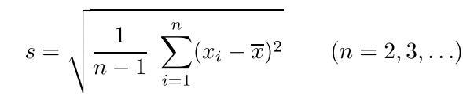
```

Varianza e deviazione standard sono detti indici di dispersione in quanto misurano la **dispersione dei dati intorno alla media**.\
La deviazione standard ha la stessa unità di misura dei valori osservati, mentre la varianza ha come unità di misura il quadrato dell'unità di misura dei valori di riferimento.

La deviazione standard viene detta anche **scarto quadratico medio** per come è definita.

Le proprietà della varianza sono le seguenti:

* **Non gode della proprietà di linearità**
* Sommare una costante a ciascuno dei dati non fa cambiare la varianza
* Moltiplicare i dati del campione per un fattore costante fa sì che la varianza campionaria risulti **moltiplicata per il quadrato di tale fattore**

Il valore della varianza è 0 quando tutti i valori sono uguali tra loro e **risulta essere più grande tanto più le osservazioni si discostano dalla media**.

In R per calcolare la varianza campionaria usiamo il comando var(), mentre per calcolare la deviazione standard usiamo la funzione sd().\
Valutiamo quindi quanto si disperdono i nostri dati rispetto alla media.\
Calcoliamo prima la varianza per ogni categoria:
```{r varianze vettori}
varianzaElementari <- var(licenza_elementare_o_nessuno)
varianzaElementari

varianzaMedie <- var(licenza_media)
varianzaMedie

varianzaDiploma <- var(diploma)
varianzaDiploma

varianzaMaturita <- var(maturita)
varianzaMaturita

varianzaLaurea <- var(laurea)
varianzaLaurea
```

Calcoliamo adesso la deviazione standard:
```{r deviazioni standard vettori}
deviazioneStandardElementari <- sd(licenza_elementare_o_nessuno)
deviazioneStandardElementari

deviazioneStandardMedie <- sd(licenza_media)
deviazioneStandardMedie

deviazioneStandardDiploma <- sd(diploma)
deviazioneStandardDiploma

deviazioneStandardMaturita <- sd(maturita)
deviazioneStandardMaturita

deviazioneStandardLaurea <- sd(laurea)
deviazioneStandardLaurea
```

Questi indici di dispersione sono relativi ai singoli dati presi in considerazione, se vogliamo però confrontare le variazioni tra diversi insiemi di dati si utilizza il **coefficiente di variazione**.

#### Coefficiente di variazione
Il coefficiente di variazione è definito come il rapporto tra la **deviazione standard campionaria e il modulo della media campionaria**:\

```{r coefficienteDiVariazioneFormula.jpg, fig.align="center", echo=FALSE}
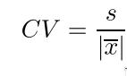
```

Il coefficiente di variazione è un **numero puro**, è un indice adimensionale, cioè non dipende dall’unità di misura utilizzata (la media campionaria e la deviazione standard campionaria sono espressi in identiche unità di misura).\
È facile capire che il coefficiente di variazione ha senso che sia calcolato solo con campioni con **media campionaria non nulla**.\
**Non dobbiamo guardare alla varianza in senso assoluto, ma dobbiamo confrontarla con la media per fare una buona valutazione**.

Nel nostro caso è importante guardare al coefficiente di variazione perché ci interessa confrontare insiemi che hanno **differenti range di variazione**, cioè insiemi in cui la differenza tra il massimo e il minimo è molto diversa.

Il coefficiente risulta essere **sempre maggiore di 0**, ma **se compreso tra 0 e 1 vuol dire che la media è più grande della deviazione standard**.\
Invece più è grande più c'è dispersione nei dati e quindi il valore medio non è molto significativo.

Dato che in R non c'è una funzione per calcolare il coefficiente di variazione, introduciamo la seguente funzione:
```{r funzione per calcolare il coefficiente di variazione}
cv <- function (x){
        sd(x)/abs(mean(x))
      }
```

Utilizziamo quindi la funzione per ricavare l'indice per i nostri vettori:
```{r calcolo coefficienti di variazione}
cvElementare <- cv(licenza_elementare_o_nessuno)
cvMedie <- cv(licenza_media)
cvDiploma <- cv(diploma)
cvMaturita <- cv(maturita)
cvLaurea <- cv(laurea)
```

Utilizziamo quindi la seguente tabella per avere un quadro totale degli indici ricavati per fare le nostre opportune analisi, in ordine di riga sono **riportate media, varianza, deviazione standard e coefficiente di variazione**:

```{r matriceIndiciDispersione, echo = FALSE}
matriceIndiciDispersione <- cbind(c(mediaCampionariaElementari,varianzaElementari,deviazioneStandardElementari,cvElementare),
                         c(mediaCampionariaMedie,varianzaMedie,deviazioneStandardMedie,cvMedie),
                         c(mediaCampionariaDiploma,varianzaDiploma,deviazioneStandardDiploma,cvDiploma),
                         c(mediaCampionariaMaturita,varianzaMaturita,deviazioneStandardMaturita,cvMaturita),
                         c(mediaCampionariaLaurea,varianzaLaurea,deviazioneStandardLaurea,cvLaurea))

rownames(matriceIndiciDispersione) <- c("Media","Varianza","Deviazione Standard", "Coefficiente di Variazione")
colnames(matriceIndiciDispersione) <- titoli
outputMatrix <- tableGrob(format (matriceIndiciDispersione , digits = 2), theme=TSpecial)
grid.draw(outputMatrix)
```

Dalla tabella notiamo come il coefficiente di variazione è minore per le variabili relative ai titoli medie, maturità e laurea, mentre è decisamente più alto per nessun titolo e soprattutto **diploma** dove si nota la variazione più grande tra i dati.

### Forma della distribuzione di frequenza

Gli indici trattati fino ad ora ci permettono già di intuire quale sia la forma della distribuzione di frequenza. Grazie ai dati sulla media e la mediana possiamo dire se c'è uno sbilanciamento verso destra o sinistra, vedendo se i valori differiscono e come differiscono, mentre con la moda possiamo dire se c'è un picco nella funzione, o più picchi.\
Introduciamo formalmente ora gli indici che permettono di misurare la **simmetria della funzione di distribuzione e la piccatezza**: **skewness e curtosi campionaria**.\

#### Skewness

Dato un insieme di dati numerici, si definisce skewness:

```{r skewness.jpg, fig.align="center", echo=FALSE}
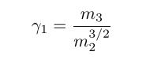
```

dove $m_j$ è il momento centrato campionario definito: 

```{r momentoCentratoCampionario.jpg, fig.align="center", echo=FALSE}
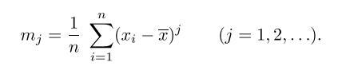
```


In base al valore della skewness abbiamo che:

* Se $\gamma1 = 0$, la distribuzione di frequenza è **simmetrica**
* Se $\gamma1 > 0$, la distribuzione di frequenza ha la **coda di destra più allungata per l’asimmetria positiva**
* Se $\gamma1 < 0$, la distribuzione di frequenza ha la **coda di sinistra più allungata per l’asimmetria negativa**

Definiamo una funzione per calcolare l'indice:

```{r funzione skewness}
skw <-function (x){
  n<-length (x)
  m2 <-(n -1)*var(x)/n
  m3 <- (sum( (x-mean(x))^3))/n
  m3/(m2 ^1.5)
}
```

E calcoliamo i valori:
```{r skewness vettori}
skw(licenza_elementare_o_nessuno)
skw(licenza_media)
skw(diploma)
skw(maturita)
skw(laurea)
```

Notiamo che l'indice non è mai pari a 0, quindi non c'è mai simmetria.\
Se guardiamo attentamente i risultati notiamo come il vettore maturità mantenga la simmetria maggiore avvicinandosi allo 0, mentre tutti gli altri hanno una distribuzione che presenta una forte **asimmetria positiva** e quindi la coda è allungata verso destra.

#### Curtosi

L'indice di curtosi invece permette di misurare la **densità dei dati intorno alla media** ed è definita:

```{r indiceCurtosi.jpg, fig.align="center", echo=FALSE}
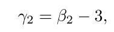
```

dove $\beta2$ è : 

```{r beta2.jpg, fig.align="center", echo=FALSE}
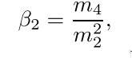
```

Quello che facciamo tramite l'indice di curtosi è confrontare la distribuzione di frequenza dei nostri dati con una **densità di probabilità normale** caratterizzata da $\beta_2 = 3$ e indice di curtosi $\gamma_2 = 0$.\

Risulta quindi:

* $\beta_2 < 3$, $\gamma_2 < 0$: la distribuzione di frequenza si definisce **platicurtica**, ossia la distribuzione di frequenza è **più piatta** di una normale
* $\beta_2 > 3$, $\gamma_2 > 0$: la distribuzione di frequenza si definisce **leptocurtica**, ossia la distribuzione di frequenza è **più piccata** di una normale
* $\beta_2 = 3$, $\gamma_2 = 0$: la distribuzione di frequenza si definisce **normocurtica**, ossia segue la curva di una normale


Definiamo quindi la funzione per calcolare l'indice nel seguente modo:
```{r funzione curtosi}
curt <-function (x){
  n<-length (x)
  m2 <-(n-1)*var (x)/n
  m4 <- (sum( (x-mean(x))^4) )/n
  m4/(m2^2) -3
}
```

E calcoliamo i valori:
```{r curtosi vettori}
curt(licenza_elementare_o_nessuno)
curt(licenza_media)
curt(diploma)
curt(maturita)
curt(laurea)
```

La curtosi risulta quindi negativa per la prima, la quarta e la quinta categoria, cioè **platicurtica**.
Negli altri due casi è invece **leptocurtica**, anche se c'è da notare che il vettore licenza media si avvicina ad avere una forma normale.

\newpage

## Statistica descrittiva Bivariata

Parliamo di statistica bivariata quando si va a confrontare e a studiare contemporaneamente **due caratteri** di una determinata popolazione.\
Quello che ci interessa fare è dunque **verificare e classificare le relazioni** esistenti tra caratteri quantitativi relativi alla stessa unità statistica.

Prima di tutto è opportuno definire uno scatterplot in cui ogni coppia di osservazioni è rappresentata nel piano euclideo, andando così a formare una nuvola di punti. Sull'ascisse viene posta quella che è definita **variabile indipendente**, mentre sulle ordine viene posta quella che viene definita **variabile dipendente**, e si disegnano dei punti in corrispondenza delle coppie $(x_i,y_i)$.\
Lo scopo di questo grafico è quello di far risaltare **eventuali pattern che legano le coppie di variabili**, sia a riguardo alla **forma** che alle **relazioni tra le categorie analizzate**.

Come già anticipato nel capitolo precedente, l'analisi verrà fatta prendendo in analisi le due categorie del nostro dataset relative alla percentuale di individui che hanno ottenuto al più la **licenza media e alla percentuale di chi ha conseguito una laurea** per ciascuna regione.

Di questi due vettori abbiamo già conoscenza degli indici di sintesi, che riportiamo di seguito:

```{r indiciVettoriMedLau, echo = FALSE}
indiciVettoriMedLau <- cbind(c(medianaMedie, mediaCampionariaMedie,deviazioneStandardMedie),
                                  c(medianaLaurea,mediaCampionariaLaurea,deviazioneStandardLaurea))

rownames(indiciVettoriMedLau) <- c("Mediana","Media","Deviazione Standard")
colnames(indiciVettoriMedLau) <- c("Medie","Laurea")
outputMatrix <- tableGrob(format (indiciVettoriMedLau , digits = 2), theme=TSpecial)
grid.draw(outputMatrix)
```

Mentre lo scatterplot relativo ai due vettori è il seguente, indicando anche mediana e media campionaria:

```{r scatterplot medie e laurea, echo=FALSE}
plot(licenza_media,laurea, 
main = "Percentuale conseguimento medie in funzione percentuale laureati", 
xlab = "Percentuale medie", ylab = "Percentuale laurea", col = "red")
abline (v=medianaMaturita,lty =1, col="magenta ")
abline (v=mediaCampionariaMaturita,lty =2, col="blue")
abline (h=medianaLaurea,lty =1, col="magenta ")
abline (h=mediaCampionariaLaurea,lty =2, col="blue")
legend (29,25,c("Mediana ","Media"),pch =0, col =c("magenta ","blue"),cex =1)
```

Dal grafico notiamo che i dati sembrano posizionati intorno ad una **retta discendente** e questo ci porta a pensare che tra i due caratteri ci sia una **correlazione lineare negativa**.

### Covarianza campionaria

Continuiamo l'indagine sulla dipendenza delle nostre variabili e lo facciamo introducendo una nuova **misura quantitativa** che descrive la correlazione, cioè la **covarianza campionaria** definita come di seguito:

```{r covarianzaCampionaria.jpg, fig.align="center", echo=FALSE}
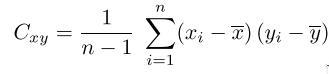
```

Da questa definizione notiamo che il prodotto interno alla sommatoria sarà **positivo per le osservazioni $(x_i,y_i)$ in cui le componenti della coppia sono o entrambe maggiori della media campionaria della variabile di cui fanno parte o entrambe minori**; il prodotto invece sarà **negativo** negli altri casi, cioè quando **una parte della coppia risulta essere maggiore e l'altra minore**.\

Un'altra cosa da notare è che nella definizione la sommatoria viene divisa per $n-1$ e questo viene fatto per **normalizzarla** in quanto nel caso in cui le variabili x e y siano uguali **si ottiene la varianza campionaria**.

La covarianza può assumere i seguenti valori:

* Se $C_{xy} > 0$ le variabili sono **correlate positivamente**
* Se $C_{xy} < 0$ le variabili sono **correlate negativamente**
* Se $C_{xy} = 0$ le variabili considerate **non risultano essere correlate tra loro**, ciò vuol dire che i punti all’interno dello scatterplot sono tutti **sparsi**

Quando la covarianza campionaria assume valori positivi quindi quello che ci si aspetta è che i **cambiamenti della prima variabile siano corrispondenti anche nella seconda** (se una cresce anche l'altra lo fa, se una decresce anche l'altra lo fa); non c'è concordanza invece in una covarianza negativa.\
Una covarianza nulla invece indica che i dati non sono in relazione diretta tra loro.

Tra le proprietà della covarianza campionaria quindi abbiamo:

* $Cov(x,y) = Cov(y,x)$
* $Cov(x,x) = var(x)$

Calcoliamo la covarianza tra le nostre variabili con il comando cov() fornitoci da R:
```{r covarianza medie e laurea}
covarianzaMedLau <- cov(licenza_media,laurea)
covarianzaMedLau
```

La covarianza risulta, come avevamo previsto, **negativa** e questo indica che i due vettori sono correlati negativamente.
Un problema della covarianza che ha come unità di misura: unità variabile x $\cdot$ unità variabile y.\
Solitamente si preferisce utilizzare qualcosa che faccia **perdere le unità di misura**, per questo motivo introduciamo il **coefficiente di correlazione campionaria**.

### Coefficiente di correlazione campionario

Un altro indice quantitativo della correlazione tra le variabili è il **coefficiente di correlazione campionario** che misura quanto è forte il legame di natura **lineare** tra le variabili considerate. Il coefficiente ci indica se e come i punti sono posizionati attorno ad una **retta interpolante**, o se c'è una **retta che allinea tutti i punti**, e dunque non è possibile con questo coefficiente individuare **relazioni curvilinee**.\
È definito nel seguente modo:

```{r coefficienteDiCorrelazione.jpg, fig.align="center", echo=FALSE}
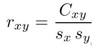
```

Il coefficiente di correlazione ha le seguenti caratteristiche:

* Prende valore tra **-1 e 1**
* È un **numero puro** senza dimensione
* Può essere calcolato solo se **entrambe le variabili sono quantitative**
* È fortemente influenzato da **valori anomali**

Il coefficiente di correlazione ha lo **stesso segno della covarianza**, e come precedentemente il segno ci dice se le variabili sono correlate positivamente, negativamente o non correlate.

Sul coefficiente di correlazione c'è da dire che:

1. se esistono due numeri reali $a$ e $b$, con $a > 0$, tali che $y_i = a x_i+b$ per ogni $i = 1, 2, .. , n$, allora $r_{xy} = 1$
2. se esistono due numeri reali $a$ e $b$, con $a < 0$, tali che $y_i = a x_i+b$ per ogni $i = 1, 2, .. , n$, allora $r_{xy} = -1$
3. se esistono quattro numeri reali $a$, $b$, $c$ e $d$, tali che $z_i = a x_i + b$ e $w_i =c y_i + d$ per  $i = 1, 2, .. , n$, allora $r_{zw} = r_{xy}$ se $ac > 0$ e $r_{zw} = -r_{xy}$ se invece $ac < 0$.

Il punto 1 e il 2 dimostrano che i valori limite -1 e +1 sono effettivamente raggiunti solo quando tra **X e Y sussiste una relazione lineare**, ossia quando i punti dello scatterplot **giacciono tutti su di una retta**.\
Il punto 3 invece ci dice che il quadrato del coefficiente non cambia se sommiamo o moltiplichiamo costanti a tutti i valori di x e/o y.\

In R possiamo calcolare il coefficiente di correlazione con la funzione Cor(), vediamolo:
```{r coefficienteCorrelazioneMedLau}
coefficienteCorrelazioneMedLau <- cor(licenza_media,laurea)
coefficienteCorrelazioneMedLau
```

Vediamo come il coefficiente di correlazione è negativo e prossimo a **-0.8**, questo ci indica una decisa **correlazione lineare con una retta discendente** tra i vettori presi in considerazione.

```{r rettaRegressione medie laurea}
plot(licenza_media ,laurea ,main="Retta di regressione ",
     xlab="Licenza media",ylab="Laurea", col ="red") 
abline (lm(laurea~licenza_media ), col="blue")
```

Trattiamo più nel dettaglio dunque il concetto di regressione lineare.

### Regressione lineare

In statistica si parla di regressione lineare indicando un approccio che modella le relazioni tra una variabile detta dipendente e una o più variabili dette indipendenti.\
Il caso in cui la variabile indipendente sia una sola è detto **regressione lineare semplice**, mentre quando ci sono più variabili indipendenti abbiamo a che fare con la **regressione lineare multipla**.\
Nella regressione lineare le relazioni sono modellate usando funzioni di predizione lineare i cui parametri del modello sono stimati dai dati. Questi modelli sono detti **modelli lineari**.

### Regressione lineare semplice

Il **modello di regressione lineare semplice** è esprimibile attraverso l'**equazione di una retta che riesce meglio di qualunque altra ad interpolare la nuvola di punti**.\
Data dunque l'equazione $$Y = \alpha + \beta X$$ dove:

1. $\alpha$ è l'**intercetta**, cioè indica l'ordinata con la quale la retta di regressione si interseca con l'asse delle ordinate 
2. $\beta$ è il **coefficiente angolare**, cioè indica la _**"pendenza"**_ della retta. 
  + Se positivo allora la retta di regressione è crescente
  + Se negativo allora la retta di regressione è discendente
  + Se nullo allora la retta di regressione è orizzontale

Questa retta viene ottenuta con il  **metodo dei minimi quadrati**.\
Per calcolare i coefficienti di regressione è necessario considerare la **somma Q dei quadrati degli errori** 
$$Q = \sum_{i=1}^n [y_i - (\alpha + \beta x_i)]^2 $$
e minimizzarla.
Quindi la variabile dipendente y viene "spiegata" attraverso una **relazione lineare della variabile indipendente x**  (cioè: $\alpha + \beta x$).\
Il problema della regressione si traduce nella determinazione di $\alpha$ e $\beta$ in modo da esprimere al meglio la relazione funzionale tra y e x.\
Derivando Q rispetto $\alpha$ e $\beta$ e ponendo le derivate parziali ottenute a 0, il metodo dei minimi quadrati conduce a: $$\beta = \frac{S_y}{S_x}r_{xy}, \qquad \qquad \alpha = \overline{y} - \beta \overline{x}$$

Notiamo come il coefficiente di correlazione influenza fortemente $\beta$ e se quest'ultimo è 0, allora la retta è **orizzontale**.

Possiamo quindi calcolare $\alpha$ e $\beta$ con le seguenti linee di codice:
```{r calcolo beta e alpha}
beta <-(sd(laurea )/sd(licenza_media ))*cor(licenza_media ,laurea)
alpha <-mean(laurea)-beta*mean(licenza_media)
c(alpha ,beta)
```
$\beta$ risulta negativa e infatti la nostra retta è **discendente**. Con $\alpha$ invece riusciamo a stimare dove la retta di regressione intercetta l'asse delle y.

Lo stesso risultato ci viene restituito dalla funzione **lm(y~x)** fornita da R in cui gli argomenti indicano che **y dipende da x**.\
Vediamo dunque:
```{r linear model MedLau}
linearModel <- lm(laurea~licenza_media)
linearModel
```
Linear model ci restituisce anche altre informazioni:
```{r}
attributes(linearModel)
```
È presente ovviamente l'attributo coefficients che ci restituisce i coefficienti di regressione:
```{r coefficienti di regressione}
linearModel$coefficients
```

La retta di regressione ha quindi equazione: $$y = 35.75439 - 0.52074x$$

#### Residui

Dopo aver trovato la retta di regressione, possiamo osservare qual è il **discostamento tra i valori osservati** (le coppie $(x_i,y_i)$) e i **valori stimati** (le coppie $(x_i,\hat{y_i})$).\

I valori stimati sono espressi secondo l'equazione $$\hat{y_i} = \alpha + \beta  x_i$$ ottenuti mediante la retta di regressione.
Risulta inoltre che la **media campionaria dei valori stimati è uguale alla media campionaria dei valori osservati**.

I residui sono dunque definiti come $$E_i = y_i - \hat{y_i} = y_i - (\alpha + \beta x_i)$$ e mostrano di quanto si discostano valori osservati e valori stimati.

Si nota sui residui:

* La media campionaria dei residui risulta sempre **nulla**
* La varianza dei residui è $S_E^2 = \frac{1}{n-1}\sum_{i=1}^n E_i^2$ **in quanto la media campionaria è 0**

Per calcolare il **vettore dei valori stimati** utilizziamo la funzione fitted(),passando come argomento lm(y~x):
```{r valori stimati}
valoriStimati <- fitted(lm(laurea~licenza_media))
valoriStimati
```
I valori stimati possono essere ottenuti anche attraverso l'attributo "fitted.values" di linear model:
```{r stime da linear model}
linearModel$fitted.values
```

Per calcolare i **residui** invece di usa la funzione resid() passando anche in questo caso lo stesso argomento:
```{r valori residui}
valoriResidui <- resid(lm(laurea~licenza_media))
valoriResidui
```
I residui possono essere ottenuti anche attraverso l'attributo "residuals" di linear model:
```{r residui da linear model}
linearModel$residuals
```

Dei residui possiamo calcolare **mediana, varianza e deviazione standard**, mentre non è possibile calcolare il coefficiente di variazione in quanto la media dei residui è 0.\
Vediamo dunque nel nostro caso:
```{r mediana varianza e deviazione standard residui}
median(linearModel$residuals)
var(linearModel$residuals)
sd(linearModel$residuals)
```

Rappresentiamo dunque graficamente i valori dei residui, vediamo tre possibili rappresentazioni:

1. aggiungiamo al grafico dello scatterpolot e la retta di regressione dei **segmenti verticali che visualizzano i residui**: congiungiamo i punti $(x_i,y_i)$) e i punti $(x_i,\hat{y_i})$

```{r residui segmenti grafico,echo=FALSE}
plot(licenza_media ,laurea ,main="Retta di regressione ", xlab="Licenza media",ylab="Laurea", col ="red") 
abline (lm(laurea~licenza_media ), col="blue")
segments(licenza_media,valoriStimati,licenza_media,laurea, col="magenta")
```

2. Usiamo un diagramma dei residui: un grafico in cui i valori dei residui sono posti sull'asse delle ordinate e quelli della variabile indipendente sull'asse delle ascisse
```{r diagramma dei residui, echo=FALSE}
plot(licenza_media ,valoriResidui , main="Diagramma  dei  residui ", xlab="Medie",ylab="Residui ",pch =13, col="red")
abline (h=0, col ="blue",lty =2)
```
Il diagramma dei residui aiuta a comprendere quale è l’**adattamento della retta di regressione rispetto ai dati**, consentendo di identificare quali sono le informazioni che hanno una forte **influenza sulla collocazione e direzione della retta di regressione**.\
Occorre notare che la posizione della retta di regressione è fortemente influenzata dalla presenza di eventuali valori anomali che si discostano in modo significativo dagli altri. 
L’analisi dei residui aiuta ad individuare eventuali **punti isolati** (valori anomali) dovuti ad errori nella stima. Tali valori possono perturbare significativamente la stima dei parametri di regressione e influenzare l’interpretazione dei residui. Eliminando i valori anomali la varianza campionaria dei residui diminuisce.

3. Rappresentare i residui standardizzati rispetto ai valori stimati. I residui standardizzati sono definiti: $$E_i^{(s)} = \frac{E_i - \overline{E}}{s_E} = \frac{E_i}{s_E}$$ caratterizzati da **media nulla e deviazione standard pari a 1**.

```{r residui standardizzati grafico, echo=FALSE}
residuiStandardizzati <- valoriResidui/sd(valoriResidui)
plot(valoriStimati ,residuiStandardizzati , main="Residui  standard  rispetto  ai valori  stimati ", xlab="Valori  stimati ",ylab="Residui  standard ",pch =5, col ="red")
abline (h=0, col ="blue",lty =2)
```

I punti indicano la **posizione dove si collocano i residui standardizzati rispetto ai valori stimati con la retta di regressione**. La retta orizzontale è posizionata nello zero, che corrisponde alla media campionaria dei residui standardizzati. Anche in questo caso i **punti sono disposti quasi casualmente attorno alla linea orizzontale e non si evidenzia nessuna tendenza particolare nella distribuzione dei punti**.

#### Coefficiente di determinazione

Un altro indice da considerare è il **coefficiente di determinazione**, definito come:

```{r coefficienteDiDeterminazione.jpg, fig.align="center", echo=FALSE}
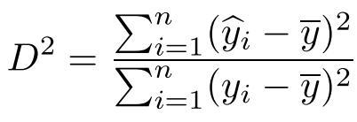
```

È definita cioè come il **rapporto tra varianza dei valori stimati** (con la retta di regressione) e **varianza dei valori osservati**.\

Il coefficiente varia tra 0 e 1:

* Vicino ad **1 significa che i punti tenderanno ad allinearsi lungo la retta di regressione**
* Vicino a **0 non c'è una retta capace di interpolare i punti**

Nel caso della regressione lineare semplice il coefficiente di determinazione è il **quadrato del coefficiente di correlazione**, cioè $$D^2 = r_{xy}^2$$

Per calcolarlo in R possiamo procedere nei due modi seguenti:
```{r calcolo coefficiente di determinazione}
(cor(licenza_media,laurea))^2

summary(linearModel)$r.square
```

### Regressione lineare multipla

Non è insolito avere dei casi in cui è opportuno e interessante avere più di una variabile indipendente, e in questi casi parliamo di **regressione lineare multipla**.

Vediamo dunque qual è la relazione tra la variabile dipendente che abbiamo scelto "laurea" e le altre variabili del nostro dataset.\
Le funzioni **cov()** e **cor()** applicate alla matrice che rappresenta il nostro campione forniscono due matrici di dimensione 5x5 i cui elementi sono rispettivamente le **covarianze e i coefficienti di correlazione di ogni coppia di variabili**.\
**Sulla diagonale nel primo caso avremo la varianza, mentre nel secondo 1**.
```{r covarianza dataset}
cov(matricePopolazionePerTitoloDiStudio)
```
```{r coefficiente di correlazione dataset}
cor(matricePopolazionePerTitoloDiStudio)

```

Notiamo che la correlazione più forte la otteniamo in corrispondenza di Laurea e Nessun titolo, e nel caso analizzato finora tra Laurea e Medie; mentre risultano poco correlate Nessun titolo e Maturità, ma anche Diploma e maturità. Notiamo inoltre che la maggior parte delle variabili sono **correlate tra loro negativamente**.

Riportiamo il grafico contenente tutti gli scatterplot per le coppie di variabili per dare una visione di insieme con i dati appena visti:

```{r scatterplot tutte le coppie_2, echo=FALSE}
pairs(matricePopolazionePerTitoloDiStudio, 
      main = "Scatterplot per tutte le coppie di variabili")
```

Il **modello di regressione lineare multipla** con p variabili è esprimibile con la seguente equazione: $$Y = \alpha + \beta_1X_1 + \beta_2X_2 + ... + \beta_pX_p$$ dove:

1. $\alpha$ è l'intercetta
2. $\beta_1, \beta_2 ,... , \beta_p$ sono i **regressori**. $\beta_i$ rappresenta **l'inclinazione di Y rispetto alla variabile $X_i$ tenendo costanti le altre variabili**

Anche qui per stimare i parametri di regressione ricorriamo al **metodo dei minimi quadrati**, bisogna minimizzare la quantità: $$Q = \sum_{i=1}^n [y_i - (\alpha + \beta_1x_{i,1} + \beta_2x_{i,2} + ... + \beta_px_{i,p})]^2$$

dove n è il numero delle osservazioni, $x_{1,j}, x_{2,j}, ... ,x_{n,j}$ sono i valori osservati dalla variabile $X_j$ e gli $y_i$ sono i valori osservati dalla variabile dipendente.\
**Derivando** rispetto ai parametri $\alpha,\beta_1,\beta_2, ...,\beta_p$ si scopre che: $$\alpha = \overline{y} - \beta_1\overline{x_1}- \beta_2\overline{x_2}- ... -\beta_p\overline{x_p}$$

In R per eseguire l'analisi di regressione lineare multipla usiamo sempre la funzione lm(y~x1 + x2 ... +xp), cioè y è la variabile dipendente da x1,x2 ...,xp.\
Vediamo dunque il codice:
```{r regressione lineare multipla calcolo}
linearModelMultiplo <- lm(
                        laurea~licenza_media+
                        licenza_elementare_o_nessuno+
                        diploma+
                        maturita)
linearModelMultiplo
```
Quindi l'intercetta $\alpha = 100.590$, mentre i regressori sono $\beta_1=-1.008, \beta_2=-1.009, \beta_3=-1.006, \beta_4=-1.007$ e il modello di regressione multipla risulta pertanto: $$y = 100.590 -1.008x_1 -1.009x_2-1.006x_3-1.007x_4$$
Notiamo che **tutti i regressori sono negativi**, questo significa che le altre variabili sono tutte **legate negativamente alla percentuale delle persone che si laureano**.

Anche in questo caso lm() restituisce una serie di attributi tra cui anche i coefficienti di regressione.

#### Residui

I residui come detto mostrano di **quanto si discostano i valori osservati da quelli stimati con la retta di regressione**.\
Sono definiti come $$E_i = y_i - \hat{y_i} = y_i - (\alpha + \beta_1 x_{i,1}+ \beta_2 x_{i,2}+...+ \beta_p x_{i,p})$$

In modo analogo con la regressione lineare semplice, si nota che:

* La media campionaria risulta sempre **nulla**
* La varianza dei residui è $S_E^2 = \frac{1}{n-1}\sum_{i=1}^n E_i^2$ dato che la media campionaria è 0

Per calcolare il vettore dei valori stimati utilizziamo la funzione fitted(),passando come argomento lm(y~x1 + x2 ... +xp):
```{r valori stimati multipla}
valoriStimatiMult <- fitted(linearModelMultiplo)
valoriStimatiMult
```
I valori stimati possono essere ottenuti anche attraverso l'attributo "fitted.values" di linear model:
```{r stime da linear model multiplo}
linearModelMultiplo$fitted.values
```

Per calcolare i residui invece di usa la funzione resid() passando anche in questo caso lo stesso argomento:
```{r valori residui multipla}
valoriResiduiMult <- resid(linearModelMultiplo)
valoriResiduiMult
```
I residui possono essere ottenuti anche attraverso l'attributo "residuals" di linear model:
```{r residui da linear model multiplo}
linearModelMultiplo$residuals
```

Dei residui possiamo calcolare **mediana, varianza e deviazione standard**, mentre non è possibile calcolare il coefficiente di variazione in quanto la media dei residui è 0.\
Vediamo dunque nel nostro caso:
```{r mediana varianza e deviazione standard residui multiplo}
median(linearModel$residuals)
var(linearModel$residuals)
sd(linearModel$residuals)
```

Anche nel caso multivariato è interessante calcolare i **residui standardizzati**:
```{r residui standardizzati regressione multipla}
residuiStandardizzatiMulti <- valoriResiduiMult/sd(valoriResiduiMult)
residuiStandardizzatiMulti
```
```{r diagramma residui standarizzati regressione multipla, echo=FALSE}
plot(valoriStimatiMult, residuiStandardizzatiMulti, main = "Residui standard rispetto ai valori stimati (regressione multipla)",xlab = "Valori stimati", ylab = "Residui standard", pch = 5, col = "red")
abline(h=0, col = "blue", lty = 2)
```

I punti ci dicono dove si trovano i residui standardizzati rispetto ai valori stimati con la retta di regressione. In questo caso non si evidenzia nessuna tendenza particolare nel grafico.

#### Coefficiente di determinazione
Abbiamo già visto in precedenza che il coefficiente di determinazione è definito come il **rapporto tra la varianza dei valori stimati** con la retta di regressione e la **varianza dei valori osservati** della variabile dipendente.\
L'indice $D^2$ risulta compreso tra 0 e 1, più è vicino a 1 meglio il modello usato riesce a spiegare i dati.

Per calcolarlo analogamente a prima si può fare:
```{r coefficiente di determinazione regressione multipla}
summary(linearModelMultiplo)$r.square
```

Nel nostro caso quindi, essendo il valore molto vicino ad 1, il **modello di regressione spiega in maniera molto significativa i dati**.

### Regressione non lineare

L'utilizzo di un modello lineare non è sempre la scelta migliore, in alcuni casi non è opportuno utilizzare una retta per approssimare i nostri dati e quindi si ricorre alla **regressione non lineare**.\
Dallo scatterplot contenente tutte le coppie di variabili notiamo che un modello lineare non è molto adatto ad approssimare la coppia (diploma,laurea).

```{r plot DipLau, echo=FALSE}
plot(diploma,laurea,main="Scatterplot laurea in funzione di diploma",xlab="Diploma",ylab="Laurea" , col = "red")
abline (lm(laurea~diploma), col="blue")
```

Come vediamo dal grafico infatti la retta di regressione non è approssima i dati adeguatamente, mentre è intuibile come una curva potrebbe essere molto più adatta allo scopo.

Calcoliamo il **coefficiente di determinazione** tramite modello lineare:
```{r coefficiente di determinazione DipLau}
summary(lm(laurea~diploma))$r.square
```

Come ci aspettavamo il risultato ci conferma quanto detto.

Attraverso alcune trasformazioni è possibile però **linearizzare modelli** che sembrano non lineari, questo ci permette di usare comunque un **modello lineare**.

Consideriamo dunque il modello non lineare $$Y = \alpha + \beta X + \gamma X^2$$
Su questo modello possiamo però ricorrere alla regressione multipla per stimare i parametri $\alpha$, $\beta$ e $\gamma$: $$Y = \alpha + \beta X_1 + \gamma X_2$$ con regressori $X_1 = X$ e $X_2 = X^2$.

Possiamo facilmente stimare i parametri in modo analogo a come fatto in precedenza servendoci questa volta anche di un **identificatore di variabile** utilizzato quando si devono effettuare **operazioni matematiche nelle variabili della regressione**:
```{r regressionePolinomialeParametri}
regressionePolinomiale <-lm(laurea~diploma+I((diploma)^2))
regressionePolinomiale
```
Otteniamo dunque $\alpha = 14.306, \beta =1.043, \gamma = -0.044$, quindi $$Y = 14.306 + 1.043 X -0.044 X^2$$

Calcoliamo dunque anche il coefficiente di determinazione per verificare la correttezza del modello statistico utilizzato:
```{r coefficiente di determinazione modello polinomiale}
summary (regressionePolinomiale)$r.square
```

Il risultato seppur non eccezionale, è **migliore rispetto a quello lineare**, quindi abbiamo migliorato la nostra stima.

Disegnamo dunque la curva stimata sullo scatterplot:

```{r plot MatEle con curva}
plot(diploma,laurea,main="Scatterplot maturità in funzione licenza elementare"
     ,xlab="Diploma",ylab="Laurea" , col = "red")
alpha <- regressionePolinomiale$coefficients[[1]]
beta <- regressionePolinomiale$coefficients[[2]]
gamma <- regressionePolinomiale$coefficients[[3]]

curve (alpha+beta*x+gamma*x^2, add=TRUE, col = "green")
```

È possibile visualizzare anche il grafico con i valori residui congiungendo i valori stimati e quelli osservati:

```{r plot DipLau con modello non lineare, echo=FALSE}
plot(diploma,laurea,main="Scatterplot laurea in funzione di diploma"
     ,xlab="Diploma",ylab="Laurea" , col = "red")
regressionePolinomiale <-lm(laurea~diploma+I((diploma)^2))
alpha <- regressionePolinomiale$coefficients[[1]]
beta <- regressionePolinomiale$coefficients[[2]]
gamma <- regressionePolinomiale$coefficients[[3]]

curve (alpha+beta*x+gamma*x^2, add=TRUE, col = "green")

segments(diploma,
         regressionePolinomiale$fitted.values,
         diploma,
         laurea, col="magenta")
```

Infine vediamo dunque i due grafici di seguito

```{r confronto modelli 1, echo=FALSE}
plot(diploma,laurea,main="Lineare",col = "red")
abline (lm(laurea~diploma), col="blue")
```
```{r confronto modelli 2, echo=FALSE}
plot(diploma,laurea,main="Non lineare", col = "red")
regressionePolinomiale <-lm(laurea~diploma+I((diploma)^2))
alpha <- regressionePolinomiale$coefficients[[1]]
beta <- regressionePolinomiale$coefficients[[2]]
gamma <- regressionePolinomiale$coefficients[[3]]

curve (alpha+beta*x+gamma*x^2, add=TRUE, col = "green")
```

\newpage

# Analisi dei cluster

## Introduzione

L'analisi dei cluster o clustering è il compito di **dividere in gruppi** un insieme di oggetti in modo tale che gli oggetti nello stesso gruppo (un gruppo viene detto **cluster** appunto) sono più simili tra loro rispetto agli oggetti degli altri gruppi (gli altri cluster).\
L'obiettivo del clustering è quello di **individuare i legami** esistenti tra i dati in analisi, permettono infatti di:

* Esplorare i dati
* Generare **ipotesi** sulla natura dei dati e verificare ipotesi
* **Ridurre la complessità** dei dati
* **Semplificazione** dei problemi senza significative perdite di informazioni
* Classificazione in **tipi**

Da come si può intuire l'analisi dei cluster viene utilizzata in **molti ambiti** come il data mining, machine learning, riconoscimento di pattern, analisi di immagini, biometria, grafica e molti altri settori come la medicina, l'economia, scienze sociali, etc ... .\
Quando si parla di analisi dei cluster non ci si riferisce ad un singolo algoritmo, ma dall'obiettivo principalmente visto che ci sono **numerosi metodi** per raggiungerlo.\
Esistono infatti molti algoritmi che differiscono principalmente nella definizione della costituzione dei cluster e come efficientemente trovarli. In base all'obiettivo e ai parametri che si sceglie di utilizzare (funzione di distanza da usare, numero di cluster, ...) ci sono algoritmi più o meno adatti, quindi la scelta va fatta in base al proprio contesto (dati) e fine (utilizzo che se ne vuole fare dei risultati).\
L'analisi dei cluster è un **processo iterativo** di scoperta e ottimizzazione che implica tentativi ed errori: non è insolito dover modificare i dati da processare e i parametri del modello finché i risultati non raggiungano le proprietà che si desidera.\

Più formalmente abbiamo un insieme $I = \{I_1,I_2, ...;I_n\}$ di n **individui**,mentre $C = \{C_1,C_2,...,C_p\}$ è l'insieme delle **caratteristiche** osservabili e possedute da ogni individuo, il problema del clustering consiste nel **determinare m sottoinsiemi di individui** di I, tale che ogni $I_i$ appartenga ad **un solo insieme** e che gli individui assegnati allo stesso cluster siano **simili**, mentre gli individui assegnati a diversi cluster siano **dissimili**.

Considerando dunque il nostro dataset, abbiamo **20 individui** (regioni) e **5 caratteristiche** per ciascun individuo (titoli di studio). Vogliamo trovare un certo numero di sottoinsiemi delle 20 regioni che siano concordi con la definizione di clustering data.

## Problematiche clustering

Prima di procedere con la vera e propria analisi dei cluster bisogna considerare alcune problematiche che ci possono essere.

Bisogna considerare la **standardizzazione delle variabili**: se le caratteristiche hanno un peso diverso ci potrebbero essere risultati differenti in base alla tecnica di clustering considerata. La standardizzazione viene raccomandata e deve essere effettuata usando la media campionaria e la deviazione standard campionaria entrambe derivate dall’insieme completo di individui della popolazione.
**Nel nostro caso però è preferibile utilizzare i pesi proporzionali alle percentuali essendo già prive delle unità di misura, usiamo quindi delle misure non standardizzate**.

Un altro problema riguarda la **correlazione delle variabili**. È preferibile infatti che **non ci siano variabili correlate** tra loro poiché **tendono a falsare i risultati** che si ottengono.

È opportuno infine **ridurre le variabili** tramite l'**analisi delle componenti principali**, tecnica che permette di diminuire il numero di variabili a solo quelle strettamente necessarie, cioè quelle principali. Ciò è necessario in quanto il numero di variabili fa crescere il **tempo di calcolo** di molto rendendo l'analisi più complessa.\
Ovviamente **non si applica al nostro caso visto che abbiamo un dataset molto piccolo**.

## Distanza e similarità

Per risolvere il problema è necessario definire cosa si intende per **somiglianza o differenza tra due individui**.\
Possiamo usare come metrica per definire se due individui sono simili o meno i **coefficienti di similarità**, oppure le **misure di distanza**. I primi hanno la caratteristica di assumere i **valori tra 0 e 1**, mentre le distanze possono assumere qualunque **valore maggiore o uguale a 0**. 

Introduciamo dunque il concetto di **funzione distanza** sul quale si basano molte delle misure di somiglianza.

Si dice che $d(X_i,X_j)$ è una funzione distanza se soddisfa le seguenti condizioni:

* $d(X_i,X_j) = 0$ se e solo se $X_I = X_J$, cioè **distanza nulla** implica uguaglianza
* $d(X_i,X_j) \geq 0 \ \ \forall \ X_i,X_j$, cioè distanza è **non negativa**
* $d(X_i,X_j) = d(X_j,X_i) \ \ \forall \ X_i,X_j$, cioè indica la **simmetria**
* $d(X_i,X_j) \leq d(X_i,X_k)+d(X_k,X_j) \ \ \forall \ \ X_i,X_j,X_k$, è la proprietà di **disuguaglianza triangolare**

Quello che bisogna fare è costruire una **matrice delle distanze**: tenendo conto che abbiamo n individui, per ogni individuo dobbiamo sapere la distanza con gli n-1 altri individui e tenendo conto che c'è la proprietà di simmetria, in totale dobbiamo conoscere $\frac{n(n-1)}{2}$ distanze.

In R per calcolare la matrice delle distanze si opera con il seguente comando:
```{r matrice distanza euclidea ,echo = TRUE, results = 'hide'}
dist(matricePopolazionePerTitoloDiStudio, method = "euclidean",
     diag = FALSE, upper = FALSE)
```

```{r matriceDistanzeEuclidea,echo=FALSE,results = 'hide'}
matriceDistanzeEuclidea <- dist(matricePopolazionePerTitoloDiStudio)
```

Con le righe di codice scritte non abbiamo fatto altro che calcolare la matrice delle distanze, usando la distanza euclidea, tra gli individui della nostra matrice (sarebbero le righe, le regioni).

Esistono **varie metriche** per calcolare la distanza, come ad esempio la distanza euclidea che è stata usata nell'esempio di sopra ed è quella di default utilizzata dalla funzione dist.\
Le varie opzioni sono:

1. Metrica **euclidea**
2. Metrica del **valore assoluto** o **Manhattan**
3. Metrica del **massimo** o di Chebychev
4. Metrica di **Minkowski**
5. Distanza di **Camberra**
6. Distanza di **Jaccard**

Vediamo dunque nel dettaglio la distanza euclidea e successivamente le altre metriche.

### Metriche distanza

La **metrica euclidea** è la misura di distanza più famosa, definita così: $$d_2(X_i,X_j) = \Bigg[ {\sum_{k=1}^p(x_{ik}-x_{jk})^2}\Bigg]^\frac{1}{2}$$
dove $x_{ik}$ è il valore della k-esima caratteristica dell'individuo $I_i$.

La distanza euclidea è **influenzata dall'unità di misura** utilizzata ed ne è legata in maniera **non invariante**, cioè non esiste una trasformazione che permetta di passare dai valori di una distanza euclidea a un'altra con valori che differiscono per unità di misura.\
Già abbiamo visto come si calcola in R la distanza euclidea.

La metrica del **valore assoluto** è definita: $$d_1(X_i,X_j) = \sum_{k=1}^p|x_{ik}-x_{jk}|$$

```{r matrice distanza valore assoluto ,echo = TRUE, results = 'hide'}
dist(matricePopolazionePerTitoloDiStudio, method = "manhattan",
     diag = FALSE, upper = FALSE)
```

La metrica del **massimo** è definita: $$d_{\infty}(X_i,X_j) = \max_{k =1,2 ... p}|x_{ik}-x_{jk}|$$

```{r matrice distanza massimo ,echo = TRUE, results = 'hide'}
dist(matricePopolazionePerTitoloDiStudio, method = "maximum",
     diag = FALSE, upper = FALSE)
```

La metrica di **Minkowski** è definita: $$d_r(X_i,X_j) = \Bigg[\sum_{k=1}^p|x_{ik}-x_{jk}|^r\Bigg]^\frac{1}{r} $$

In R bisogna aggiungere il parametro r per chiamare la funzione dist con questa metrica:

```{r matrice distanza minkowski ,echo = TRUE, results = 'hide'}
dist(matricePopolazionePerTitoloDiStudio, method = "minkowski",
     3, diag = FALSE, upper = FALSE)
```

Il valore di r è$\geq 1$.\
Si possono considerare dei casi speciali:

* Se **r=2** allora quella che si ottiene la metrica euclidea
* Se **r=1** si ottiene la metrica del valore assoluto
* Se **r = $\infty$** si ottiene la metrica di Chebychev

Inoltre per ogni coppia di valori $X_i,X_j$ e per ogni intero $r$ e $k$ tali che $r \geq k$ vale la disuguaglianza $d_r(X_i,X_j) \leq d_k(X_i,X_j)$ ed implica che  $$d_{\infty}(X_i,X_j) \leq d_2(X_i,X_j)\leq d_1(X_i,X_j)$$ 

La metrica di **Canberra** è definita: $$d_c(X_i,X_j) = \sum_{k=1}^p\frac{|x_{ik}-x_{jk}|}{|x_{ik}+x_{jk}|}$$

```{r matrice distanza canberra ,echo = TRUE, results = 'hide'}
dist(matricePopolazionePerTitoloDiStudio, method = "canberra",
     diag = FALSE, upper = FALSE)
```

A differenza delle precedenti metriche non è necessario scalare la matrice perché i contributi della somma sono **adimensionali**.\
La metrica è definita per **variabili non negative**, e ha il problema che se uno dei due valori $x_{ik},x_{jk}$ è uguale a zero allora il contributo nella sommatoria è pari a 1 (il massimo).\
È inoltre poco sensibile all'asimmetria delle distribuzioni e ai valori anomali.

Infine vi è la **metrica di Jaccard** applicabile solo ai vettori binari in R, definito come:
$$d(X_i,X_j) = 1 - \frac{\sum_{k=1}^p min(x_{ik}+x_{jk})}{\sum_{k=1}^p max(x_{ik}+x_{jk})}$$

### Misure di similarità

Oltre a poter calcolare la matrice delle distanze, è possibile anche calcolare la **matrice delle similarità**.\
Una misura di similarità differisce dalle misure di distanza fornendo un **valore compreso tra 0 e 1**, dove 0 indica l'assenza totale di similarità, mentre 1 la massima presenza di somiglianza.\

Una funzione $s{ij} = s(X_i,X_j)$ è una misura di similarità se:

* $s(X_i,X_i) = 1$ (similarità è unitaria se i due punti sono incidenti)
* $0 \leq s(X_i,X_j) \leq 1$ (range di similarità)
* $s(X_i,X_j) = s(X_j,X_i) \forall \ X_i,X_j$ (simmetria)

È importante dire che **è sempre possibile trasformare una misura di distanza in una di similarità, ma non sempre è possibile il contrario** (potrebbe non essere rispettata la disuguaglianza triangolare).\
Un esempio è la formula $$s{ij} = \frac{1}{1+d_{ij}} (i,j = 1,2, ... ,n)$$
che permette di passare dalla misura di distanza a quella di similarità.

## Misure di non omogeneità totale

Abbiamo introdotto dunque fino ad ora la **matrice delle misure** che ci indica per **riga il vettore delle misure delle caratteristiche dell'individuo i-esimo**, mentre **per colonna ci indica le misure che assume la caratteristica j-esima per ogni individuo**, e successivamente abbiamo visto la **matrice delle distanze** che ci da informazioni riguardo la distanza tra due individui calcolata con uno dei metodi visti in precedenza.\
Introduciamo ora una matrice $W_X$ di cardinalità $p_xp$ definita come la matrice delle **varianze e covarianze** dove il generico elemento $w_{rl}$ è uguale a $$\frac{1}{n-1}\sum_{i=1}^n (x_{ir}- \overline x_r)(x_{il}- \overline x_l) \qquad (r,l = 1,2,...,p)$$

Notiamo che se $r=l$ allora $W_{rl}$ è la **varianza campionaria** della caratteristica r-esima, altrimenti è la **covarianza** tra la caratteristica r-esima e l-esima effettuate entrambe su tutti gli individui.

La matrice è ottenibile applicando la funzione cov() sulla matrice delle misure delle caratteristiche.

Partendo dalla matrice $W_X$ definiamo la **matrice statistica di non omogeneità**: $$H_I = (n-1)W_I$$
dove l'elemento generico $h_{rl}$ è uguale a: $$\sum_{i=1}^n (x_{ir}- \overline x_r)(x_{il}- \overline x_l)= (n-1)w_{rl}\qquad (r,l = 1,2,...,p)$$
Si nota che quando $r = l$ l'elemento $h_{rl} = (n-1)Var(C_r) = (n-1)s_r^2$

Possiamo definire allora la **misura di non omogeneità statistica** di un dato insieme di individui I la traccia della matrice $H_I$: $$trH_I = \sum_{r=1}^p h_{rr} = (n-1)\sum_{r=1}^ps_r^2$$

che può essere scritta anche come $$trH_I = \sum_{i=1}^n d_2^2(X_i,\overline X)$$
dove $d_2$ indica la **distanza euclidea** e $\overline X$ è il vettore che contiene le **medie campionarie** di tutte le p caratteristiche sugli n individui.

Si dimostra inoltre che $trH_I = \frac{1}{n}\sum_{i=1}^n\sum_{j=1}^n d_2^2(X_i,X_j)$, cioè che la traccia della matrice di non omogeneità corrisponde al **rapporto tra la somma dei quadrati degli elementi al di sotto della diagonale principale della matrice delle distanze euclidee e il numero n di individui**.\
Sono tre i fattori che incidono sul calcolo della misura di non omogeneità statistica e sono la **distanza euclidea** che ha un ruolo rilevante da come abbiamo visto e dipende anche dalla numerosità del campione (**n**) e dalla varianza delle caratteristiche (**omogeneità interna**).

Oltre a considerare le misure di non omogeneità relative all'insieme totale di individui, dobbiamo introdurre anche le misure di non omogeneità **interne ai cluster** e misure di non omogeneità **tra cluster**.\
Vediamole dunque.

## Misure di non omogeneità tra cluster

Come abbiamo detto quello che vogliamo ottenere è che gli **individui appartenenti allo stesso cluster siano quanto più possibile omogenei tra loro** e **il più possibile differenti da quelli appartenenti agli altri cluster individuati**.\
Quello che facciamo allora è considerare una misura di non omogeneità interna ai cluster (**within**) e una misura di non omogeneità tra cluster (**between**).\

Consideriamo la seguente espressione:$$T = S + B$$
in cui **T è la matrice di non omogeneità statistica totale** ed è fissata.\
S è la somma delle matrici di **non omogeneità statistica relative ai singoli m cluster** , B è la matrice di **non omogeneità statistica tra i cluster**.\
Come è facile immaginare **S e B dipendono da come avviene la suddivisione in cluster**.

Per ogni partizione dell’insieme I degli n individui in m fissati cluster, otteniamo un’equazione come quella vista sopra da cui segue:$$trT = trS + trB$$
o in modo equivalente $$1 = \frac{trS}{trT} + \frac{trB}{trT}$$

La **traccia di T è univocamente determinata** per ogni matrice che descrive p caratteristiche di n individui, allora fissato un numero m di suddivisioni, i cluster devono essere individuati in modo da **minimizzare la misura di non omogeneità statistica interna ai cluster**, e **massimizzare la misura di non omogeneità statistica tra i gruppi**. 

Utilizziamo queste misure per capire quale suddivisione in cluster risulta essere la migliore per il nostro insieme di 20 regioni.\
Vediamo quali sono i metodi per decidere come effettuare il clustering.

## Metodi di ottimizzazione

I metodi per decidere come effettuare il clustering si suddividono in tre tipologie:

* Metodi di **enumerazione completa**
* Metodi **gerarchici**
* Metodi **non gerarchici**.

Il primo metodo non è applicabile poiché si basa su tecniche di ottimizzazione che sono computazionalmente onerose dato che prevedono il calcolo della funzione obiettivo (minimizzare la traccia della matrice B, o massimizzare la traccia della matrice S) per **ogni possibile partizione dell'insieme totale di n individui in m cluster**.\

Per tale motivo si vanno ad utilizzare i metodi di raggruppamento **gerarchici** e **non gerarchici** che operano su una sottoclasse delle partizioni degli individui in cluster.\
Vediamoli entrambi nel dettaglio.

## Metodi gerarchici 

I metodi gerarchici operano eseguendo una sequenza ordinata di operazioni della stessa natura.\
Possiamo distinguere metodi gerarchici **agglomerativi** e metodi gerarchici **divisivi**.\
I primi operano partendo da **n gruppi formati da un singolo individuo** e procedono **aggregando** degli insiemi ad ogni passo fino ad ottenere un **unico gruppo**.\
Gli altri invece partono da **un singolo gruppo** formato da tutte le unità accorpate e procedono **dividendo** ad ogni passo i gruppi finché non si ottengono **gruppi di un singolo elemento**.

I metodi gerarchici utilizzano le distanze per determinare le aggregazioni o le divisioni, e forniscono dunque una **visione dell'insieme in termini di distanza** (dendrogramma) e **non obbligano il dover scegliere i parametri a priori**.\
Uno svantaggio invece è quello che questi metodi **non permettono di riallocare gli individui assegnati a un gruppo in un livello precedente**.

L'obiettivo dei metodi gerarchici è quello di ottenere una **sequenza di partizioni** che vengono rappresentate graficamente tramite una struttura ad albero detto **dendrogramma** in cui sulle ordinate sono riportati i **livelli di distanza**, mentre sulle ascisse ci sono i **singoli individui**. Ad ogni livello corrisponde un **partizionamento**.\
Attraverso un dendrogramma abbiamo un **quadro completo della struttura dell'insieme** in termini delle **distanze** tra gli individui.\
Utilizzando il dendrogramma è facile capire a che livello fermarsi per ottenere un clustering buono.

Consideriamo dunque i metodi gerarchici agglomerativi.

### Metodi gerarchici agglomerativi

Molti dei metodi di questa tipologia hanno una **struttura comune** divisa in vari passi che riportiamo di seguito:

1. Predisporre la matrice dei dati, scalata o meno in base al caso, e **calcolare la matrice D delle distanze** degli n individui.
2. Individuare la **coppia di cluster con distanza minore** e **unirli in un unico cluster**. Calcolare la distanza tra questo nuovo cluster e tutti gli altri cluster già esistenti.
3. Costruire la **nuova matrice delle distanze D** su questo nuovo gruppo di cluster (la matrice avrà una riga e una colonna in meno)
4. Operare analogamente al passo 2 sulla matrice ottenuta **fino ad esaurire tutti i possibili raggruppamenti** (n-1 passi)
5. Rappresentare il processo di agglomerazione tramite un **dendrogramma**

Tra i vari metodi gli unici cambiamenti che ci sono si verificano nel **passo 1 e nel passo 2**.\
Nel passo 1 la **scelta della misura di distanza** influenza richiedendo più o meno forti proprietà.\
Il passo 2 caratterizza i metodi in base a come vengono **individuati i cluster meno distanti** e per il modo in cui si **determinano le distanze** con i cluster ottenuti man mano.

L'analisi gerarchica di tipo agglomerativo viene effettuata in R attraverso la funzione a cui passiamo la matrice delle distanze e il metodo gerarchico specifico da utilizzare:
```{r esempio hclust ,echo = TRUE, results = 'hide'}
hclust(dist(matricePopolazionePerTitoloDiStudio),method="complete")
```

Le opzioni disponibili per method sono:

* **single** (legame singolo)
* **complete** (legame completo)
* **average** (legame medio)
* **centroid** (centroide)
* **median** (mediana)

Possiamo suddividere questi metodi in due gruppi, i primi tre utilizzano la matrice delle distanze, mentre gli ultimi due utilizzano la matrice della distanza con gli elementi al quadrato (non la matrice).\
Di default method è posto a "*complete*" come nell'esempio.

Per disegnare il dendrogramma ottenuto invece è necessario passare l'output della funzione hclust (che restituisce una lista di informazioni riguardo l'esecuzione) alla funzione plot(), ad esempio:

```{r esempio dendrogramma ,echo = TRUE, results = 'hide'}
plot(hclust(dist(matricePopolazionePerTitoloDiStudio),method="complete"),
     main ="Dendrogramma esempio",
     xlab="Esempio",sub="")
```

Prima di iniziare a vedere il clustering vero e proprio, introduciamo delle metriche che ci saranno utili per analizzare i nostri risultati.\
Prima di tutto vediamo cos'è uno **screeplot** e successivamente vediamo come **analizzare un dendrogramma** in maniera ottimale.

#### Screeplot

Lo screeplot è un **grafico** che rende più semplice la scelta su come partizionare un dendrogramma che si sta analizzando. **Sull'asse delle ordinate sono posti il numero di cluster ottenibili e sull'asse delle ascisse le distanze a cui avvengono le aggregazioni**.\
Se nel passaggio da **k a k-1 gruppi la distanza viene incrementata di molto**, allora è consigliabile tagliare il dendrogramma in k gruppi.\
Si tratta di un **metodo empirico** ed è consigliabile utilizzare le misure di non omogeneità statistiche (potrebbe suggerire una suddivisione errata).

Costruire uno screeplot è **sconsigliato con il metodo del centroide e della mediana** (vedremo in seguito che usano i **quadrati della distanza**) in quanto le agglomerazioni potrebbero verificarsi a livelli di distanza minore o uguale alle precedenti.\
Sono invece **di aiuto col metodo del legame singolo, completo e medio** in cui si utilizza una funzione di distanza. 

#### Analisi del dendrogramma

R mette a disposizione varie funzioni per arricchire il dendrogramma e darci una visione più chiara o per aiutarci ad analizzarlo, vediamole:

* La funzione rect.hclust() ci dà la possibilità di **disegnare dei rettangoli intorno ai cluster** individuati in base all'altezza a cui vogliamo operare il taglio, oppure specificando il numero di cluster che vogliamo ottenere.

* La funzione cutree() ci consente di ottenere una **suddivisione degli individui in cluster** in corrispondenza di un livello o di un numero di cluster indicato. Ci restituisce o un vettore o una matrice in cui vengono specificati gli individui in quali cluster sono inseriti.

* La funzione aggregate() ci consente di ricavare **misure di sintesi** (media, varianza, deviazione standard, ...) sui singoli cluster che si sono ottenuti

Ci sono poi le misure più importanti e su cui valuteremo effettivamente la bontà del nostro clustering: **misure di non omogeneità statistiche**.\
Come già detto infatti la traccia di T è univocamente determinata per ogni matrice che descrive p caratteristiche di n individui, allora fissato un numero m di suddivisioni, i cluster devono essere individuati in modo da **minimizzare** la misura di non omogeneità statistica interna ai cluster, e **massimizzare** la misura di non omogeneità statistica tra i gruppi.\
Considereremo vari metodi gerarchici e vedremo se con lo stesso numero di cluster ci conducono a due diverse partizioni: se capita bisogna scegliere quella che presenta la misura di non omogeneità statistica all'interno dei cluster più piccola ($trS$), cioè puntare ad avere una maggiore omogeneità interna ai cluster.

Dato che nel paragrafo successivo si dovranno calcolare le tracce della matrice di non omogeneità statistica tra i cluster, calcoliamo la **misura di non omogeneità totale**:

```{r misura di non omogeneità totale}
numeroRighe <- nrow(matricePopolazionePerTitoloDiStudio)
trHI <- (numeroRighe-1) *sum(
  apply(matricePopolazionePerTitoloDiStudio,2, var ))
trHI
```

Vediamo dunque nel dettaglio i vari metodi gerarchici che abbiamo presentato nel paragrafo precedente.

#### Metodo legame singolo

Il metodo del **legame singolo**, detto anche *nearest neighbour method*, individua la distanza tra due cluster come la **distanza minima calcolata tra tutte le coppie** di individui in cui il primo individuo appartiene al primo cluster, mentre il secondo all'altro cluster preso in considerazione.

Al livello 0 l'algoritmo considera n cluster, uno per ogni individuo.\
Al passo 1 si cerca la coppia di individui con la distanza minore e si uniscono in un unico cluster. Si modifica poi la matrice delle distanze scegliendo la distanza come la **minima** tra quella del primo individuo e quella del secondo individuo del nuovo cluster.\
Ad ogni passo dopo che due cluster generici $G_u$ e $G_v$ sono stati uniti scegliendo la coppia di cluster meno distante, la distanza tra il nuovo cluster denotato $G_{uv}$ e un altro cluster $G_z$ è definita scegliendo dalla precedente matrice delle distanze: $$d_{(uv),z} = \min (d_{uz},d_{vz})$$

Questo metodo ha il vantaggio di essere applicabile a gruppi di **qualsiasi forma** e di **evidenziare la presenza di eventuali valori anomali** meglio di altre tecniche, ma ha anche il difetto di basarsi su un singolo legame e non è raro che si possano trovare nello stesso cluster individui piuttosto dissimili: si potrebbero originare delle **catene**.\
Può capitare che due gruppi ben delineati e distinti vengono inseriti nello stesso gruppo erroneamente, dunque **non è sempre affidabile il legame singolo**.

Effettuiamo il calcolo dei cluster usando il metodo del legame singolo, e vediamo il campo merge dell'output che indica come sono state effettuate le aggregazioni nel corso della computazione:
```{r outputMetodoLegameSingolo}
legameSingolo <- hclust(matriceDistanzeEuclidea,method="single")
legameSingolo$merge
```

Di seguito il dendrogramma e lo screeplot ottenuti utilizzando il metodo:

```{r dendrogramma singolo,echo=FALSE}
plot(legameSingolo,main ="Dendrogramma metodo legame singolo",xlab="Metodo legame singolo",sub="suddivisione in 5 gruppi",labels = regioniAbbreviate,hang=-1)
axis(side=4, at=round (c(0, legameSingolo$height ) ,2),cex.axis=0.8)
rect.hclust (legameSingolo , k =5, border = "red")
box()
```

```{r screeplot singolo, echo=FALSE}
plot(c(0, legameSingolo$height ),seq (20,1) ,type="b",main="Screeplot metodo legame singolo",xlab="Distanza di  aggregazione",ylab="Numero di cluster", col ="red",axes=FALSE)
axis(side=1)
axis(side=2, at=1:20, cex.axis=0.90)
box()
```


Valutiamo dunque partizionando in 3, 4 o 5 gruppi come cambia la **misura di non omogeneità statistica tra i cluster**.

Vediamo come calcoliamo la misura con un partizionamento in 3 gruppi:

```{r analisi singolo cutree k3}

taglio <-cutree (legameSingolo , k =3, h = NULL)
num <-table (taglio )
tagliolist <- list(taglio)
agvar <- aggregate (matricePopolazionePerTitoloDiStudio, tagliolist , var)[, -1]

trH1 <-(num [[1]] -1) * sum(agvar [1, ])
if(is.na(trH1))
trH1 <- 0

trH2 <-(num [[2]] -1) *sum(agvar [2, ])
if(is.na(trH2))
trH2 <- 0

trH3 <-(num [[3]] -1) *sum(agvar [3, ])
if(is.na(trH3))
trH3 <- 0

sum <- trH1 + trH2 +trH3
trB <- trHI - sum
trB/trHI
```
Il risultato ci dice che una suddivisione del genere non va affatto bene.

Con 4 gruppi il risultato è decisamente migliore, ci avviciniamo a una suddivisione buona.
```{r analisi singolo cutree k4, echo=FALSE}

taglio <-cutree (legameSingolo , k =4, h = NULL)
num <-table (taglio )
tagliolist <- list(taglio)
agvar <- aggregate (matricePopolazionePerTitoloDiStudio, tagliolist , var)[, -1]

trH1 <-(num [[1]] -1) * sum(agvar [1, ])
if(is.na(trH1))
trH1 <- 0

trH2 <-(num [[2]] -1) *sum(agvar [2, ])
if(is.na(trH2))
trH2 <- 0

trH3 <-(num [[3]] -1) *sum(agvar [3, ])
if(is.na(trH3))
trH3 <- 0

trH4 <-(num [[4]] -1) *sum(agvar [4, ])
if(is.na(trH4))
trH4 <- 0

sum <- trH1 + trH2 +trH3 + trH4
trB <- trHI - sum
trB/trHI
```

Con la suddivisione in 5 gruppi non cambia molto rispetto a quanto visto nel caso con 4, comunque sappiamo che il legame singolo si fa influenzare da valori anomali e sappiamo che ce ne sono ben due nel nostro dataset.

```{r analisi singolo cutree k5, echo=FALSE}

taglio <-cutree (legameSingolo , k =5, h = NULL)
num <-table (taglio )
tagliolist <- list(taglio)
agvar <- aggregate (matricePopolazionePerTitoloDiStudio, tagliolist , var)[, -1]

trH1 <-(num [[1]] -1) * sum(agvar [1, ])
if(is.na(trH1))
trH1 <- 0

trH2 <-(num [[2]] -1) *sum(agvar [2, ])
if(is.na(trH2))
trH2 <- 0

trH3 <-(num [[3]] -1) *sum(agvar [3, ])
if(is.na(trH3))
trH3 <- 0

trH4 <-(num [[4]] -1) *sum(agvar [4, ])
if(is.na(trH4))
trH4 <- 0

trH5 <-(num [[5]] -1) *sum(agvar [5, ])
if(is.na(trH5))
trH5<- 0

sum <- trH1 + trH2 +trH3 + trH4 + trH5
trB <- trHI - sum
trB/trHI
```

#### Metodo legame completo

Il metodo del **legame completo**, detto anche *furthest neighbour method*, individua la distanza tra due cluster come la **distanza massima calcolata tra tutte le coppie** di individui in cui il primo individuo appartiene al primo cluster, mentre il secondo all'altro cluster preso in considerazione.

Al livello 0 l'algoritmo considera n cluster, uno per ogni individuo.\
Al passo 1 si cerca la coppia di individui con la distanza minore e si uniscono in un unico cluster. Si modifica poi la matrice delle distanze scegliendo la distanza con gli altri cluster individuata come la maggiore tra quella del primo individuo e quella del secondo individuo del nuovo cluster.\
Ad ogni passo dopo che due cluster generici $G_u$ e $G_v$ sono stati uniti scegliendo la coppia di cluster meno distante, la distanza tra il nuovo cluster denotato $G_{uv}$ e un altro cluster $G_z$ è definita scegliendo dalla precedente matrice delle distanze: $$d_{(uv),z} = \max (d_{uz},d_{vz})$$

Questo metodo è adatto per gruppi che si **addensono intorno a un elemento centrale**.\
Viene privilegiata l'**omogeneità dei gruppi** e si **evita l'effetto catena**.\
Si nota inoltre che il dendrogramma costruito con questo metodo ha **rami più lunghi** poiché le distanze sono maggiori. In linea generale il metodo del legame completo è ottimo da utilizzare.

Effettuiamo il calcolo dei cluster usando il metodo del legame completo, e vediamo il campo merge dell'output che indica come sono state effettuate le aggregazioni nel corso della computazione:
```{r outputMetodoLegameCompleto}
legameCompleto <- hclust(matriceDistanzeEuclidea,method="complete")
legameCompleto$merge
```

Di seguito il dendrogramma e lo screeplot ottenuti utilizzando il metodo:

```{r dendrogramma completo,echo=FALSE}
plot(legameCompleto,main ="Dendrogramma metodo legame completo",xlab="Metodo legame completo",sub="suddivisione in 5 gruppi",labels = regioniAbbreviate,hang=-1)
axis(side=4, at=round (c(0, legameCompleto$height ) ,2),cex.axis=0.8)
rect.hclust (legameCompleto , k =5, border = "red")
box()
```

```{r screeplot completo, echo=FALSE}
plot(c(0, legameCompleto$height ),seq (20,1) ,type="b",main="Screeplot metodo legame completo",xlab="Distanza di aggregazione",ylab="Numero di cluster", col ="red",axes=FALSE)
axis(side=1)
axis(side=2, at=1:20, cex.axis=0.90)
box()
```

Valutiamo dunque partizionando in 3, 4 o 5 gruppi come cambia la **misura di non omogeneità statistica tra i cluster**.

Una divisione in 3 gruppi va scartata in quanto non raggiungiamo una misura adeguata.
```{r analisi completo cutree k3, echo=FALSE}

taglio <-cutree (legameCompleto , k =3, h = NULL)
num <-table (taglio )
tagliolist <- list(taglio)
agvar <- aggregate (matricePopolazionePerTitoloDiStudio, tagliolist , var)[, -1]

trH1 <-(num [[1]] -1) * sum(agvar [1, ])
if(is.na(trH1))
trH1 <- 0

trH2 <-(num [[2]] -1) *sum(agvar [2, ])
if(is.na(trH2))
trH2 <- 0

trH3 <-(num [[3]] -1) *sum(agvar [3, ])
if(is.na(trH3))
trH3 <- 0

sum <- trH1 + trH2 +trH3
trB <- trHI - sum
trB/trHI
```

Anche partizionando in 4 cluster non raggiungiamo un risultato positivo, va scartata anche questa suddivisione.
```{r analisi completo cutree k4, echo=FALSE}

taglio <-cutree (legameCompleto , k =4, h = NULL)
num <-table (taglio )
tagliolist <- list(taglio)
agvar <- aggregate (matricePopolazionePerTitoloDiStudio, tagliolist , var)[, -1]

trH1 <-(num [[1]] -1) * sum(agvar [1, ])
if(is.na(trH1))
trH1 <- 0

trH2 <-(num [[2]] -1) *sum(agvar [2, ])
if(is.na(trH2))
trH2 <- 0

trH3 <-(num [[3]] -1) *sum(agvar [3, ])
if(is.na(trH3))
trH3 <- 0

trH4 <-(num [[4]] -1) *sum(agvar [4, ])
if(is.na(trH4))
trH4 <- 0

sum <- trH1 + trH2 +trH3 + trH4 
trB <- trHI - sum
trB/trHI
```
Con 5 cluster invece raggiungiamo un **risultato ottimo**, il migliore ottenuto fino ad ora. Anche dal dendrogramma è evidente che questa suddivisione è ottima.
```{r analisi completo cutree k5, echo=FALSE}

taglio <-cutree (legameCompleto , k =5, h = NULL)
num <-table (taglio )
tagliolist <- list(taglio)
agvar <- aggregate (matricePopolazionePerTitoloDiStudio, tagliolist , var)[, -1]

trH1 <-(num [[1]] -1) * sum(agvar [1, ])
if(is.na(trH1))
trH1 <- 0

trH2 <-(num [[2]] -1) *sum(agvar [2, ])
if(is.na(trH2))
trH2 <- 0

trH3 <-(num [[3]] -1) *sum(agvar [3, ])
if(is.na(trH3))
trH3 <- 0

trH4 <-(num [[4]] -1) *sum(agvar [4, ])
if(is.na(trH4))
trH4 <- 0

trH5 <-(num [[5]] -1) *sum(agvar [5, ])
if(is.na(trH5))
trH5<- 0

sum <- trH1 + trH2 +trH3 + trH4 + trH5
trB <- trHI - sum

trBMiglioreOttenuto <-trB/trHI
trBMiglioreOttenuto
```
#### Metodo legame medio

Il metodo del **legame medio**, detto anche *average linkage method*, individua la distanza tra due cluster come la **media aritmetica delle distanze tra tutte le coppie di individui che compongono due gruppi**.

Al livello 0 l'algoritmo considera n cluster, uno per ogni individuo.\
Al passo 1 si cerca la coppia di individui con la distanza minore e si uniscono in un unico cluster. Si modifica poi la matrice delle distanze scegliendo la distanza con gli altri cluster: viene individuata come la **media calcolata** tra i nuovi elementi del cluster (unione degli elementi dei due cluster aggregati) con gli altri insiemi già presenti.\
Ad ogni passo dopo che due cluster generici $G_u$ e $G_v$ sono stati uniti scegliendo la coppia di cluster meno distante, la distanza tra il nuovo cluster denotato $G_{uv}$ e un altro cluster $G_z$ è definita effettuando il calcolo di seguito in base alla matrice delle distanze precedente: $$d_{(uv),z} = \frac{N_u}{N_u + N_v} d_{uz} + \frac{N_v}{N_u + N_v}d_{vz}$$

Dove $N_u$ e $N_v$ sono individui nel cluster $G_u$ e $G_v$. $d_{(uv),z}$ rappresenta la misura di **distanza media tra gli elementi dei cluster** $G_uv$ e $G_z$. La procedura si ripete fino ad ottenere un unico cluster formato da tutti gli individui.

Questo metodo ha il seguente svantaggio: se il numero di elementi dei due cluster che si uniscono è molto diverso, la **distanza sarà più vicina a quella del cluster più numeroso**.

Effettuiamo il calcolo dei cluster usando il metodo del legame medio, e vediamo il campo merge dell'output che indica come sono state effettuate le aggregazioni nel corso della computazione:

```{r outputMetodoLegameMedio}
legameMedio <- hclust(matriceDistanzeEuclidea,method="average")
legameMedio$merge
```

Di seguito il dendrogramma e lo screeplot ottenuti utilizzando il metodo:

```{r dendrogramma medio,echo=FALSE}
plot(legameMedio,main ="Dendrogramma metodo legame medio",xlab="Metodo legame medio",sub="suddivisione in 5 gruppi",labels = regioniAbbreviate,hang=-1)
axis(side=4, at=round (c(0, legameCompleto$height ) ,2),cex.axis=0.8)
rect.hclust (legameMedio , k =5, border = "red")
box()
```

```{r screeplot metodo legame medio, echo=FALSE}
plot(c(0, legameMedio$height ),seq (20,1) ,type="b",main="Screeplot metodo legame medio",xlab="Distanza di aggregazione",ylab="Numero di cluster", col ="red",axes=FALSE)
axis(side=1)
axis(side=2, at=1:20, cex.axis=0.90)
box()
```

Valutiamo dunque partizionando in 3, 4 o 5 gruppi come cambia la **misura di non omogeneità statistica tra i cluster**.

Una divisione in 3 gruppi rispetto ai casi precedenti da un risultato migliore, vediamo gli altri.

```{r analisi medio cutree k3, echo=FALSE}

taglio <-cutree (legameMedio , k =3, h = NULL)
num <-table (taglio )
tagliolist <- list(taglio)
agvar <- aggregate (matricePopolazionePerTitoloDiStudio, tagliolist , var)[, -1]

trH1 <-(num [[1]] -1) * sum(agvar [1, ])
if(is.na(trH1))
trH1 <- 0

trH2 <-(num [[2]] -1) *sum(agvar [2, ])
if(is.na(trH2))
trH2 <- 0

trH3 <-(num [[3]] -1) *sum(agvar [3, ])
if(is.na(trH3))
trH3 <- 0

sum <- trH1 + trH2 +trH3
trB <- trHI - sum
trB/trHI
```

La divisione in 4 gruppi non migliora sostanzialmente la divisione con 3, questo ci fa pensare che il clustering non sia stato effettuato in maniera ottimale.

```{r analisi medio cutree k4, echo=FALSE}

taglio <-cutree (legameMedio , k =4, h = NULL)
num <-table (taglio )
tagliolist <- list(taglio)
agvar <- aggregate (matricePopolazionePerTitoloDiStudio, tagliolist , var)[, -1]

trH1 <-(num [[1]] -1) * sum(agvar [1, ])
if(is.na(trH1))
trH1 <- 0

trH2 <-(num [[2]] -1) *sum(agvar [2, ])
if(is.na(trH2))
trH2 <- 0

trH3 <-(num [[3]] -1) *sum(agvar [3, ])
if(is.na(trH3))
trH3 <- 0

trH4 <-(num [[4]] -1) *sum(agvar [4, ])
if(is.na(trH4))
trH4 <- 0

sum <- trH1 + trH2 +trH3 + trH4 
trB <- trHI - sum
trB/trHI
```

Come predetto il risultato con 5 gruppi è deludente, il metodo del legame completo ci ha dato un risultato sicuramente più soddisfacente. in maniera ottimale.

```{r analisi medio cutree k5, echo=FALSE}

taglio <-cutree (legameMedio , k =5, h = NULL)
num <-table (taglio )
tagliolist <- list(taglio)
agvar <- aggregate (matricePopolazionePerTitoloDiStudio, tagliolist , var)[, -1]

trH1 <-(num [[1]] -1) * sum(agvar [1, ])
if(is.na(trH1))
trH1 <- 0

trH2 <-(num [[2]] -1) *sum(agvar [2, ])
if(is.na(trH2))
trH2 <- 0

trH3 <-(num [[3]] -1) *sum(agvar [3, ])
if(is.na(trH3))
trH3 <- 0

trH4 <-(num [[4]] -1) *sum(agvar [4, ])
if(is.na(trH4))
trH4 <- 0

trH5 <-(num [[5]] -1) *sum(agvar [5, ])
if(is.na(trH5))
trH5<- 0

sum <- trH1 + trH2 +trH3 + trH4 + trH5
trB <- trHI - sum
trB/trHI
```
#### Metodo del centroide

Il metodo del **centroide** individua la distanza tra due gruppi come la distanza tra i **centroidi**, la **distanza tra le medie campionarie calcolate sugli individui appartenenti ai due gruppi**.

Per questo metodo viene usata la matrice che contiene i **quadrati delle singole distanze euclidee**.

Questo metodo può portare gruppi di grandi dimensioni a portare dentro di se piccoli gruppi (**fenomeni gravitazionali**).\
Analogamente a prima se uno dei due gruppi uniti ha una numerosità maggiore all'altro, allora il centroide risultante sarà molto vicino a quello del cluster più numeroso.

Calcoliamo dunque la matrice dei quadrati delle singole distanze euclidee che ci servirà per applicare il metodo:

```{r matriceDistanzeEuclideaQuadrato, results = 'hide'}
matriceDistanzeEuclideaQuadrato <- matriceDistanzeEuclidea^2
```

Effettuiamo il calcolo dei cluster usando il metodo del centroide, e vediamo il campo merge dell'output che indica come sono state effettuate le aggregazioni nel corso della computazione:

```{r outputMetodoCentroide}
metodoCentroide <- hclust(matriceDistanzeEuclideaQuadrato,method="centroid")
metodoCentroide$merge
```

In questo caso calcoliamo solo il dendrogramma visto che lo screeplot non è molto utile per questo metodo (e il successivo che vedremo).\
Di seguito il dendrogramma dunque:

```{r dendrogramma centroide,echo=FALSE}
plot(metodoCentroide,main ="Dendrogramma metodo centroide",xlab="Metodo centroide",sub="suddivisione in 5 gruppi",labels = regioniAbbreviate,hang=-1)
axis(side=4, at=round (c(0, metodoCentroide$height ) ,2),cex.axis=0.8)
rect.hclust (metodoCentroide , k =5, border = "red")
box()
```

Valutiamo dunque partizionando in 3, 4 o 5 gruppi come cambia la **misura di non omogeneità statistica tra i cluster**.

Una divisione in 3 gruppi non dà un risultato molto buono:

```{r analisi centroide cutree k3, echo=FALSE}

taglio <-cutree (metodoCentroide , k =3, h = NULL)
num <-table (taglio )
tagliolist <- list(taglio)
agvar <- aggregate (matricePopolazionePerTitoloDiStudio, tagliolist , var)[, -1]

trH1 <-(num [[1]] -1) * sum(agvar [1, ])
if(is.na(trH1))
trH1 <- 0

trH2 <-(num [[2]] -1) *sum(agvar [2, ])
if(is.na(trH2))
trH2 <- 0

trH3 <-(num [[3]] -1) *sum(agvar [3, ])
if(is.na(trH3))
trH3 <- 0

sum <- trH1 + trH2 +trH3
trB <- trHI - sum
trB/trHI
```

Anche il risultato con 4 gruppi non è entusiasmante:

```{r analisi centroide cutree k4, echo=FALSE}

taglio <-cutree (metodoCentroide , k =4, h = NULL)
num <-table (taglio )
tagliolist <- list(taglio)
agvar <- aggregate (matricePopolazionePerTitoloDiStudio, tagliolist , var)[, -1]

trH1 <-(num [[1]] -1) * sum(agvar [1, ])
if(is.na(trH1))
trH1 <- 0

trH2 <-(num [[2]] -1) *sum(agvar [2, ])
if(is.na(trH2))
trH2 <- 0

trH3 <-(num [[3]] -1) *sum(agvar [3, ])
if(is.na(trH3))
trH3 <- 0

trH4 <-(num [[4]] -1) *sum(agvar [4, ])
if(is.na(trH4))
trH4 <- 0

sum <- trH1 + trH2 +trH3 + trH4 
trB <- trHI - sum
trB/trHI
```

Con 5 gruppi raggiungiamo una soglia buona, ma col metodo del legame completo abbiamo raggiunto un risultato migliore:

```{r analisi centroide cutree k5, echo=FALSE}

taglio <-cutree (metodoCentroide , k =5, h = NULL)
num <-table (taglio )
tagliolist <- list(taglio)
agvar <- aggregate (matricePopolazionePerTitoloDiStudio, tagliolist , var)[, -1]

trH1 <-(num [[1]] -1) * sum(agvar [1, ])
if(is.na(trH1))
trH1 <- 0

trH2 <-(num [[2]] -1) *sum(agvar [2, ])
if(is.na(trH2))
trH2 <- 0

trH3 <-(num [[3]] -1) *sum(agvar [3, ])
if(is.na(trH3))
trH3 <- 0

trH4 <-(num [[4]] -1) *sum(agvar [4, ])
if(is.na(trH4))
trH4 <- 0

trH5 <-(num [[5]] -1) *sum(agvar [5, ])
if(is.na(trH5))
trH5<- 0

sum <- trH1 + trH2 +trH3 + trH4 + trH5
trB <- trHI - sum
trB/trHI
```

#### Metodo della mediana

Infine è stato utilizzato anche il metodo della mediana senza nessun risultato significativo.

```{r outputMetodoMediana}
metodoMediana <- hclust(matriceDistanzeEuclideaQuadrato,method="median")
metodoMediana$merge
```

Il corrispondente dendrogramma è il seguente:

```{r dendrogramma mediana,echo=FALSE}
plot(metodoMediana,main ="Dendrogramma metodo mediana",xlab="Metodo mediana",sub="suddivisione in 5 gruppi",labels = regioniAbbreviate,hang=-1)
axis(side=4, at=round (c(0, metodoMediana$height ) ,2),cex.axis=0.8)
rect.hclust (metodoMediana , k =5, border = "red")
box()
```

Di seguito la misura di non omogeneità statistica ottenuta con 3, 4 e 5 cluster:

```{r analisi mediana cutree k3, echo=FALSE}

taglio <-cutree (metodoMediana , k =3, h = NULL)
num <-table (taglio )
tagliolist <- list(taglio)
agvar <- aggregate (matricePopolazionePerTitoloDiStudio, tagliolist , var)[, -1]

trH1 <-(num [[1]] -1) * sum(agvar [1, ])
if(is.na(trH1))
trH1 <- 0

trH2 <-(num [[2]] -1) *sum(agvar [2, ])
if(is.na(trH2))
trH2 <- 0

trH3 <-(num [[3]] -1) *sum(agvar [3, ])
if(is.na(trH3))
trH3 <- 0

sum <- trH1 + trH2 +trH3
trB <- trHI - sum
trB/trHI
```

```{r analisi mediana cutree k4, echo=FALSE}

taglio <-cutree (metodoMediana , k =4, h = NULL)
num <-table (taglio )
tagliolist <- list(taglio)
agvar <- aggregate (matricePopolazionePerTitoloDiStudio, tagliolist , var)[, -1]

trH1 <-(num [[1]] -1) * sum(agvar [1, ])
if(is.na(trH1))
trH1 <- 0

trH2 <-(num [[2]] -1) *sum(agvar [2, ])
if(is.na(trH2))
trH2 <- 0

trH3 <-(num [[3]] -1) *sum(agvar [3, ])
if(is.na(trH3))
trH3 <- 0

trH4 <-(num [[4]] -1) *sum(agvar [4, ])
if(is.na(trH4))
trH4 <- 0

sum <- trH1 + trH2 +trH3 + trH4 
trB <- trHI - sum
trB/trHI
```

```{r analisi mediana cutree k5, echo=FALSE}

taglio <-cutree (metodoMediana , k =5, h = NULL)
num <-table (taglio )
tagliolist <- list(taglio)
agvar <- aggregate (matricePopolazionePerTitoloDiStudio, tagliolist , var)[, -1]

trH1 <-(num [[1]] -1) * sum(agvar [1, ])
if(is.na(trH1))
trH1 <- 0

trH2 <-(num [[2]] -1) *sum(agvar [2, ])
if(is.na(trH2))
trH2 <- 0

trH3 <-(num [[3]] -1) *sum(agvar [3, ])
if(is.na(trH3))
trH3 <- 0

trH4 <-(num [[4]] -1) *sum(agvar [4, ])
if(is.na(trH4))
trH4 <- 0

trH5 <-(num [[5]] -1) *sum(agvar [5, ])
if(is.na(trH5))
trH5<- 0

sum <- trH1 + trH2 +trH3 + trH4 + trH5
trB <- trHI - sum
trB/trHI
```

In conclusione da questa analisi abbiamo individuato che il **clustering migliore lo otteniamo utilizzando il metodo del legame completo con 5 cluster**.\
Il clustering ottenuto è dunque:
```{r listaRisultatoClustering, echo=FALSE}
cutree(legameCompleto,5)
```
$C_1 = \{Piemonte, Valle D'aosta, Lombardia, Veneto, Friuli-Venezia\ Giulia,Emilia-Romagna\}$\
$C_2 = \{Liguria,Toscana,Umbria,Marche,Lazio,Abruzzo\}$\
$C_3 = \{Trentino Alto Adige\}$\
$C_4 = \{Molise,Campania,Basilicata,Calabria\}$\
$C_5 = \{Puglia,Sicilia,Sardegna\}$\

La misura di non omogeneità statistica tra cluster ottenuta è pari a:
```{r trBMiglioreOttenuto, echo=FALSE}
trBMiglioreOttenuto
```

Passiamo dunque all'analisi con i **metodi non gerarchici** per migliorare ulteriormente il partizionamento ottenuto.

## Metodi non gerarchici 

A differenza dei metodi gerarchici, con i metodi non gerarchici **possiamo ricollocare gli individui** già classificati in un livello precedente dell'analisi.\
Quello che si vuole ottenere con questi metodi è una **partizione unica** degli n individui.\
In molti metodi non gerarchici **numero di cluster va precisato all'inizio dell'analisi**, mentre in alcuni viene determinato nel corso dell'analisi stessa.\

Generalmente un metodo non gerarchico, data una partizione iniziale, procedono riallocando gli individui nel gruppo con il **centroide più vicino**, fino ad arrivare al passo in cui per ogni individuo la **distanza rispetto al centroide del proprio gruppo è minima**.\
Il metodo più utilizzato è **k-means**. Per questo metodo bisogna specificare il numero di cluster che si vuole ottenere a priori.

Vediamo dunque i passi di seguito:

1. **Specificare a priori il numero k di cluster e specificare m punti di riferimento iniziali** per produrre una prima partizione provvisoria
2. Per ogni individuo determinare il cluster di appartenenza, cioè quello individuato dal **punto di riferimento da cui ha distanza minore**
3. Calcolare il **centroide di ognuno dei k gruppi ottenuti**: questi centroidi sono i punti di riferimento per i nuovi cluster
4. **Rivaluta la distanza di ogni individuo da ogni centroide** e nel caso in cui la distanza minima sia col centroide di un altro gruppo, l'individuo viene spostato in quel gruppo.
5. Si **ricalcolano i centroidi**
6. Si ripete il passo 4 e 5 **finché non si arriva al punto che nessun individuo viene spostato**

Come misura di distanza viene utilizzata la **distanza euclidea** e si considerano i **quadrati della matrice delle distanze**.

Non si tratta di un metodo di ottimizzazione, infatti **si ottengono ottimi locali**: in base alla partizione iniziale possono ottenere risultati migliori.

Applichiamo dunque k-means alla nostra matrice come input il un **numero di cluster pari a 5** in accordo a quanto ottenuto analizzando con i metodi gerarchici. Si noti che per essere sicuri di trovare una buona suddivisione tra tutte quelle possibili, nstart è posto a 10 dunque ci saranno dieci tentativi e il numero masso di iterazioni è posto a 20.
```{r kmeans 5}
km <- kmeans (matricePopolazionePerTitoloDiStudio, centers = 5 ,
              iter.max = 20, nstart = 10)
km
```

L'output di k-means ci dice che dal clustering ottenuto tramite l'algoritmo risulta che la misura di non omogeneità statistica tra cluster è pari a:
```{r misura con k-means}
km$betweenss/km$totss
```

Il risultato non si discosta praticamente di nulla rispetto a quanto trovato con il metodo del legame completo, ma seppur di poco il clustering risulta migliore. Cambiamo di conseguenza i nostri cluster, da cui otteniamo quindi:

$C_1 = \{Piemonte, Valle D'aosta, Liguria, Lombardia, Veneto, Friuli-Venezia\ Giulia,Emilia-Romagna, Marche\}$\
$C_3 = \{Molise,Basilicata,Calabria\}$\
$C_4 = \{Toscana,Umbria,Lazio,Abruzzo\}$\
$C_2 = \{Campania,Puglia,Sicilia,Sardegna\}$\
$C_5 = \{Trentino Alto Adige\}$\