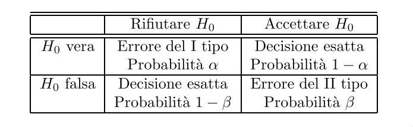

\newpage

# Introduzione

Il seguente documento ha come scopo quello di fornire le nozioni e le conoscenze di base sulla distribuzione di probabilità continua **normale** e di mostrare tramite quest'ultima le applicazioni delle **tecniche dell'inferenza statistica**.\
Lo scopo della statistica inferenziale è quello di **derivare le caratteristiche di una popolazione** tramite un campione estratto da essa.\
L'utilizzo che faremo dunque dell'inferenza statistica è quello di studiare una popolazione descritta da una variabile aleatoria avente distribuzione normale e ottenere delle stime sui **parametri non noti** e verificare delle **ipotesi**. La variabile aleatoria è definita osservabile poiché si possono osservare i valori assunti dalla variabile: il parametro non è noto solo nella legge di probabilità (funzione di distribuzione). Il campione inoltre deve essere scelto in modo da essere **rappresentativo della popolazione**.\
Nel documento dunque tratteremo varie sezioni. Nella prima introdurremo la distribuzione normale enunciandone e analizzando caratteristiche e proprietà. Nei capitoli successivi tratteremo di **stime puntuali** (un solo valore) e **stime intervallari** (limite inferiore e superiore), e della **verifica delle ipotesi**.

\newpage

# Distribuzione normale

Ricordiamo la definizione di variabile aleatoria: una variabile aleatoria è una funzione che fa corrispondere un numero reale a ogni esito di un esperimento. Se l'insieme dei valori assunti dalla variabile aleatoria **non è numerabile**, la variabile si definisce continua: non è possibile elencare tutti i valori essendo un'infinità e non è possibile attribuire una probabilità ai singoli valori. Mentre per una variabile discreta è possibile elencare tutti i valori che essa può assumere, per una variabile continua è necessario definire delle classi, cioè degli intervalli in cui suddividere i possibili valori della variabile.

Introduciamo adesso la funzione di distribuzione normale.\
L'importanza della distribuzione normale è dovuta alla sua caratteristica di poter efficacemente **approssimare molte distribuzioni** (lo vedremo in seguito) di numerosi fenomeni, basti pensare che non sono poche le distribuzioni che sono normalizzabili tramite delle trasformazioni.\
Vediamone le caratteristiche.

## Densità di probabilità

Una variabile aleatoria $X$ di densità di probabilità $$f_X(x) = \frac{1}{\sigma\sqrt{2\pi}}exp\bigg\{-\frac{(x-\mu)^2}{2\sigma^2}\bigg\}, \qquad x \in R \quad (\mu \in R,\sigma > 0)$$
si dice avere distribuzione normale di **parametri** $\mu$ e $\sigma$.

La densità è simmetrica rispetto all'asse $x=\mu$, risulta infatti $f_X(\mu-x) = f_X(\mu+x)$.\
La densità ha le seguenti caratteristiche:

* La **forma a campana** rispetto a $x=\mu$
* Il **massimo** è in corrispondenza del punto $x=\mu$ ed è pari a $\frac{1}{\sigma\sqrt{2\pi}}$
* Ha due **flessi** in corrispondenza di $\mu - \sigma$ e $\mu + \sigma$

Per indicare una variabile aleatoria $X$ che ha distribuzione normale di parametri $\mu$ e $\sigma$ useremo la notazione $X \sim N(\mu,\sigma)$ ($X$ è una variabile normale).

Per calcolare la densità normale in R usiamo la funzione dnorm come nel seguente esempio:

```{r esempioDnorm, eval=FALSE}
dnorm(x, mean = mu , sd = sigma )
```

Attraverso l'utilizzo di questa funzione vediamo cosa succede modificando i parametri $\mu$ e $\sigma$.

Vediamo modificando $\mu$ cosa succede:

```{r cambio media su grafico}
curve(dnorm (x,mean=0,sd =1) ,from=-6, to=6, xlab="x",ylab="f(x)",
      main="mu = -1,0,1;    sigma = 1",col = "red")
curve(dnorm (x,mean=-1,sd =1) ,from=-6, to=6, xlab="x",ylab="f(x)",
      add=TRUE,col = "blue")
curve(dnorm (x,mean=1,sd =1) ,from=-6, to=6, xlab="x",ylab="f(x)",
      add=TRUE, col = "green")
```

Abbiamo disegnato le tre curve che descrivono la funzione di densità normale con media pari a -1,0 e 1 (curva rossa con $\mu = 0$).
Notiamo che al variare del parametro $\mu$ quello che accade è che la curva viene **traslata lungo l'asse delle ascisse**, ma la **forma non cambia**. 

Vediamo ora per $\sigma$ cosa succede:

```{r cambio sd su grafico}
curve(dnorm(x,mean=0, sd =0.5) ,from=-4, to=4, xlab="x",
      ylab="f(x)",main="mu=0;    sigma = 0.5 ,1 ,1.5 ",col = "blue")
curve(dnorm(x,mean=0, sd=1) ,from=-4, to=4, xlab="x",ylab="f(x)",
      add=TRUE,col="red")
curve(dnorm(x,mean=0, sd =1.5) ,from=-4, to=4, xlab="x",ylab="f(x)",
      add=TRUE,col="green")
```

Abbiamo disegnato le tre curve che descrivono la funzione di densità normale con deviazione standard pari a 0.5,1 e 1.5 (curva rossa con $\sigma = 1$).

Notiamo come dal parametro $\sigma$ dipenda la **larghezza della funzione**: se aumenta $\sigma$ la curva è sempre più piatta, al contrario invece si allunga verso l'alto. Questo succede in quanto il punto massimo è inversamente proporzionale a $\sigma$.\
L'aria sottesa rimane sempre **unitaria**.

Vediamo ora la **funzione di distribuzione**.

## Funzione di distribuzione

La funzione di distribuzione di una variabile aleatoria $X \sim N(\mu,\sigma)$ è: $$F_X(x) = P(X \leq x) = \int_{-\infty}^{x} fx(y) \ dy = \Phi\Big(\frac{x - \mu}{\sigma}\Big)$$
dove $$\Phi(z) = \frac{1}{\sqrt{2\pi}} \int_{-\infty}^{z} e^{-\frac{y^2}{2}} \ dy$$
è la funzione di distribuzione di una variabile aleatoria $Z \sim N(0,1)$, detta **normale standard**.

Quindi se $X \sim N(\mu,\sigma)$ si ha: $$P(a<X<b) = F_X(b)-F_X(a)= \Phi\Big(\frac{b - \mu}{\sigma}\Big)- \Phi\Big(\frac{a - \mu}{\sigma}\Big)$$

Per calcolare la funzione di distribuzione in R lo si fa tramite la funzione pnorm() come nel seguente esempio:
```{r esempio calcolo funzione distribuzione, eval=FALSE}
pnorm(x, mean = mu , sd = sigma , lower.tail = TRUE)
```

Vediamo come cambia la funzione di distribuzione in base al parametro $sigma$:

```{r esempio funzione di distribuzione}
curve(pnorm (x,mean=0,sd =0.5) ,from=-4, to=4, xlab="x",
ylab=expression (P(X<=x)),main="mu=0; sigma = 0.5 ,1 ,1.5 ",lty =2)
text (-0.4,0.8, "sigma = 0.5")
curve(pnorm (x,mean=0,sd=1) ,add=TRUE,col="red")
arrows (-1,0.1,0.21,0.18, code=1, length = 0.10)
text (0.8 ,0.2 , "sigma = 1")
curve(pnorm (x,mean=0,sd =1.5) ,add =TRUE ,lty =3)
text (-2.2,0.2, "sigma = 1.5")
```

Dato che adesso sappiamo cos'è una normale standard e come è fatta la funzione di distribuzione di una normale, introduciamo la regola del 3$-\sigma$.

### Regola 3$-\sigma$

La regola ci dice che per una qualsiasi variabile aleatoria normale $X \sim N(\mu,\sigma)$ risulta: $$P(\mu -3\sigma < X < \mu + 3\sigma) = P(-3 < \frac{X-\mu}{\sigma}< 3) = P(-3<Z<3) = 0.9973002$$

La regola ci dice sostanzialmente che la probabilità che una variabile aleatoria avente distribuzione normale assuma valori in un intervallo avente come **centro** $\mu$ e **semiampiezza** $3\sigma$ è prossima all'**unità**: dato che l'aria sottesa è 1, quasi il 100% viene preso nel range descritto, l'area restante delle code è praticamente nulla e può essere trascurata.

Proviamo quanto detto in R con il codice di seguito:

```{r regola 3 sigma}
pnorm (3, mean=0,sd =1) - pnorm (-3,mean=0, sd=1)
```

## Quantili

R ci permette anche di calcolare i quantili della distribuzione normale attraverso la funzione qnorm() come nell'esempio:
```{r esempio calcolo quantili, eval=FALSE}
qnorm(z, mean = mu , sd = sigma , lower.tail = TRUE)
```

La funzione restituisce in output il percentile $z \cdot 100-esimo$ cioè **il più piccolo numero $x$ assunto dalla variabile aleatoria normale $X$** tale che $P(X \leq x)\geq z$

Usiamo la funzione su una normale standard per ricavare i quartili $Q_1$,$Q_2$,$Q_3$ e $Q_4$

```{r calcolo quartili}
scelta <- c(0 ,0.25,0.5 ,0.75,1)
qnorm(scelta, mean = 0, sd = 1)
```
Notiamo come $Q_1$ e $Q_3$ siano uguali ma di segno opposto per la **simmetria** discussa in precedenza intorno a $\mu$, mentre $Q_2$ è pari a $\mu$, cioè 0.

Dato l'uso che se ne fa nella statistica nei libri sono riportate in forma tabellare i valori della funzione di distribuzione di una normale standard per diversi valori (tavole Gaussiane).\
I quantili ricoprono un ruolo fondamentale nei problemi di stima che vedremo nel capitolo successivo.

## Risultati legati alla normale

Vediamo due teoremi molto importanti legati alla distribuzione normale **teorema di De moivre-Laplace** e il **teorema centrale di convergenza**.

### Approssimazione binomiale

**Teorema di De moivre-Laplace**:
Sia $X_1,X_2,...,X_n$ una successione di variabili aleatorie indipendenti distribuite alla **Bernoulli** con parametro $p$ $(0<p<1)$, e sia $Y_n = X_1+X_2+...+X_n$.\
Per ogni $x \in R$ abbiamo:$$\lim\limits_{n \to \infty} P\bigg(\frac{Y_n-np}{\sqrt{np(1-p)}} \leq x\bigg) = \frac{1}{\sqrt2\pi}\int_{-\infty}^{x}e^{\frac{-y^2}{2}} \ dy$$

cioè che $$\frac{Y_n-np}{\sqrt{np(1-p)}} \to Z$$

Chiariamo quanto scritto.\
Sappiamo che $X_1,X_2,...,X_n$ sono variabili aleatorie indipendenti di Bernoulli di parametro $p$, quindi $Y_n$ è una **variabile aleatoria binomiale** di valore medio $np$ e varianza $np(1-p)$.\
Il teorema mostra come sottraendo a $Y_n$ la sua media e dividendo questa differenza per la deviazione standard, si ottiene una variabile aleatoria standardizzata la cui funzione di distribuzione è con **n grande** approssimativamente una **normale standard**.

Il risultato del teorema ci permette di evitare di calcolare le binomiali con la formula ricorsiva vista, cosa che al crescere di n diventa molto onerosa, una formula approssimata del genere ci rende quindi il calcolo molto più conveniente.\
L'approssimazione che otteniamo è dunque:
$$Y_n \simeq np + \sqrt{np(1-p)} \ Z$$
Bisogna notare che l'approssimazione dipende da $n$ e da $p$ e migliora al tendere di $p$ a $\frac{1}{2}$.
Valutiamo quindi qual è l'errore derivante dall'approssimazione con i seguenti grafici confrontando una variabile con densità normale di valore medio $np$ e varianza $np(1-p)$ con $p = 0.2$ e $n = 25,50,75,100$:\

```{r esempio approssimazione binomiale al crescere di n,echo=FALSE}
par(mfrow =c(2,2))
p<-0.2
q<-1-p

x<-0:25
n<-25
curve(dnorm(x,n*p,sqrt(n*p*q)),from=n*p-3*sqrt(n*p*q),to=n*p+3*sqrt(n*p*q),xlab="x",ylab="P(X=x)",main="Binomiale con n=25 e p=0.2")
lines(x,dbinom (x,n ,0.2) ,type="h")

x<-0:50
n<-50
curve(dnorm(x,n*p,sqrt(n*p*q)),from=n*p-3*sqrt(n*p*q),to=n*p+3*sqrt(n*p*q),xlab="x",ylab="P(X=x)",main="Binomiale con n=50 e p=0.2")
lines(x,dbinom (x,n ,0.2) ,type="h")

x<-0:75
n<-75
curve(dnorm(x,n*p,sqrt(n*p*q)),from=n*p-3*sqrt(n*p*q),to=n*p+3*sqrt(n*p*q),xlab="x",ylab="P(X=x)",main="Binomiale con n=75 e p=0.2")

lines(x,dbinom (x,n ,0.2) ,type="h")

x<-0:100
n<-100
curve(dnorm (x,n*p,sqrt(n*p*q)),from=n*p-3*sqrt(n*p*q),to=n*p+3*sqrt(n*p*q),xlab="x",ylab="P(X=x)",main="Binomiale con n=100 e p=0.2")
lines(x,dbinom (x,n ,0.2) ,type="h")
```

Notiamo come l'**errore man mano che n cresce tende a diminuire sempre più**.\
Vediamo ora cosa succede in un grafico simile con n fissato e probabilità man mano tendente a $\frac{1}{2}$, con $n = 30$ e $p = 0.125, 0.25, 0.375, 0.5$:\

```{r esempio approssimazione binomiale con p tendente man mano a 1/2,echo=FALSE}
par(mfrow =c(2,2))
x<-0:30
n<-30
p<-0.125
q<-1-p
curve(dnorm(x,n*p,sqrt(n*p*q)),from=n*p-3*sqrt(n*p*q),to=n*p+3*sqrt(n*p*q),xlab="x",ylab="P(X=x)",main="Binomiale con n=30 e p=0.125 ")
lines(x,dbinom (x,n ,0.125) ,type="h")

p<-0.25
q<-1-p
curve(dnorm(x,n*p,sqrt(n*p*q)),from=n*p-3*sqrt(n*p*q),to=n*p+3*sqrt(n*p*q),xlab="x",ylab="P(X=x)",main="Binomiale con n=30 e p=0.25 ")
lines(x,dbinom (x,n ,0.25) ,type="h")

p<-0.375
q<-1-p
curve(dnorm(x,n*p,sqrt(n*p*q)),from=n*p-3*sqrt(n*p*q),to=n*p+3*sqrt(n*p*q),xlab="x",ylab="P(X=x)",main="Binomiale con n=30 e p=0.375 ")
lines(x,dbinom (x,n ,0.375) ,type="h")

p<-0.5
q<-1-p
curve(dnorm(x,n*p,sqrt(n*p*q)),from=n*p-3*sqrt(n*p*q),to=n*p+3*sqrt(n*p*q),xlab="x",ylab="P(X=x)",main="Binomiale con n=30 e p=0.5")
lines(x,dbinom (x,n ,0.5) ,type="h")
```

Notiamo come **l'approssimazione migliora** con p tendente a $\frac{1}{2}$, e diventa pressoché perfetta con $p = \frac{1}{2}$.

### Teorema centrale di convergenza

**Teorema centrale di convergenza**:
Sia $X_1,X_2,...,X_n$ una successione di variabili aleatorie generiche **indipendenti e identicamente distribuite** con valore medio $\mu$ finito e varianza $\sigma^2$ finita e positiva.\
Dato $Y_n = X_1+X_2+...+X_n$, per ogni $x \in R$ risulta:$$\lim\limits_{n \to \infty} P\bigg(\frac{Y_n-n\mu}{\sigma\sqrt{n}} \leq x\bigg) = \frac{1}{\sqrt2\pi}\int_{-\infty}^{x}e^{\frac{-y^2}{2}} \ dy = \Phi(x)$$
cioè che $$\frac{Y_n-E(Y_n)}{\sqrt{Var(Y_n)}} =  \frac{Y_n-n\mu}{\sigma\sqrt{n}} \to Z$$

Il teorema mostra come sottraendo a $Y_n$ la sua media e dividendo questa differenza per la deviazione standard di $Y_n$, quello che si ottiene è anche qui una variabile aleatoria standardizzata la cui funzione di distribuzione è approssimativamente **normale standard**.\
Analogamente al caso visto con la binomiale, l'approssimazione è più o meno buona in base ad $n$, ma dipende anche dal tipo di distribuzione delle variabili.\
Solitamente l'approssimazione è buona per **campioni di almeno 30 elementi**.

Abbiamo dunque introdotto tutte le caratteristiche principali della distribuzione normale, vediamo dunque come simulare in R la variabile aleatoria e iniziamo l'analisi del campione fornitoci da R.

## Simulare la variabile in R

Vediamo dunque come è possibile simulare in R una variabile normale attraverso la funzione rnorm():

```{r esempio simulazione variabile, eval=FALSE}
rnorm(N, mean = mu , sd = sigma )
```

È interessante confrontare la normale teorica con la densità simulata e dataci in output da R vedendo come si comporta l'istogramma del campione.\
Il seguente grafico riporta dunque la normale teorica con $\mu = 2$ e $\sigma = 1$ con valore di $n = 500,5000,5000$:

```{r confronto normale teorica e campione, echo=FALSE}
par(mfrow =c(2,2))
curve(dnorm(x,mean=2, sd=1) ,from=-2, to=6, xlab="x",ylab="f(x)", ylim=c(0 ,0.5) ,main="Densità normale con mu=2 e sigma =1")

sim1 <-rnorm (500, mean=2,sd =1)
hist(sim1 ,freq=F,xlim=c(-2,6) ,ylim=c(0 ,0.5) ,breaks =100, xlab="x",ylab="Istogramma ",main="Densità simulata con N=500")

sim2 <-rnorm (5000 , mean=2, sd=1)
hist(sim2 ,freq=F,xlim=c(-2,6) ,ylim=c(0 ,0.5) ,breaks =100, xlab="x",ylab="Istogramma ",main="Densità simulata con N=5000")

sim3 <-rnorm (50000 , mean=2,sd=1)
hist(sim3 ,freq=F,xlim=c(-2,6) ,ylim=c(0 ,0.5) ,breaks =100, xlab="x",ylab="Istogramma ",main="Densità simulata con N=50000 ")
```

Notiamo come aumentando la sequenza in output, l'istogramma delle frequenze relative si avvicina sempre maggiormente alla curva teorica.

Possiamo quindi iniziare la nostra effettiva analisi facendoci generare da R un campione descritto da densità normale:

```{r campione dati}
campione <- rnorm(10000,mean = 1000 , sd = 1.5)
```

Nella seguente tabella schematizziamo i valori ottenuti di media, varianza e deviazione standard sul campione ricavato:

```{r tabella media varianza deviazione standard campione, echo=FALSE}
library(gridExtra)
library(grid)

TSpecial <- ttheme_minimal(
  core=list(bg_params = list(fill = blues9[1:4], col=NA),
            fg_params=list(fontface=3)),
  colhead=list(fg_params=list(col="olivedrab", fontface=4L)),
  rowhead=list(fg_params=list(col="orangered4", fontface=3L)))

mediaCampione <- mean(campione)
varianzaCampione <- var(campione)
deviazioneStandardCampione <- sd(campione)
valori <- c(mediaCampione, varianzaCampione,deviazioneStandardCampione)

matriceValori <- cbind(valori)
rownames(matriceValori) <- c("Media","Varianza","Deviazione Standard")
colnames(matriceValori) <- "Indici di sintesi del campione"
outputTable <- tableGrob(format (matriceValori , digits = 5), theme=TSpecial)
grid.draw(outputTable)
```

Vediamo dunque i quantili del nostro campione e il boxplot relativo per avere un'idea di come è stato generato e di come sono distribuiti i valori.

Di seguito i **quantili** del campione:

```{r quantili campione, echo=FALSE}
quantile(campione)
```

Il seguente invece è il **boxplot** ricavato dal campione:

```{r boxplot campione, echo=FALSE}
boxplot(campione,main="Boxplot campione normale", col = "blue", horizontal = TRUE)
```


Osservando il boxplot vediamo come il campione sembra centrato intorno al valore medio 1000 e la distribuzione sembra **simmetrica**, verifichiamolo tramite l'**istogramma** del campione:

```{r istogramma campione, echo=FALSE}
hist(campione ,freq=F,breaks =100, xlab="x",ylab="Istogramma ",main="Istogramma campione con n = 10000")
```

Vediamo come la forma è molto simile alla curva a campana che descrive la funzione di densità normale teorica (è stato scelto un n molto grande).

Dopo questa panoramica iniziale del campione, possiamo dunque iniziare a trattare della stima dei parametri.
\newpage

# Stima puntuale

## Stimatori

Quando parliamo di stime puntuali quello che vogliamo fare è ottenere **informazioni su un parametro non noto della popolazione** effettuando su un campione estratto da quest'ultima delle opportune misure.

Introduciamo quindi gli **stimatori**.\
Quando parliamo di uno stimatore intendo una **funzione che associa ad ogni possibile campione un valore del parametro che si vuole stimare**.\
**Abbiamo dunque una variabile casuale funzione del campione che assume valore tra i possibili valori del parametro che si vuole stimare**.

Nell'inferenza statistica si fa uso degli stimatori, detti anche **statistiche**, per ricavare da un campione di n osservazioni un valore per un **parametro non noto della funzione di distribuzione statistica**.

Vediamo la definizione formale di **stimatore**:\
Uno stimatore $\hat{\Theta} = t(X_1, X_2, ...,X_n)$ è una **funzione misurabile e osservabile** del campione $(X_1, X_2, ...,X_n)$ i cui valori sono usati per stimare un parametro non noto $\vartheta$ della popolazione. I valori $\hat \vartheta$ assunti dallo stimatore sono dette stime del parametro $\vartheta$.

Tra gli stimatori tipici ci sono **media campionaria** e **varianza campionaria**.

Vediamo la seguente proposizione:\
Sia $(X_1, X_2, ...,X_n)$ un campione casuale estratto da una popolazione descritta da una variabile aleatoria osservabile $X$ caratterizzata da valore medio $E(X) = \mu$ finito e varianza $Var(x) = \sigma^2$ finita.\
Risulta:$$E(\overline{X}) = \mu, \qquad \qquad Var(\overline{X}) = \frac{\sigma^2}{n}$$

Per la proprietà di linearità del valore medio e l’identica distribuzione delle variabili aleatorie che costituiscono il campione, dalla proposizione si ha:$$E(\overline{X}) = E\bigg[\frac{1}{n} \sum_{i=1}^n X_i\bigg] = \frac{1}{n}\sum_{i=1}^n E(X_i) = \mu$$

e anche: $$Var(\overline{X}) = Var\bigg[\frac{1}{n} \sum_{i=1}^n X_i\bigg] = \frac{1}{n^2}\sum_{i=1}^n Var(X_i) = \frac{1}{n^2} nVar(X) = \frac{\sigma^2}{n}$$

Questo significa che tanto più è **numeroso** il campione, **migliore è la stima** del valore medio della popolazione.\
Invece ricordandoci il teorema centrale di convergenza sappiamo che se n è sufficientemente grande la funzione di distribuzione della media campionaria X è approssimativamente normale con valore medio $\mu$ e varianza $\frac{\sigma^2}{n}$.

## Metodi di ricerca di stimatori

I principali metodi di stima puntuale dei parametri sono il **metodo dei momenti** e il **metodo della massima verosimiglianza**

### Metodo dei momenti

Per descrivere il metodo bisogna introdurre il concetto di **momento campionario**.

Si definisce momento campionario r-esimo relativo ai valori osservati $(x_1,x_2,...,x_n)$ del campione casuale il valore:$$M_r(x_1,x_2,...,x_n) = \frac{1}{n}\sum_{i=1}^n x_i^r \qquad \qquad (r =1,2,3,...)$$

si tratta dunque della media aritmetica delle potenze r-esime delle n osservazioni effettuate sulla popolazione. Se $r =1$ otteniamo la media campionaria.

Il metodo dei momenti prevede nell'**uguagliare i primi k momenti della popolazione con i corrispondenti momenti del campione casuale**.\
Bisogna cioè risolvere il sistema di k equazioni: $$E(X^r) = M_r(x_1,x_2,...,x_n) \qquad (r =1,2,3,...,k)$$

La stima dipende dal campione osservato.

Vediamo dunque l'applicazione del metodo su una popolazione normale.\
Quello che vogliamo è stimare i parametri $\mu$ e $\sigma^2$.

Ricordando che $\sigma^2 = E[x_i^2] - (E[x_i])^2$, il momento di ordine 2 $E[x_i^2] = \sigma^2 + (E[x_i])^2 = \sigma^2 + \mu^2$.

Quindi avremo:$$\hat{\mu} = \frac{x_1+x_2+...+x_n}{n}; \qquad \hat{\sigma}^2 + \hat{\mu}^2= \frac{(x_1+x_2+...+x_n)^2}{n}$$

Dalla seconda equazione si ricava: $$\hat{\sigma}^2 = \frac{(x_1+x_2+...+x_n)^2}{n} - \frac{(x_1+x_2+...+x_n)^2}{n^2} = \frac{1}{n}\sum_{i=1}^n (x_i-\overline{x})^2$$

Quindi per $\mu$ lo stimatore è la media campionaria, mentre per $\sigma$ la variabile aleatoria $\frac{(n-1)}{n}S^2$ 

Consideriamo dunque il nostro campione e stimiamo i parametri in R:

```{r stime metodo momenti}
stimaMediaMomenti <-mean(campione)
stimaMediaMomenti

stimaVarianzaMomenti <-(length (campione) -1)*var(campione)/length (campione)
stimaVarianzaMomenti
```

Abbiamo ottenuto quindi le stime per $\hat{\mu}$ e per $\hat{\sigma}^2$.

### Metodo della massima verosimiglianza

Il metodo della massima verosimiglianza di solito è preferito a quello dei metodi, ed è infatti considerato il metodo migliore per la stima dei parametri non noti.\
Dobbiamo introdurre il concetto di **funzione di verosimiglianza** per descriverlo:\
Sia $(X_1,X_2,...,X_n)$ un campione casuale estratto dalla popolazione.\
La funzione di verosimiglianza $L(\vartheta1,\vartheta2,...,\vartheta k) = L(\vartheta1,\vartheta2,...,\vartheta k; x_1,x_2,...,x_n)$ è la **funzione di probabilità (densità nel caso continuo) congiunta del campione casuale** $(X_1,X_2,...,X_n)$, cioè: $$L(\vartheta1,\vartheta2,...,\vartheta k) = f(x_1;\vartheta1,\vartheta2,...,\vartheta k) f(x_2;\vartheta1,\vartheta2,...,\vartheta k) ... f(x_n;\vartheta1,\vartheta2,...,\vartheta k)$$

Il metodo consiste nel **massimizzare questa funzione** rispetto ai parametri $\vartheta1,\vartheta2,...,\vartheta k$: si cerca di determinare da quale funzione di probabilità (densità) congiunta è più **verosimile** (per questo verosimiglianza) che provenga il campione osservato.\
Si cercano i vari $\vartheta_i$ in modo tale che spieghino meglio il campione osservato.

I valori stimati, indicati con $\hat{\vartheta_i}$ sono detti **stime di massima verosimiglianza**.\
Anche in questo caso le stime dipendono dal campione.

Vediamo per stimare i parametri di una popolazione normale cosa dobbiamo fare.\

La funzione di densità della normale è la seguente:$$f_X(x) = \frac{1}{\sigma\sqrt{2\pi}}exp\bigg\{- \frac{(x-\mu)^2}{2\sigma^2}\bigg\}, \qquad x \in R \quad (\mu \in R,\sigma > 0)$$

Abbiamo dunque:$$L(\mu,\sigma^2) =  (\frac{1}{\sigma\sqrt{2\pi}})^2 \ exp\bigg\{- \sum_{i=1}^n \frac{(x-\mu)^2}{2\sigma^2}\bigg\}$$

Dai calcoli si ricavano rispettivamente $\hat\mu$ lo stimatore è $\frac{1}{n}\sum_{i=1}^n x_i$, mentre per $\hat\sigma^2$ lo stimatore è $\frac{1}{n}\sum_{i=1}^n (x_i -\hat\mu)^2$.\
Quindi per $\mu$ lo stimatore è la media campionaria, mentre per $\sigma$ la variabile aleatoria $\frac{(n-1)}{n}S^2$: entrambi gli stimatori coincidono con quelli calcolati col metodo dei momenti.

## Proprietà degli stimatori

Dato che per stimare un parametro di una popolazione ci possono essere diversi stimatori, sono definite alcune proprietà.

Gli stimatori sono quindi classificati in:

* corretto
* più efficiente
* corretto e con varianza uniforme minima
* asintoticamente corretto
* consistente

Uno stimatore si dice corretto se il **valore medio dello stimatore è uguale al corrispondente parametro** non noto della popolazione.\
Bisogna dire che ci possono essere **più stimatori corretti**, quindi qualche volta va considerato quale conviene: ci sono dei criteri che permettano di confrontare stimatori dello stesso parametro. Ad esempio viene usata la ricerca dello stimatore con **errore quadratico uniformemente minimo** per la classe degli stimatori corretti.

Riguardo la popolazione normale ricaviamo che la media campionaria è uno **stimatore corretto** del parametro $\mu$ di una popolazione normale con varianza minima, mentre lo stimatore $\frac{(n-1)}{n}S^2$ della varianza $\sigma^2$ individuato sia con il metodo dei momenti che con il metodo della massima verosimiglianza, risulta **asintoticamente corretto**: il valore medio dello stimatore con n grande tende al corrispondente parametro non noto della popolazione.\
Inoltre entrambi gli stimatori sono **consistenti**.

\newpage

# Stima intervallare

## Introduzione

Anziché determinare un singolo valore per un parametro non noto come si fa nel caso delle stime puntuali, spesso si preferisce trovare un **intervallo di valori** nel quale il parametro non noto sia compreso in modo tale che questo intervallo abbia un **buon coefficiente di confidenza**.

Diamo dunque una definizione di **intervallo di confidenza**:
Fissato un coefficiente di confidenza $1-\alpha$ $(0<\alpha<1)$ se è possibile scegliere due statistiche $\underline{C}_n$ e $\overline{C}_n$ in modo tale che: $$P(\underline{C}_n < \vartheta < \overline{C}_n) = 1 - \alpha$$
allora $(\underline{C}_n,\overline{C}_n)$ è un **intervallo di confidenza** di grado $1 - \alpha$ per il parametro $\vartheta$.\
Le statistiche $(\underline{C}_n,\overline{C}_n)$ sono dette **limite inferiore e superiore** dell’intervallo di confidenza.

L'intervallo ottenuto è detto **stima dell'intervallo di confidenza**, e i punti forniti dalle statistiche sono detti rispettivamente **stima del limite inferiore** e **stima del limite superiore dell’intervallo di confidenza**.

Dato che gli intervalli di confidenza di grado $1 - \alpha$ possono essere più di uno, di solito si sceglie l'intervallo, fissato il grado di confidenza, che abbia la **lunghezza assoluta o media più piccola possibile** (restringiamo l'intervallo il più possibile).

Va detto che ovviamente la **stima puntuale deve cadere nell'intervallo**.

## Metodo pivotale

Il metodo prevede la determinazione di una variabile aleatoria di pivot $\gamma(X_1,X_2,...,X_2;\vartheta)$ che **dipende dal campione casuale estratto** e **dal parametro non noto** $\vartheta$ e la cui funzione di distribuzione non contiene il parametro che si vuole stimare.\
Si noti che la variabile aleatoria definita non è osservabile in quanto dipende dal parametro non noto $\vartheta$, quindi **non è statistica**.

Vediamo dunque nel dettaglio in cosa consiste il metodo:
Per ogni coefficiente $\alpha$, siano $\alpha_1$ e $\alpha_2$, con $\alpha_1 < \alpha_2$, due valori dipendenti soltanto dal coefficiente fissato $\alpha$ tali che per qualunque parametro non noto $\vartheta$ si abbia: $$P(\alpha_1< \gamma(X_1,X_2,...,X_n;\vartheta) < \alpha_2) = 1-\alpha$$

Se per ogni campione $(X_1,X_2,...,X_n)$ e per ogni  $\vartheta$ e qualunque campione si riesce a dimostrare:$$\alpha_1<\gamma(x;\vartheta)<\alpha_2 \iff g_1(x) < \vartheta < g_2(x)$$
con $g_1(x)$ e $g_2(x)$ dipendenti soltanto dal campione osservato allora la probabilità precedente è esprimibile come: $$P(g_1(X_1,X_2,...,X_n) <\vartheta < g_2(X_1,X_2,...,X_n)) = 1-\alpha$$
Denotiamo $\underline{C}_n =g_1(X_1,X_2,...,X_n)$ e $\overline{C}_n = g_2(X_1,X_2,...,X_n)$, allora $(\underline{C}_n,\overline{C}_n)$ è un intervallo di confidenza di grado $1-\alpha$ per $\vartheta$.


Analizziamo quindi di seguito diversi problemi relativi a un campione normale.

1. Determinare un intervallo di confidenza di grado $1-\alpha$ per il valore medio $\mu$ nel caso in cui la varianza $\sigma^2$ della popolazione normale è nota\
**Intervallo di confidenza per $\mu$ con $\sigma^2$ nota**

Abbiamo visto che $E(\overline{X}_n = \mu)$ e $Var(\overline{X}_n) = \frac{\sigma^2}{n}$.

Vogliamo determinare un intervallo di confidenza $\alpha -1$ per il parametro $\mu$ avendo nota la varianza.\
Usiamo il metodo pivotale e consideriamo la variabile aleatoria standardizzata $$Z_n = \frac{\overline{X}_n-\mu}{\sigma/\sqrt{n}}$$

Questa variabile è una normale standard che dipende dal campione e dal parametro non noto, quindi posso applicare il metodo pivotale.\
Dato che la distribuzione è normale, sappiamo che la curva è simmetrica quindi ci conviene scegliere $\alpha_1 = -\alpha_2$. Scegliamo quindi $\alpha_1 = -z_{\alpha/2}$ e $\alpha_2 = z_{\alpha/2}$ in modo che $$P(Z_n < -z_{\alpha/2}) = P(Z_n < -z_{\alpha/2}) = \frac{\alpha}{2}$$
Abbiamo dunque che $P(-z_{\alpha/2}< Z_n<z_{\alpha/2}) = 1-\alpha)$.\
Graficamente quanto detto si traduce nel seguente modo:

```{r echo=FALSE}
curve(dnorm (x,mean=0,sd=1) ,from=-3, to=3, axes=FALSE ,ylim=c(0 ,0.5) ,
xlab="",ylab="",main="Densità normale standard")
text (0,0.05, expression (1- alpha))
axis(1,c(-3,-1,0,1,3) ,c("",expression (-z[alpha /2]) ,
0, expression (z[alpha /2]) ,""))
vals <-seq(-3,-1, length =100)
x<-c(-3,vals ,-1,-3)
y<-c(0, dnorm(vals) ,0,0)
polygon (x,y,density =20, angle =45)
vals <-seq(1,3, length =100)
x<-c(1,vals ,3,1)
y<-c(0, dnorm(vals) ,0,0)
polygon (x,y,density =20, angle =45)
abline (h=0)
text (-1.5,0.05, expression (alpha/2))
text (1.5 ,0.05 , expression (alpha/2))
box ()
```

Una stima dell'intervallo di confidenza $1-\alpha$ per il valore medio $\mu$ è: $$\overline{x}_n-z_{\alpha/2}\frac{\sigma}{\sqrt{n}}< \mu<\overline{x}_n+z_{\alpha/2}\frac{\sigma}{\sqrt{n}}$$
Poniamo $\alpha = 0.05$ e supponiamo che la varianza nota sia $\sigma^2 = 2.25$ e quindi $\sigma = 1.5$ , stimiamo il parametro con l'intervallo di confidenza che abbiamo trovato:

```{r stima media con var nota}
alpha <-1 - 0.95

deviazioneStandard <- 1.5
n<-length (campione)
#stima del limite inferiore
mean(campione)-qnorm (1- alpha /2,mean=0,sd =1)*deviazioneStandard/sqrt(n)
#stima del limite superiore
mean(campione)+qnorm (1- alpha /2,mean=0,sd =1)*deviazioneStandard/sqrt(n)

```

Consideriamo ora lo stesso problema ma con varianza non nota:

2. Determinare un intervallo di confidenza di grado $1-\alpha$ per il valore medio $\mu$ nel caso in cui la varianza della popolazione normale è non nota\
**Intervallo di confidenza per $\mu$ con $\sigma^2$ non nota**

Dato che non sappiamo quanto vale la varianza, quello che facciamo è usare una variabile aleatoria uguale alla precedente ma che al posto della varianza della popolazione presenta la varianza campionaria:$$T_n = \frac{\overline{X}_n-\mu}{S_n/\sqrt{n}}$$
Anche in questo caso la variabile dipende dal campione e dal parametro non noto, quindi può essere interpretata come una variabile aleatoria di pivot.
Si dimostra che questa variabile è distribuita con legge di Student con n-1 gradi di libertà.

Scegliamo $\alpha_1 = -t_{\alpha/2,n-1}$ e $\alpha_2 = t_{\alpha/2,n-1}$ si ha:$$P(-t_{\alpha/2,n-1}< T_n<t_{\alpha/2,n-1}) = 1-\alpha)$$
Graficamente quanto detto si traduce nel seguente modo:

```{r echo=FALSE}
curve(dt(x,df =5) ,from=-3, to=3, axes=FALSE ,ylim=c(0 ,0.5) ,xlab="",
ylab="",main="Densità di Student con n-1 gradi di libertà")
text(0,0.05, expression (1- alpha ))
axis(1,c(-3,-1,0,1,3) ,c("",expression (-t[list(alpha/2,n-1) ]) ,0,
expression (t[list(alpha/2,n-1) ]),""))
vals <-seq(-3,-1, length =100)
x<-c(-3,vals ,-1,-3)
y<-c(0,dt(vals ,df=5) ,0,0)
polygon (x,y,density =20, angle =45)
vals <-seq(1,3, length =100)
x<-c(1,vals ,3,1)
y<-c(0,dt(vals ,df=5) ,0,0)
polygon (x,y,density =20, angle =45)
abline (h=0)
text (-1.5,0.05, expression (alpha/2))
text (1.5 ,0.05 , expression (alpha/2))
box ()
```

Una stima dell'intervallo di confidenza $1-\alpha$ per il valore medio $\mu$ è: $$\overline{x}_n-t_{\alpha/2,n-1}\frac{s_n}{\sqrt{n}}< \mu<\overline{x}_n+t_{\alpha/2,n-1}\frac{s_n}{\sqrt{n}}$$
Poniamo $\alpha = 0.05$ e stimiamo il parametro con l'intervallo di confidenza che abbiamo trovato:

```{r stima media con var non nota}
alpha <-1 - 0.95

deviazioneStandard <- sd(campione)
deviazioneStandard
n<-length (campione)
#stima del limite inferiore
mean(campione)-qt(1- alpha /2,df=n-1)*deviazioneStandard/sqrt(n)
#stima del limite superiore
mean(campione)+qt(1- alpha /2,df=n-1)*deviazioneStandard/sqrt(n)

```


3. Determinare un intervallo di confidenza di grado $1-\alpha$ per la varianza $\sigma^2$ nel caso in cui il valore medio $\mu$ della popolazione normale è noto\
**Intervallo di confidenza per $\sigma^2$ con $\mu$ noto**

Consideriamo la variabile: $$V_n = \sum_{i=1}^n \bigg(\frac{X_i - \mu}{\sigma}\bigg) = \frac{1}{\sigma^2}\sum_{i=1}^n \bigg(X_i - \mu\bigg)^2$$
Tale variabile dipende dal campione casuale e dal parametro non noto $\sigma^2$ ed è distribuita con legge chi–quadrato con n gradi di libertà, essendo costituita dalla somma dei quadrati di n variabili aleatorie normali standard.

Scegliamo $\alpha_1 = \chi^2_{1-\alpha/2,n}$ e $\alpha_2 = \chi^2_{\alpha/2,n}$ si ha:$$P(\chi^2_{1-\alpha/2,n}< V_n<\chi^2_{\alpha/2,n}) = 1-\alpha$$
Graficamente quanto detto si traduce nel seguente modo:

```{r echo=FALSE}
curve(dchisq (x,df=6) ,from=0, to=12, axes=FALSE ,ylim=c(0 ,0.15),
xlab="",ylab="",main="Densità chi-quadrato con n gradi di libertà")
text (4,0.02, expression (1- alpha))
axis(1,c(0,2,4,6,12) ,c("",expression ({ chi ^2}[ list(1- alpha/2,n)]),expression (n-2) ,expression ({chi ^2}[ list(alpha /2,n)]),""))
vals <-seq(0,2, length =100)
x<-c(0,vals ,2,0)
y<-c(0, dchisq (vals ,df=6) ,0,0)
polygon (x,y,density =20, angle =45)
vals <-seq (6,12, length =100)
x<-c(6,vals ,12 ,6)
y<-c(0, dchisq (vals ,df=6) ,0,0)
polygon (x,y,density =20, angle =45)
abline (h=0)
text (1.2 ,0.02 , expression (alpha /2))
text (8.5 ,0.02 , expression (alpha /2))
box ()
```

Una stima dell'intervallo di confidenza $1-\alpha$ per $\sigma^2$ è: $$\frac{(n-1)s_n^2+ n(\overline{X}_n - \mu)^2}{\chi^2_{\alpha/2,n}} < \sigma^2 < \frac{(n-1)s_n^2+ n(\overline{X}_n - \mu)^2}{\chi^2_{1-\alpha/2,n}} $$
Poniamo $\alpha = 0.05$ e supponiamo che la media nota sia $\mu = 1000$, stimiamo il parametro con l'intervallo di confidenza che abbiamo trovato:

```{r stima varianza conoscendo media}
n <- length (campione)
mu <- 1000
alpha <-1 - 0.95


#stima del limite inferiore
((n-1)*var (campione)+n*(mean(campione)-mu)**2)/qchisq (1- alpha/2,df=n)
#stima del limite superiore
((n-1)*var (campione)+n*(mean(campione)-mu)**2)/qchisq(alpha/2,df=n)
```

4. Determinare un intervallo di confidenza di grado $1-\alpha$ per la varianza $\sigma^2$ nel caso in cui il valore medio della popolazione normale è non noto\
**Intervallo di confidenza per $\sigma^2$ con $\mu$ non noto**

In questo caso non abbiamo la media nota, usiamo dunque la media campionaria.
Consideriamo la variabile: $$Q_n = \frac{(n-1)S_n^2}{\sigma} = \frac{1}{\sigma^2}\sum_{i=1}^n (X_i - \overline{X}_n)^2$$
Tale variabile dipende dal campione casuale e dal parametro non noto $\sigma^2$ ed è distribuita con legge chi–quadrato con n-1 gradi di libertà.
Scegliamo $\alpha_1 = \chi^2_{1-\alpha/2,n-1}$ e $\alpha_2 = \chi^2_{\alpha/2,n-1}$ si ha:$$P(\chi^2_{1-\alpha/2,n-1}< Q_n<\chi^2_{\alpha/2,n-1}) = 1-\alpha$$
Graficamente quanto detto si traduce nel seguente modo:

```{r echo=FALSE}
curve(dchisq (x,df=6) ,from=0, to=12, axes=FALSE ,ylim=c(0 ,0.15),
xlab="",ylab="",main="Densità chi-quadrato con n-1 gradi di libertà")
text(4,0.02, expression (1- alpha ))
axis(1,c(0,2,4,6,12) ,c("",expression ({chi ^2}[ list(1- alpha/2,n-1) ]),expression (n-2) ,expression ({chi ^2}[ list(alpha /2,n-1) ]),""))
vals <-seq(0,2, length =100)
x<-c(0,vals ,2,0)
y<-c(0, dchisq (vals ,df=6) ,0,0)
polygon (x,y,density =20, angle =45)
vals <-seq (6,12, length =100)
x<-c(6,vals ,12 ,6)
y<-c(0, dchisq(vals ,df =6) ,0,0)
polygon (x,y,density =20, angle =45)
abline (h=0)
text (1.2 ,0.02 , expression (alpha/2))
text (8.5 ,0.02 , expression (alpha/2))
box ()
```

Una stima dell'intervallo di confidenza $1-\alpha$ per $\sigma^2$ è: $$\frac{(n-1)s_n^2}{\chi^2_{\alpha/2,n-1}} < \sigma^2 < \frac{(n-1)s_n^2}{\chi^2_{1-\alpha/2,n-1}}$$
Poniamo $\alpha = 0.05$ e stimiamo il parametro con l'intervallo di confidenza che abbiamo trovato:

```{r stima varianza con media non nota}
n <- length (campione)
alpha <-1 - 0.95

(n-1) *var(campione)/qchisq (1- alpha/2,df=n -1)
(n-1) *var(campione)/qchisq (alpha /2,df=n-1)
```

### Considerazioni sulla stima

Ricordiamo che per quanto riguarda una popolazione normale è possibile fare le stime **qualsiasi sia la numerosità del campione**. Questo infatti è dovuto al fatto che **conosciamo la distribuzione esatta** della variabili pivotali che abbiamo usato: normale, student e chi-quadrato.

Un'altra cosa da sottolineare è che ai fini reali sono interessanti i casi in cui **non abbiamo noto nessuna misura della popolazione**, infatti il secondo e quarto caso sono quelli davvero utilizzati.

## Differenza tra i valori medi

Alcuni problemi richiedono il **confronto tra i valori medi di due popolazioni**, vediamo come costruire dunque degli intervalli di confidenza per la differenza tra i valori medi di due popolazioni normali.

Come operazione preliminare introduciamo un nuovo campione che ci servirà per il confronto:
```{r campione dati2}
campione2 <- rnorm(9000,mean = 980 , sd = 2)
```

Nella seguente tabella schematizziamo i valori ottenuti di media, varianza e deviazione standard sul campione ricavato:

```{r tabella media varianza deviazione standard campione2, echo=FALSE}
mediaCampione2 <- mean(campione2)
varianzaCampione2 <- var(campione2)
deviazioneStandardCampione2 <- sd(campione2)
valori2 <- c(mediaCampione2, varianzaCampione2,deviazioneStandardCampione2)

matriceValori2 <- cbind(valori2)
rownames(matriceValori2) <- c("Media","Varianza","Deviazione Standard")
colnames(matriceValori2) <- "Indici di sintesi del campione"
outputTable <- tableGrob(format (matriceValori2 , digits = 5), theme=TSpecial)
grid.draw(outputTable)
```

Di seguito i **quantili** del campione appena creato:

```{r quantili campione2, echo=FALSE}
quantile(campione2)
``` 
\break

Possiamo dunque ora considerare i problemi veri e propri.

Consideriamo due campioni, $X_1,X_2,...,X_{n1}$ e $Y_1,Y_2,...,Y_{n2}$, casuali e indipendenti, di ampiezza $n_1$ e $n_2$ estratti rispettivamente da due **popolazioni normali** $N(\mu_1,\sigma_1^2)$ e $N(\mu_2,\sigma_2^2)$.

I problemi che vogliamo affrontare sono i seguenti:

1. Determinare un intervallo di confidenza di grado $1-\alpha$ per $\mu_1 - \mu_2$ quando entrambe le varianze $\sigma_1^2$ e $\sigma_2^2$ sono **note**.
**Intervalli di confidenza per $\mu_1 - \mu_2$ con $\sigma_1^2$ e $\sigma_2^2$ note**

Innanzitutto consideriamo le medie campionarie dei due campioni, poiché per ipotesi abbiamo detto che i campioni sono **indipendenti**, $\overline{X}_{n1} - \overline{Y}_{n2}$ è distribuita normalmente con valore medio $\mu_1 - \mu_2$ e varianze $\frac{\sigma_1^2}{n_1}$ e $\frac{\sigma_2^2}{n_2}$.

Per determinare l'intervallo di confidenza $1-\alpha$ (conoscendo le varianze), consideriamo la **variabile aleatoria di pivot**:$$Z_n = \frac{\overline{X}_{n1} - \overline{Y}_{n2}- (\mu_1 - \mu_2)}{\sqrt{\frac{\sigma_1^2}{n_1}+\frac{\sigma_2^2}{n_2}}}$$

Questa variabile è di pivot:

* Dipende dal parametro non noto
* Dipende dal campione
* È caratterizzata da una densità normale

Ricaviamo dunque che una stima dell'intervallo di confidenza $1-\alpha$ per la differenza tra le medie $\mu_1 - \mu_2$ è: $$\overline{X}_{n1} - \overline{Y}_{n2} - z_{\alpha/2}\sqrt{\frac{\sigma_1^2}{n_1}+\frac{\sigma_2^2}{n_2}} < \mu_1 - \mu_2 <\overline{X}_{n1} - \overline{Y}_{n2} + z_{\alpha/2}\sqrt{\frac{\sigma_1^2}{n_1}+\frac{\sigma_2^2}{n_2}}$$

Poniamo $\alpha = 0.05$ e stimiamo $\mu_1 - \mu_2$ per i due campioni che abbiamo a disposizione sapendo che le varianze note sono $\sigma_1^2 = 2.25$ e $\sigma_2^2 = 4$, mentre la numerosità del primo campione è pari a 10000, mentre quella del secondo 9000.\
Procediamo con la stima:

```{r stima differenze medie con var note}
alpha <-1 -0.95

n1 <- length(campione)
n2 <- length(campione2)

m1 <- mean(campione)
m2 <- mean(campione2)

sigma1 <- 2.25
sigma2 <- 4

#stima del limite inferiore
m1-m2 -qnorm (1- alpha/2,mean=0, sd=1)*sqrt(sigma1 ^2/n1+sigma2 ^2/n2)
#stima del limite superiore
m1-m2+qnorm (1- alpha/2,mean=0, sd=1)*sqrt(sigma1 ^2/n1+sigma2 ^2/n2)
```

Passiamo ora al problema successivo.

2. Determinare un intervallo di confidenza di grado $1-\alpha$ per $\mu_1 - \mu_2$ quando entrambe le varianze $\sigma_1^2$ e $\sigma_2^2$ **non sono note** per campioni numerosi estratti dalla popolazione.
**Intervalli di confidenza per $\mu_1 - \mu_2$ con $\sigma_1^2$ e $\sigma_2^2$ non note**

Consideriamo ora il caso in cui non abbiamo nessun parametro noto (**caso reale**).\
Abbiamo visto in precedenza che le varianze campionarie $S_{n1}^2$ e $S_{n2}^2$ sono stimatori di $\sigma_1^2$ e $\sigma_2^2$ quando le ampiezze dei campioni sono abbastanza grandi. Possiamo quindi considerare la variabile aleatoria ricavata dal caso precedente:$$\frac{\overline{X}_{n1} - \overline{Y}_{n2}- (\mu_1 - \mu_2)}{\sqrt{\frac{S_{n1}^2}{n_1}+\frac{S_{n2}^2}{n_2}}}$$

Ovviamente anche qui abbiamo una variabile aleatoria pivotale, possiamo dunque applicare il metodo pivotale in **forma approssimata** e ricavare che : $$P\Bigg(\overline{X}_{n1} - \overline{Y}_{n2} - z_{\alpha/2}\sqrt{\frac{S_{n1}^2}{n_1}+\frac{S_{n2}^2}{n_2}} < \mu_1 - \mu_2 <\overline{X}_{n1} - \overline{Y}_{n2} + z_{\alpha/2}\sqrt{\frac{S_{n1}^2}{n_1}+\frac{S_{n2}^2}{n_2}}\Bigg) \simeq 1 -\alpha$$

Ricaviamo dunque che una stima dell'intervallo di confidenza $1-\alpha$ per la differenza tra le medie $\mu_1 - \mu_2$ è: $$\overline{X}_{n1} - \overline{Y}_{n2} - z_{\alpha/2}\sqrt{\frac{S_{n1}^2}{n_1}+\frac{S_{n2}^2}{n_2}} < \mu_1 - \mu_2 <\overline{X}_{n1} - \overline{Y}_{n2} + z_{\alpha/2}\sqrt{\frac{S_{n1}^2}{n_1}+\frac{S_{n2}^2}{n_2}}$$

Poniamo $\alpha = 0.05$ e stimiamo $\mu_1 - \mu_2$ per i due campioni che abbiamo a disposizione sapendo che le varianze note sono $\sigma_1^2 = 2.25$ e $\sigma_2^2 = 4$, mentre la numerosità del primo campione è pari a 10000, mentre quella del secondo 9000.\
Procediamo con la stima:

```{r}
alpha <-1 -0.99

n1 <- length(campione)
n2 <- length(campione2)

m1 <- mean(campione)
m2 <- mean(campione2)


s1 <- sd(campione)
s2 <- sd(campione2)

#stima del limite inferiore
m1-m2 -qnorm (1- alpha/2,mean=0, sd=1)*sqrt(s1^2/n1+s2^2/n2)
#stima del limite superiore
m1-m2+qnorm (1- alpha/2,mean=0, sd=1)*sqrt(s1^2/n1+s2^2/n2)
```

Quindi per stimare la differenza tra le medie su una popolazione normale questi sono i metodi, ricordiamo che la **numerosità** dei campioni è importante nel secondo caso in quanto la varianza campionaria è asintoticamente corretta.

\newpage

# Verifica delle ipotesi con R 

## Introduzione

Definiamo innanzitutto il concetto di **ipotesi statistica**:
Un'ipotesi statistica è un'affermazione o una congettura su un parametro non noto $\vartheta$.\
Se l'ipotesi statistica specifica completamente $f(x;\vartheta)$ è detta **ipotesi semplice**, altrimenti è chiamata **ipotesi composta** (se si specifica o meno completamente la legge della popolazione).

L'ipotesi che si vuole verificare è denotata con $H_0$ e viene chiamata **ipotesi nulla**.\
Il procedimento con il quale decidiamo, sulla base del campione, se accertare o meno $H_0$ si chiama **test di ipotesi**. Il test prevede che venga specificata un'ipotesi alternativa a quella sotto verifica, definita appunto **ipotesi alternativa**, ed è indicata con $H_1$.

Il problema consiste dunque nell'individuare un test capace di suddividere l'insieme dei possibili campioni in due sottoinsiemi che rappresentano la **regione di accettazione** e la **regione di rifiuto** dell'ipotesi nulla.\
Se l'ipotesi nulla risulta falsa, quella alternativa risulta vera: l'ipotesi $H_0$ va verificata in alternativa all'ipotesi $H_1$.

Ci sono ovviamente dei margini di errore di cui tenere conto. La seguente immagine ci aiuta a capire:
```{r ipotesi.jpg, fig.align="center", echo=FALSE}

```

Ci sono due possibilità di errore quindi:

* **Rifiutare** l’ipotesi nulla $H_0$ nel caso in cui tale ipotesi sia **vera**; si dice allora che si commette un errore di **tipo I**, prob $\alpha$
* **Accettare** l’ipotesi nulla $H_0$ nel caso in cui tale ipotesi sia **falsa**; si dice allora che si commette un errore di **tipo II**, prob $\beta$

Dato che non è possibile rendere piccole entrambe le probabilità (se non in casi banali), la strategia che si usa è quella di fissare una delle due probabilità ($\alpha$) e minimizzare l'altra.\
Fissiamo l'errore più grave che in statistica corrisponde a **rifiutare il vero**.\

Fissiamo $\alpha$ e costruiamo un test per minimizzare $\beta$.

Solitamente la probabilità di commettere un errore di tipo I si sceglie uguale a 0.05, 0.01, 0.001 ed il test viene rispettivamente detto **statisticamente significativo**, **statisticamente molto significativo** e **statisticamente estremamente significativo**. Infatti, quanto minore è il valore di $\alpha$ tanto **maggiore è la credibilità di un eventuale rifiuto dell’ipotesi nulla**.

I test statistici si dividono in due categorie:

* **Unilaterali** del tipo $\to H_0: \vartheta \leq \vartheta_0, \quad H_1: \vartheta > \vartheta_0$ 
* **Bilaterali** del tipo $\to H_0: \vartheta = \vartheta_0, \quad H_1: \vartheta \neq \vartheta_0$ 

Vediamo dunque la verifica delle ipotesi su una popolazione normale usando il nostro campione.

## Popolazione normale

Affrontiamo i seguenti problemi:

### Test su $\mu$ con varianza $\sigma^2$ nota

1. Verifica delle ipotesi sul valore medio $\mu$ nel caso in cui la varianza $\sigma^2$ della popolazione normale è nota\

**Verifica delle ipotesi per $\mu$ con $\sigma^2$ nota**

**Test bilaterale**

Consideriamo le ipotesi:$$H_0: \mu = \mu_0, \quad H_1: \mu \neq \mu_0$$

L'ipotesi nulla è **semplice**, mentre quella alternativa è **composta**.

Gioca un ruolo fondamentale la variabile aleatoria:$$Z_n = \frac{\overline{X}_n - \mu_0}{\sigma/\sqrt{n}}$$

Il test bilaterale è dunque il seguente:

* si **accetta** $H_0$ se $-z_{\alpha/2} < \frac{\overline{X}_n - \mu_0}{\sigma/\sqrt{n}} <z_{\alpha/2}$
* si **rifiuta** $H_0$ se :
  + $\frac{\overline{X}_n - \mu_0}{\sigma/\sqrt{n}} <-z_{\alpha/2}$
  + $\frac{\overline{X}_n - \mu_0}{\sigma/\sqrt{n}} > z_{\alpha/2}$
  
Graficamente è rappresentata la densità normale standard e sono riportate le zone di accettazione e di rifiuto dell'ipotesi nulla per il test bilaterale:

```{r echo=FALSE}
curve(dnorm(x,mean=0, sd=1) ,from=-3, to=3, axes=FALSE ,ylim=c(0 ,0.5) ,xlab="",ylab="",main="Densità normale standard")
text(0,0.05, expression (1- alpha ))
text(0,0.2,"Regione di accettazione")
axis(1,c(-3,-1,0,1,3) ,c("",expression (-z[alpha/2]) ,0, expression (z[alpha/2]) ,""))
vals <-seq(-3,-1, length =100)
x<-c(-3,vals ,-1,-3)
y<-c(0, dnorm(vals) ,0,0)
polygon (x,y,density =20, angle =45)
vals <-seq(1,3, length =100)
x<-c(1,vals ,3,1)
y<-c(0, dnorm(vals) ,0,0)
polygon (x,y,density =20, angle =45)
abline (h=0)
text (-1.5,0.05, expression (alpha/2))
text (-2.2,0.1, "Regione di rifiuto")
text (1.5 ,0.05 , expression (alpha/2))
text (2.2 ,0.1 , "Regione di rifiuto")
box ()
```
  
Applichiamo dunque la verifica bilaterale al nostro campione:

```{r}
alpha <- 0.05
mu0 <- 999.94
sigma <- 2.25

#z alpha/2
qnorm (1- alpha /2,mean=0,sd=1)

#-z alpha/2
-qnorm (1- alpha /2,mean=0,sd=1)

n <- length(campione)

meancamp <-mean(campione)
(meancamp -mu0 )/(sigma/sqrt(n))
```

**Test unilaterale sinistro**
Consideriamo le ipotesi:$$H_0: \mu \leq \mu_0, \quad H_1: \mu > \mu_0$$

* si **accetta** $H_0$ se $\frac{\overline{X}_n - \mu_0}{\sigma/\sqrt{n}} < z_{\alpha}$
* si **rifiuta** $H_0$ $\frac{\overline{X}_n - \mu_0}{\sigma/\sqrt{n}} > z_{\alpha}$


```{r echo=FALSE}
curve (dnorm (x,mean=0,sd=1) ,from=-3, to=3, axes=FALSE ,ylim=c(0 ,0.5)
,xlab="",
ylab="",main="Densità normale standard")
text (0,0.05, expression (1- alpha))
text (0,0.2,"Regione di accettazione")
axis(1,c(-3,-1,0,1,3) ,c(""," "," ",expression (z[alpha ]),""))
vals <-seq(1,3, length =100)
x<-c(1,vals ,3,1)
y<-c(0, dnorm(vals) ,0,0)
polygon (x,y,density =20, angle =45)
abline (h=0)
text (1.5 ,0.05 , expression (alpha))
text (2.2 ,0.1 , "Regione di rifiuto")
box ()
```

**Test unilaterale sinistro**
Consideriamo le ipotesi:$$H_0: \mu \geq \mu_0, \quad H_1: \mu < \mu_0$$

* si **accetta** $H_0$ se $\frac{\overline{X}_n - \mu_0}{\sigma/\sqrt{n}} > -z_{\alpha}$
* si **rifiuta** $H_0$ $\frac{\overline{X}_n - \mu_0}{\sigma/\sqrt{n}} < -z_{\alpha}$


```{r echo=FALSE}
curve (dnorm(x,mean=0,sd =1) ,from=-3, to=3, axes=FALSE ,ylim=c(0 ,0.5)
,xlab="",
ylab="",main="Densità normale standard")
text (0,0.05, expression (1- alpha))
text (0,0.2,"Regione di accettazione")
axis(1,c(-3,-1,0,1,3) ,c("",expression (-z[alpha ])," "," ",""))
vals <-seq(-3,-1, length =100)
x<-c(-3,vals ,-1,-3)
y<-c(0, dnorm(vals) ,0,0)
polygon (x,y,density =20, angle =45)
abline (h=0)
text (-1.5,0.05, expression (alpha ))
text (-2.2 ,0.1 , "Regione di rifiuto")
box ()
```

### Test su $\mu$ con varianza $\sigma^2$ non nota


2. Verifica delle ipotesi sul valore medio $\mu$ nel caso in cui la varianza $\sigma^2$ della popolazione normale non è nota\

**Verifica delle ipotesi per $\mu$ con $\sigma^2$ non nota**

**Test bilaterale**

Consideriamo le ipotesi:$$H_0: \mu = \mu_0, \quad H_1: \mu \neq \mu_0$$

La varianza non è nota quindi **entrambe le ipotesi sono composte**.

In analogia a quanto visto per gli intervalli di confidenza gioca un ruolo fondamentale la variabile aleatoria:$$T_n = \frac{\overline{X}_n - \mu_0}{S_n/\sqrt{n}}$$
distribuita con legge di Student con n-1 gradi di libertà

Il test bilaterale è dunque il seguente:

* si **accetta** $H_0$ se $-t_{\alpha/2,n-1} < \frac{\overline{X}_n - \mu_0}{S_n/\sqrt{n}} < t_{\alpha/2,n-1}$
* si **rifiuta** $H_0$ se :
  + $\frac{\overline{X}_n - \mu_0}{S_n/\sqrt{n}} <-t_{\alpha/2,n-1}$
  + $\frac{\overline{X}_n - \mu_0}{S_n/\sqrt{n}} > t_{\alpha/2,n-1}$
  
Graficamente è rappresentata la densità normale standard e sono riportate le zone di accettazione e di rifiuto dell'ipotesi nulla per il test bilaterale:

```{r echo=FALSE}
curve (dt(x,df=5) ,from=-3, to=3, axes=FALSE ,ylim=c(0 ,0.5) ,xlab="",
ylab="",main="Densità di Student con n-1 gradi di libertà")
text (0,0.05, expression (1- alpha))
text (0,0.2,"Regione di accettazione")
axis(1,c(-3,-1,0,1,3) ,c("",expression (-t[list(alpha /2,n -1) ]) ,0,
expression (t[list(alpha/2,n-1) ]),""))
vals <-seq(-3,-1, length =100)
x<-c(-3,vals ,-1,-3)
y<-c(0, dt(vals ,df =5) ,0,0)
polygon (x,y,density =20, angle =45)
vals <-seq(1,3, length =100)
x<-c(1, vals ,3,1)
y<-c(0, dt(vals ,df =5) ,0,0)
polygon (x,y,density =20, angle =45)
abline (h=0)
text (-1.5,0.05, expression (alpha /2))
text (-2.2,0.1, "Regione di rifiuto")
text (1.5 ,0.05 , expression (alpha/2))
text (2.2,0.1, "Regione di rifiuto")
box ()
```
  
Applichiamo dunque la verifica bilaterale al nostro campione:

```{r}
alpha <- 0.03
mu0 <- 999.90
sigma <- 2.25

#z alpha/2
qt(1- alpha/2,df=n-1)
#-z alpha/2
-qt(1- alpha/2,df=n-1)

n <- length(campione)

meancamp <-mean(campione)
sdCamp <- sd(campione) 
(meancamp -mu0)/(sdCamp /sqrt(n))
```

**Test unilaterale sinistro**
Consideriamo le ipotesi:$$H_0: \mu \leq \mu_0, \quad H_1: \mu > \mu_0$$

* si **accetta** $H_0$ se $\frac{\overline{X}_n - \mu_0}{S_n/\sqrt{n}} < t_{\alpha/2,n-1}$
* si **rifiuta** $H_0$ se $\frac{\overline{X}_n - \mu_0}{S_n/\sqrt{n}} > t_{\alpha/2,n-1}$


```{r echo=FALSE}
curve (dt(x,df=5) ,from=-3, to=3, axes=FALSE ,ylim=c(0 ,0.5) ,xlab="",
ylab="",main="Densità di Student con n-1 gradi di libertà")
text (0,0.05, expression (1- alpha))
text (0,0.2,"Regione di accettazione")
axis(1,c(-3,-1,0,1,3) ,c("",expression (-t[list(alpha ,n-1) ])," "," ",""))
vals <-seq(-3,-1, length =100)
x<-c(-3,vals ,-1,-3)
y<-c(0, dt(vals ,df =5) ,0,0)
polygon (x,y,density =20, angle =45)
abline (h=0)
text (-1.5,0.05, expression (alpha /2))

box ()
```

**Test unilaterale sinistro**
Consideriamo le ipotesi:$$H_0: \mu \geq \mu_0, \quad H_1: \mu < \mu_0$$

* si **accetta** $H_0$ se $\frac{\overline{X}_n - \mu_0}{S_n/\sqrt{n}} > -t_{\alpha/2,n-1}$
* si **rifiuta** $H_0$ se $\frac{\overline{X}_n - \mu_0}{S_n/\sqrt{n}} < -t_{\alpha/2,n-1}$


```{r echo=FALSE}
curve (dt(x,df=5) ,from=-3, to=3, axes=FALSE ,ylim=c(0 ,0.5) ,xlab="",
ylab="",main="Densità di Student con n-1 gradi di libertà")
text (0,0.05, expression (1- alpha))
text (0,0.2,"Regione di accettazione")
axis(1,c(-3,-1,0,1,3) ,c(""," "," ",expression (t[list(alpha ,n-1) ]),""))
vals <-seq(1,3, length =100)
x<-c(1, vals ,3,1)
y<-c(0, dt(vals ,df =5) ,0,0)
polygon (x,y,density =20, angle =45)
abline (h=0)
text (1.5 ,0.05 , expression (alpha/2))
text (2.2,0.1, "Regione di rifiuto")
box ()
```

Se non abbiamo una popolazione normale, si applica il **teorema centrale del limite** (campioni grandi) e tutto quello fatto per gli intervalli di confidenza va bene anche applicato alla verifica delle ipotesi.

## Criterio chi-quadrato

Il criterio del chi-quadrato ci permette di verificare se un dato campione osservato può essere stato estratto da una popolazione descritta da una variabile aleatoria $X$ con una funzione di distribuzione $F_X(x)$.

Denotiamo con $H_0$ l'ipotesi nulla soggetta a verifica e con $H_1$ l'ipotesi alternativa tali che:

* $H_0: X$ ha una funzione di distribuzione $F_x(x)$ (avendo stimato k parametri non noti in base al campione)
* $H_1: X$ non ha una funzione di distribuzione $F_x(x)$

Il test chi-quadrato di misura $\alpha$ mira a verificare l'ipotesi nulla, dove $\alpha$ è la probabilità massima di rifiutare l'ipotesi nulla quando essa è vera.

Bisogna determinare un test per determinare la **regione di accettazione** e di **rifiuto** dell'ipotesi nulla.\
Suddividiamo dunque l'insieme dei valori che può assumere la variabile aleatoria in r sottoinsiemi, in modo tale che la probabilità $p_i$ rappresenti la probabilità **secondo la distribuzione ipotizzata** che la variabile aleatoria assuma un valore appartenente al sottoinsieme $I_i$.\
Dal campione osserviamo le frequenze assolute $n_1,n_2,...,n_r$ in cui gli elementi del campione si distribuiscono rispettivamente in $I_1,I_2,...,I_r$.

Il criterio del chi-quadrato si basa sulla statistica: $$Q = \sum_{i=1}^{r}\bigg(\frac{N_i-np_i}{\sqrt{np_i}}\bigg)^2$$
dove $N_i$ è la variabile aleatoria che descrive il **numero di elementi del campione casuale che cadono nell'intervallo $I_i$**.

Se la variabile aleatoria $X$ ha una funzione di distribuzione $F_x(x)$ con $k$ parametri non noti, si dimostra che con n sufficientemente grande la funzione di distribuzione della statistica $Q$ è **approssimabile con la funzione di distribuzione chi–quadrato con $r-k-1$ gradi di libertà**.

È importante inoltre che **ogni classe abbia almeno 5 elementi**.

La definizione del test del chi-quadrato bilaterale è la seguente:
Per un campione sufficientemente numeroso di ampiezza n, il test chi-quadrato di misura $\alpha$ è il seguente:

* si accetta $H_0$ se $\chi_{1-\alpha/2,r-k-1}^2 < \chi^2 < \chi_{\alpha/2,r-k-1}^2$
* si rifiuta $H_0$ se
  + $\chi^2 < \chi_{1-\alpha/2,r-k-1}^2$
  + $\chi^2 > \chi_{\alpha/2,r-k-1}^2$
  
con $\chi_{1-\alpha/2,r-k-1}^2$ soluzione dell'equazione: $$P(Q<\chi_{1-\alpha/2,r-k-1}^2)=\frac{\alpha}{2}$$

e con $\chi_{\alpha/2,r-k-1}^2$ soluzione dell'equazione: $$P(Q<\chi_{\alpha/2,r-k-1}^2)= 1 - \frac{\alpha}{2}$$

Vediamo quindi l'esempio per la normale.\
Suddividiamo l'insieme in **5 sottoinsiemi**, determiniamo quindi i sottoinsiemi utilizzando i quantili:

```{r}

m <- mean(campione)
d <- sd(campione)

a <- numeric (4)
for(i in 1:4)
a[i]<-qnorm (0.2*i,mean=m,sd=d)
a
```

Determiniamo dunque il **numero di elementi che cadono in ogni insieme**:

```{r}
r<-5
nint <-numeric (r)
nint [1] <-length (which(campione < a[1]))
nint [2] <-length (which ((campione >= a[1])&(campione <a[2])))
nint [3] <-length (which ((campione >= a[2])&(campione <a[3])))
nint [4] <-length (which ((campione >= a[3])&(campione <a[4])))
nint [5] <-length (which(campione >= a[4]))
nint
```

Calcoliamo dunque $\chi^2$:

```{r}
chi2 <-sum ((( nint -n*0.2)/sqrt(n*0.2))^2)
chi2
```

Per la distribuzione normale abbiamo due parametri non noti e quindi $k = 2$. Quindi la statistica Q è approssimabile con la funzione di distribuzione chi-quadrato con $r-k-1 = 2$ gradi di libertà. Usiamo $\alpha = 0.05$:

```{r}
k<-2
alpha <-0.05
qchisq (alpha/2,df=r-k -1)

qchisq (1- alpha /2,df=r-k-1)
```

Quindi essendo compresa l’ipotesi $H_0$ di popolazione normale può essere **accettata**.

